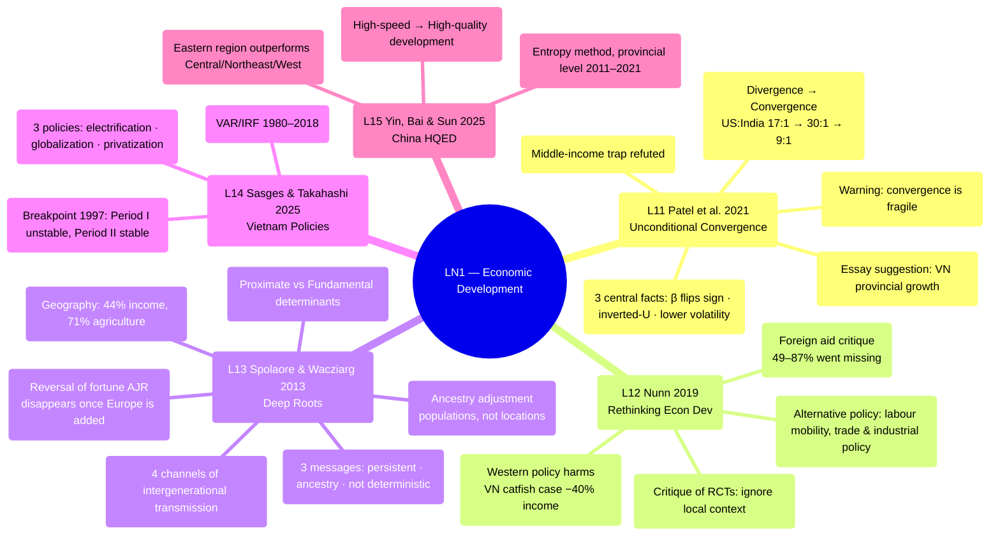

# LN1 — Economic Development

Lecture 1 (scheduled Wed 22/7, 18:00–20:30, H104 — see [[ln0-course-intro]]). 53-page slide
deck, dated 17/07/2026, covering 5 required readings. Position in the course: the opening
topic of [[overview]].

## Lecture structure

The lecture moves through 5 papers in order: Spolaore & Wacziarg (16 sections) → Nunn
(9 sections) → Patel et al. (14 sections) → Sasges & Takahashi (2 sections) → Yin et al.
(6 sections), closing with 2 "Take away" slides.

## Mindmap

## Main arguments by paper

### 1. Spolaore & Wacziarg 2013 — [[l13-spolaore-2013-deep-roots]]

The growth literature has shifted from **proximate determinants** (capital accumulation,
exogenous technology) toward **fundamental factors** rooted in long-run history
([[deep-roots-of-development]]). Key points from the slides:

- Geography explains 44% of the variance in log income per capita (Table 1, latitude is the
  most important factor); geographic conditions explain 71% of the variance in adoption of
  agriculture — Neolithic transmission (Table 2).
- **Reversal of fortune** (Acemoglu-Johnson-Robinson 2002 — the slides note AJR won the 2025
  Nobel): institutions brought by settlers depended on settler mortality; but once Europe is
  added to the sample, the evidence for reversal disappears (the coefficient on AD 1500
  population density = 0, Table 3).
- **Ancestry adjustment** (Putterman & Weil 2010): persistence is a property of
  **populations, not locations** (migration matrix); genetic distance FST (Spolaore &
  Wacziarg 2009).
- 4 channels of intergenerational transmission (Jablonka & Lamb 2005): genetic, epigenetic,
  behavioural, symbolic — grouped into biological / cultural / dual transmission.
- 3 messages: (1) technology and productivity are highly persistent; (2) ancestry must be
  controlled for; (3) genealogical links explain the diffusion of development. History
  matters but is **not deterministic** — barriers can be overcome (Japan → East Asia; the
  Hong Kong demonstration effect for China, Romer 2009).

### 2. Nunn 2019 — [[l12-nunn-2019-rethinking-econ-dev]]

A reflection on development policy (foreign aid, interventions) and academic research (RCTs):

- Foreign aid: 49–87% of aid for schools in Africa "went missing"; aid fuels rent-seeking and
  corruption, crowds out savings, and can fuel conflict (Biafra, DRC); tied aid inflates costs
  by 15–40%.
- Western policies **actively cause harm**: tariffs, antidumping duties, restrictions on
  labour mobility. Vietnam case: the 2003 antidumping duty on catfish (cá tra/basa) imposed
  from Mississippi caused real income for Vietnamese farmers to fall 40% (Brambilla et al.
  2012); Figure 3: rich countries initiate duties, poor countries are the targets.
- Alternative policy options: labour mobility/migration, trade and industrial policy (Korea,
  Finland...), consumer purchasing power (certified products).
- Critique of RCT-style research: high fixed costs, disregard for **local context**, little
  collaboration with local scholars — examples in health (Ebola refusal due to colonial
  memory), agriculture (Bali), and education (bride price).

### 3. Patel, Sandefur & Subramanian 2021 — [[l11-patel-2021-unconditional-convergence]]

Central to [[unconditional-convergence]]:

- The post-WWII era was one of unconditional **divergence** (US:India ratio rose from 17:1 in
  1950 to 30:1 in 1990), but by 2017 the ratio had fallen back to 9:1 — divergence has
  reversed.
- 3 central facts: (1) the β-convergence coefficient flips sign and becomes significant
  between 1990–2000 (the gap closes over roughly 170 years); (2) an inverted-U shape —
  middle-income countries grow fastest; (3) the convergence era is accompanied by lower
  volatility and higher persistence in developing countries.
- The slides emphasize that the **[[middle-income-trap]]** (Gill & Kharas 2015) is refuted
  empirically — after 1985, middle-income countries grew 0.50–0.75 percentage points faster.
- Warning: the convergence of the past 25 years (driven by China, cheap finance) is not
  guaranteed against deglobalization, climate change, and labour-saving technology.
- **Professor's suggestion**: the convergence model can be applied to uneven growth across
  provinces/regions of Vietnam (slide 37) — a suggested essay topic.

### 4. Sasges & Takahashi 2025 — [[l14-sasges-2025-vietnam-policies]]

VAR/IRF, Vietnam 1980–2019, 3 policies: electrification, globalization, privatization. Two
periods: Period I (1980–1997) — high but unstable growth, with globalization and electricity
infrastructure explaining 97% of GDP growth variation; Period II (1998–2019) — high and
stable growth, with the same 3 factors explaining only 25–40% of variation (60–75% is
self-explained by GDPG itself). Breakpoint in 1997; average growth >6.4%. Stabilizing
mechanism: stable household consumption (unlike China, which relies on gross capital
formation). Conclusion: Vietnam's growth path fits **optimal growth theory** better than the
classical economic-takeoff model (capital accumulation).

### 5. Yin, Bai & Sun 2025 — [[l15-yin-2025-china-hqed]]

China's shift from high-speed to **high-quality development**
([[high-quality-development]]); entropy method + clustering + kernel density, provincial
level 2011–2021; the Eastern region outperforms the Central/Northeast/Western regions;
development is "uneven, uncoordinated, insufficient."

## Potential exam questions

1. Distinguish proximate vs. fundamental determinants of development.
2. β-convergence vs. σ-convergence; why β is necessary but not sufficient for σ; convergence
   speed ~2% (developed) vs. 4.5% (developing), half-life τ ≈ 35 years.
3. Reversal of fortune: the institutional mechanism in AJR and the critique once Europe is
   added / ancestry is adjusted for.
4. Why does Patel et al.'s evidence contradict the middle-income trap?
5. The main active policy harms caused by the West according to Nunn; the Vietnam catfish
   case.

## Links

- [[overview]] · [[ln0-course-intro]] · [[almas-heshmati]]
- Full slide-by-slide translation: [[ln1-slides]]
- Concepts: [[unconditional-convergence]], [[deep-roots-of-development]],
  [[middle-income-trap]], [[high-quality-development]]
