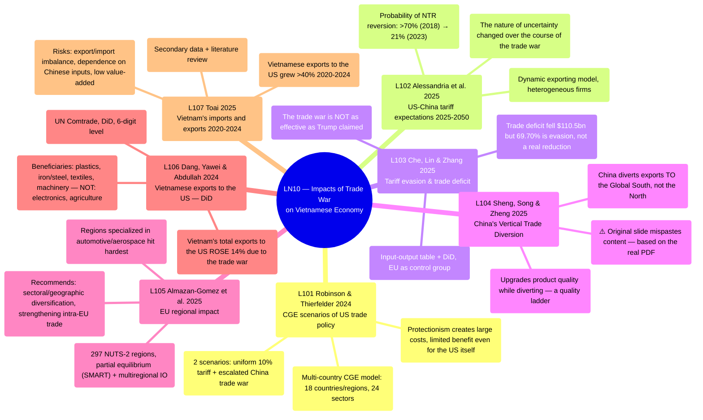

# LN10 — Impacts of Trade War on Vietnamese Economy

Lecture 10 (the final session) in [[overview]] (detailed schedule: [[ln0-course-intro]]). A 30-page slide deck, dated 6/8/2026, covering 7 required readings (L101–L107) — the first 5 papers analyze the US–China trade war at the global/theoretical level (CGE modeling, tariff expectations, tariff evasion, trade diversion, EU regional impacts), the final 2 provide direct Vietnam-specific empirical evidence.

## Lecture structure

A simple structure like LN9: **the list of 7 readings** (slide 3, with full citations) → **7 individually summarized readings in order** (slides 4–24, each paper 1–3 slides) → **Planning Schedule** (slide 25, duplicating content already in [[ln0-course-intro]] — not repeated here in detail) → **"Recent useful research and reading"** (slides 26–29, 2 supplementary papers with NO PDF in `raw/` — Lartey-Law 2025 on AI in urban governance, Ngo-Lee 2025 on income inequality/the Vietnam–US BTA — only a slide summary exists, not deep-ingested separately) → **Closing** (slide 30).

⚠️ **Error found in the source slide — L104**: the slide header reads "Sheng, Song and Zheng (2025). How did Chinese Exporters Manage the trade War?" but the bullet content underneath incorrectly describes a different paper about "climate change exposure and green innovation at Chinese firms" — clearly a copy-paste error when the professor prepared the slide. The page [[l104-sheng-2025-chinese-exporters-trade-diversion]] was written DIRECTLY from the original PDF (confirmed correct paper title/authors/journal, real content about Vertical Trade Diversion), NOT from the incorrect slide content.

## Mindmap

## Main arguments by paper

### 1. Robinson & Thierfelder 2024 — [[l101-robinson-thierfelder-2024-us-trade-policy-cge]]

- A multi-country CGE model (18 countries/regions, 24 sectors) simulating 2 US trade-policy scenarios: a uniform 10% tariff increase and an escalated trade war with China.
- Both scenarios show tariffs do NOT protect US manufacturing jobs; rising intermediate-input costs are counterproductive; the world adapts by diverting trade around the US.

### 2. Alessandria, Yor Khan, Khederlarian, Ruhl & Steinberg 2025 — [[l102-alessandria-2025-trade-war-tariff-risk]]

- A dynamic exporting model with heterogeneous firms estimating how expectations about US–China tariffs evolved, using US + EU import data 2014–2024.
- The probability of tariffs reverting to NTR levels was initially >70% but fell to 21% by 2023 — the nature of trade-policy uncertainty changed as the trade war persisted across multiple presidencies.

### 3. Che, Lin & Zhang 2025 — [[l103-che-2025-tariff-evasion-trade-war]]

- Uses an input-output table + DiD (with the EU as a control group) to measure US importers' tariff-evasion behavior on Chinese goods.
- The US–China trade deficit fell by USD 110.5 billion after the trade war, but up to 69.70% of that gap is due to tariff evasion (underreporting values/quantities, product misclassification), not a genuine trade reduction.

### 4. Sheng, Song & Zheng 2025 — [[l104-sheng-2025-chinese-exporters-trade-diversion]]

- ⚠️ The original slide content was mispasted — the wiki page is based on the real PDF: distinguishing Horizontal Trade Diversion (HTD, diverting to countries similar to the US) from Vertical Trade Diversion (VTD, diverting down to lower-income countries along a quality ladder).
- Contrary to conventional expectations (HTD), China primarily adopts the VTD strategy — diverting high-quality products to the Global South while upgrading product quality as it diverts.

### 5. Almazan-Gomez, El Khatabi, Llano & Perez 2025 — [[l105-almazan-gomez-2025-regional-exposure-trade-wars-eu]]

- Measures the regional impact of 2 US protectionist measures against the EU (Boeing-Airbus dispute, 25% automotive tariff) across 297 European NUTS-2 regions, combining a partial equilibrium model (SMART) + interregional input-output.
- Regions specialized in automotive/aerospace and deeply embedded in European value chains are hit hardest; recommends sectoral/geographic diversification and strengthening intra-EU trade.

### 6. Dang, Yawei & Abdullah 2024 — [[l106-dang-2024-vietnam-exports-us-trade-war-did]]

- Uses a Difference-in-Differences approach on HS6-level UN Comtrade data to measure the US–China trade war's impact on Vietnamese exports to the US.
- Vietnam's total exports to the US rose 14% due to the trade war; clear beneficiary sectors are plastics, iron/steel, textiles, and machinery — direct empirical evidence for the trade-diversion theory in L101/L104.

### 7. Toai 2025 — [[l107-toai-2025-vietnam-import-export-trade-war]]

- A descriptive analysis + literature review of the trade war's impact on Vietnam's import/export structure 2020–2024, based on secondary data.
- Vietnamese exports to the US grew >40% (2020–2024), making the US the largest market, but the imbalanced structure (exports nearly 5x imports) creates risk of trade investigation/retaliation and dependence on Chinese intermediate inputs.

## Potential exam questions

1. Compare 2 global trade-war simulation frameworks — [[l101-robinson-thierfelder-2024-us-trade-policy-cge]] (static CGE, "what if" scenarios) and [[l102-alessandria-2025-trade-war-tariff-risk]] (dynamic model of tariff expectations) — strengths/weaknesses of each approach.
2. Per [[l103-che-2025-tariff-evasion-trade-war]], why can the "reduced US-China trade deficit" figure the Trump administration touted be misleading? Specify the concrete tariff-evasion mechanism and its contribution to the gap.
3. [[l104-sheng-2025-chinese-exporters-trade-diversion]] finds China uses a Vertical Trade Diversion strategy (diverting to the Global South) rather than Horizontal (diverting to US-similar countries) as prior literature predicted — connect this to Vietnam's evidence in [[l106-dang-2024-vietnam-exports-us-trade-war-did]]/[[l107-toai-2025-vietnam-import-export-trade-war]]: what role does Vietnam play in this VTD picture (a destination for Chinese tariff-evading goods, a direct substitute for Chinese goods in the US market, or both)?
4. Compare the regional/sectoral impact-measurement approaches between [[l105-almazan-gomez-2025-regional-exposure-trade-wars-eu]] (297 European NUTS-2 regions) and [[l106-dang-2024-vietnam-exports-us-trade-war-did]] (Vietnamese export sectors) — both find UNEVEN impacts; specify the mechanism driving unevenness in each context.
5. Both [[l106-dang-2024-vietnam-exports-us-trade-war-did]] and [[l107-toai-2025-vietnam-import-export-trade-war]] conclude Vietnam benefits short-term from the US–China trade war — but L107 raises additional long-term structural risks not directly addressed by L106. List those risks and assess their severity given L106's more rigorous quantitative DiD method.
6. This is the course's final session — synthesize: across the 10 lectures, how does the "trade war/protectionism" theme (LN10) relate to the "institutions/governance" theme (LN2) and "FDI/informal economy" ([[l26-huynh-tran-2025-fdi-informal-economy]], LN2)? Both concern how the Vietnamese economy responds to external shocks/pressures.

## Links

- [[overview]] · [[ln0-course-intro]] · [[almas-heshmati]]
- Concept: [[trade-war-and-protectionism]]
