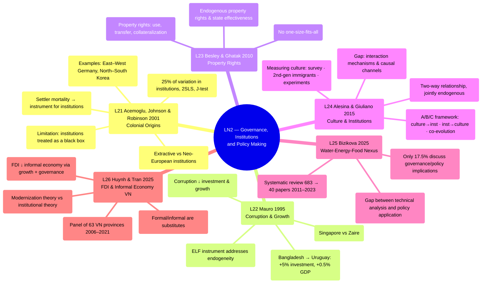

# LN2 — Governance, Institutions and Policy Making

Lecture 2 in [[overview]] (detailed schedule: [[ln0-course-intro]]). 49-page slide deck, dated
23/07/2026, covering 6 required readings.

## Lecture structure

Moves through 6 papers in order: Acemoglu, Johnson & Robinson 2001 (23 sections) → Mauro 1995
(9 sections) → Besley & Ghatak 2010 (3 sections) → Alesina & Giuliano 2015 (4 sections) →
Bizikova 2025 (5 sections) → Huynh & Tran 2025 (2 sections), closing with 2 "Take away"
slides. Acemoglu provides the theoretical foundation of [[institutions]] on which the
following 5 papers all build.

## Mindmap

## Main arguments by paper

### 1. Acemoglu, Johnson & Robinson 2001 — [[l21-acemoglu-2001-colonial-origins]]

Question: what is the fundamental cause of income differences across countries? Central to
[[institutions]]:

- Uses the mortality rate of European colonial soldiers (malaria, yellow fever — accounting
  for 80% of deaths in tropical regions) as an **instrument** for current institutions:
  settler mortality → settlements → early institutions → current institutions → income per
  capita.
- Where mortality was high, Europeans could not settle, so **extractive** institutions were
  established (extracting resources to send back to the mother country); where mortality was
  low, **Neo-European** institutions emerged (protecting property rights, encouraging
  investment). Both types **persist** to the present.
- Mortality explains 25% of the variation in current institutions; OLS + 2SLS on a sample of
  64 ex-colonies. After controlling for institutions, the income gap associated with latitude
  or being in Africa disappears.
- The overidentification test (J-test) does not reject the hypothesis; the result is robust
  to adding controls for climate, natural resources, soil, and life expectancy.
- Illustrative examples in the slides: East–West Germany, North–South Korea (same initial
  conditions, different institutions → different outcomes).
- The slides explicitly note a limitation: institutions are treated as a "black box" — the
  specific mechanisms (property rights, expropriation risk) are left open for further
  research.

### 2. Mauro 1995 — [[l22-mauro-1995-corruption-growth]]

- Uses Business International/EIU data (56 risk indices, 68 countries, 1980–83) to measure
  corruption, red tape, judicial efficiency, and political instability.
- **Corruption reduces the investment rate and growth**, even after controlling for
  bureaucratic regulation; the result is robust when using **ELF** (the ethnolinguistic
  fractionalization index) as an instrument to address endogeneity.
- Illustration: Singapore (10/10 on every indicator, highest investment 1960–85) vs. Zaire
  (worst institutions, extremely low investment).
- A concrete estimate: if Bangladesh raised bureaucratic integrity to Uruguay's level,
  investment rate would rise +5% and GDP growth +0.5 percentage points.

### 3. Besley & Ghatak 2010 — [[l23-besley-ghatak-2010-property-rights]]

A Handbook of Development Economics chapter, continuing the new institutional approach
(North 1990):

- Property rights = the rights to use, transfer, and collateralize assets; central to
  resource allocation, limiting expropriation, reducing barriers to trade.
- Also discusses endogenous property rights (when rights arise endogenously, and state
  effectiveness).
- The conclusion emphasizes: **there is no "one size fits all" formula** for expanding
  private property rights — effects are heterogeneous depending on context.

### 4. Alesina & Giuliano 2015 — [[l24-alesina-giuliano-2015-culture-institutions]]

- Question: culture and [[institutions]] have a **two-way relationship** (feedback loop),
  with neither causally superior — both are jointly endogenous with respect to demography,
  technology, disease, war, and shocks.
- Culture is measured 3 ways: survey data, second-generation immigrants (separating culture
  from the economic/institutional environment), and experiments. Formal institutions are
  measured via the World Bank's Worldwide Governance Indicators (voice & accountability,
  rule of law, control of corruption...).
- Analytical framework: (A) culture → formal institutions, (B) institutions → culture
  (exogenous shocks, markets, regulation), (C) two-way co-evolution.
- Conclusion: two research directions remain underdeveloped — (i) understanding the
  interaction mechanism (usually studied in isolation, though the reality is a complex
  nonlinear process), and (ii) understanding the causal channel (complementarity makes
  identification via IV difficult).

### 5. Bizikova 2025 — [[l25-bizikova-2025-water-energy-food-nexus]]

- Systematic review of 683 papers, narrowed to 40 (2011–2023), on the water-energy-food
  (WEF) nexus and governance.
- Only **17.5%** of studies actually discuss governance/policy implications, even though 63%
  quantify the WEF nexus — a gap between technical analysis and policy application.
- Main framing: improving engagement with policymakers/academia/communities (32.5%),
  coordination (27.5%), technological solutions (35%).

### 6. Huynh & Tran 2025 — [[l26-huynh-tran-2025-fdi-informal-economy]]

Panel of 63 Vietnamese provinces, 2006–2021 — **a paper with direct Vietnam data**, notable
for the essay:

- FDI inflows reduce the informal economy through 2 simultaneous channels (the interaction
  coefficients FDI×GROW and FDI×GOV are both significantly negative): boosting growth and
  improving local governance quality (measured by the PAPI index, 6 dimensions).
- Formal and informal economies are **substitutes**; local governance quality has the
  LARGEST negative coefficient in the model — the strongest reducer of informal activity.
- Poverty, unemployment, and rapid population growth are the main drivers of the informal
  economy in Vietnam; strategic fiscal policy plus urbanization plus human capital can shrink
  this sector. Informal employment averages 75.6% of total labour (ranging 31–91% across
  provinces) — a very large regional disparity.
- The main estimation uses **System GMM** (Blundell & Bond, forward-orthogonal deviations for
  an unbalanced panel) to address endogeneity — cross-checked with pooled OLS/RE/FE and 2
  robustness checks (arcsinh(FDI), and an alternative proxy of TAX revenue/GDP) — testing
  modernization theory (FDI → reduces informality) and institutional theory (FDI → improves
  governance) simultaneously rather than choosing one.

## Potential exam questions

1. Present Acemoglu et al.'s (2001) identification strategy: the chain settler mortality →
   settlements → early institutions → current institutions, and the 3 conditions for a valid
   IV.
2. Why does Mauro use ELF as an instrument? The mechanism of corruption → investment →
   growth.
3. Compare the property rights approach of Besley & Ghatak with the institutional approach of
   Acemoglu — similarities and differences.
4. Why do Alesina & Giuliano argue that the causal effect of culture cannot be separated from
   institutions? Give an example of joint endogeneity.
5. Based on Huynh & Tran (2025), through which channels does FDI affect the informal economy
   in Vietnam? Relate this to provincial governance quality.

## Links

- [[overview]] · [[ln0-course-intro]] · [[almas-heshmati]]
- Full slide-by-slide translation: [[ln2-slides]]
- Concepts: [[institutions]]
