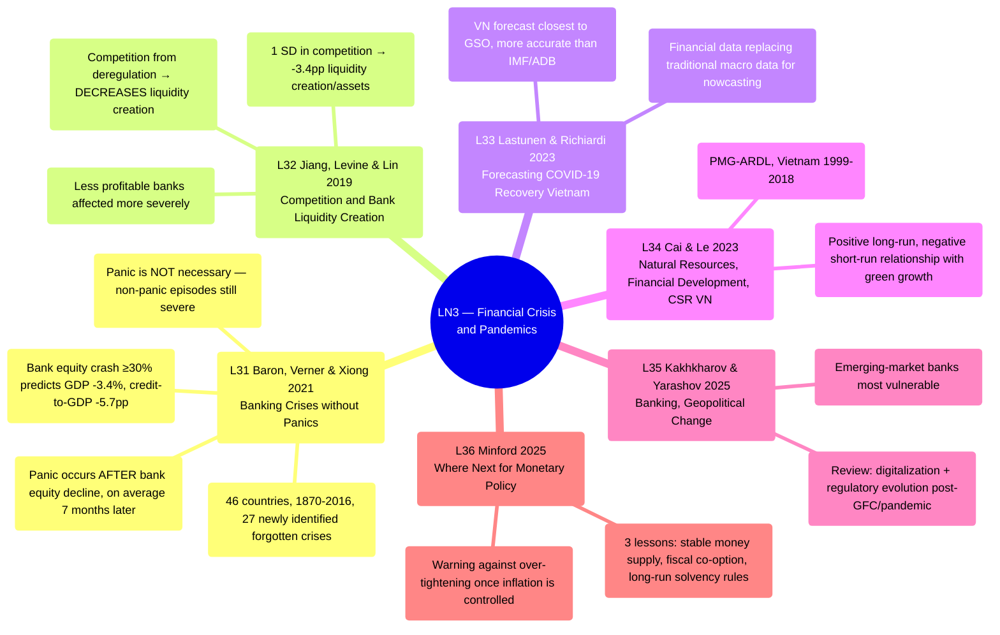

# LN3 — Financial Crisis and Pandemics

Lecture 3 in [[overview]] (detailed schedule: [[ln0-course-intro]]). 56-page slide deck, dated
25/07/2026, covering 6 required readings.

## Lecture structure

Moves through 6 papers in order: Baron, Verner & Xiong 2021 (21 sections) → Jiang, Levine &
Lin 2019 (11 sections) → Lastunen & Richiardi 2023 (7 sections, plus 1 bonus slide summarizing
Heshmati 2021's review of COVID-19 consequences) → Cai & Le 2023 (4 sections) → Kakhkharov &
Yarashov 2025 (1 section) → Minford 2025 (4 sections), closing with 2 "Take away" slides.
Afterward there are 2 slides introducing 2 of the professor's own research papers (UEH PhD
Seminars, not required readings with a code number): "Global Bank Balance Sheet Constraints
and Local Corporate Distress: Evidence from Sweden" and "Capital Structure Dynamics and
Adjustment Behavior of Listed Firms in Vietnam."

## Mindmap

## Main arguments by paper

### 1. Baron, Verner & Xiong 2021 — [[l31-baron-2021-banking-crises-without-panics]]

Central to [[banking-crisis]]:

- A bank equity crash (a decline of ≥30%/year) predicts a 3.4% decline in real GDP and a 5.7
  percentage-point decline in bank credit-to-GDP after 3 years — even without a panic
  (non-panic episodes: GDP -2.7%, credit-to-GDP -3.5%).
- Panic is an amplification mechanism, not the cause: it occurs on average 7 months after
  bank equity has already fallen 30%, by which point 55% of the total decline has already
  occurred.
- A new dataset covering 46 countries from 1870–2016, identifying 27 "forgotten" crises.
- Policy implication: prioritize early bank recapitalization, not just liquidity backstops.

### 2. Jiang, Levine & Lin 2019 — [[l32-jiang-2019-competition-bank-liquidity-creation]]

- Increased bank competition due to U.S. federal deregulation DECREASES liquidity creation
  (counterintuitive).
- A 1 SD increase in competition reduces liquidity creation/assets by 3.4 percentage points;
  the median bank loses $3.5 million, the average bank loses $21.3 million.
- Mechanism: less profitable banks (with less capacity to absorb risk) are affected more
  severely.

### 3. Lastunen & Richiardi 2023 — [[l33-lastunen-2023-forecasting-covid-recovery-vietnam]]

- Nowcasts COVID-19 recovery using financial data (sectoral indices) instead of traditional
  macro data.
- The Vietnam forecast (based on Q2/2020, published 09/2020): −4.1% trend GDP — closest to
  the official GSO figure (−4.0%), more accurate than the IMF (−4.9%) and ADB (−4.7%).

### 4. Cai & Le 2023 — [[l34-cai-2023-natural-resources-financial-development-vietnam]]

- Natural resources, financial development, and CSR have a positive long-run but negative
  short-run relationship with green growth in Vietnam (PMG-ARDL, 1999–2018).
- Note: the paper's writing contains some inconsistent terminology in places, so cross-check
  carefully.

### 5. Kakhkharov & Yarashov 2025 — [[l35-kakhkharov-2025-banking-geopolitical-change]]

A review of banking in the post-GFC/pandemic era amid geopolitical fragmentation;
emerging-market banks (such as Vietnam's) are especially vulnerable.

### 6. Minford 2025 — [[l36-minford-2025-monetary-policy-lessons]]

3 monetary policy lessons: stabilize money supply growth, use fiscal policy to support
stability, and apply budget discipline via long-run solvency rules — warns against the risk
of over-tightening.

## Potential exam questions

1. Distinguish "banking crisis" from "panic" per Baron et al. (2021); why is panic not a
   necessary condition?
2. What mechanism explains why bank competition (from deregulation) DECREASES liquidity
   creation according to Jiang et al.?
3. Why was Lastunen & Richiardi's forecast more accurate than the IMF/ADB for Vietnam in
   2020? Cite the specific comparative figures.
4. What are the 3 monetary policy stabilization lessons according to Minford (2025)?
5. Compare the role of "financial market data" in L31 (bank equity) and L33 (sectoral
   indices) — what do they share methodologically?

## Links

- [[overview]] · [[ln0-course-intro]] · [[almas-heshmati]]
- Full slide-by-slide translation: [[ln3-slides]]
- Concepts: [[banking-crisis]]
