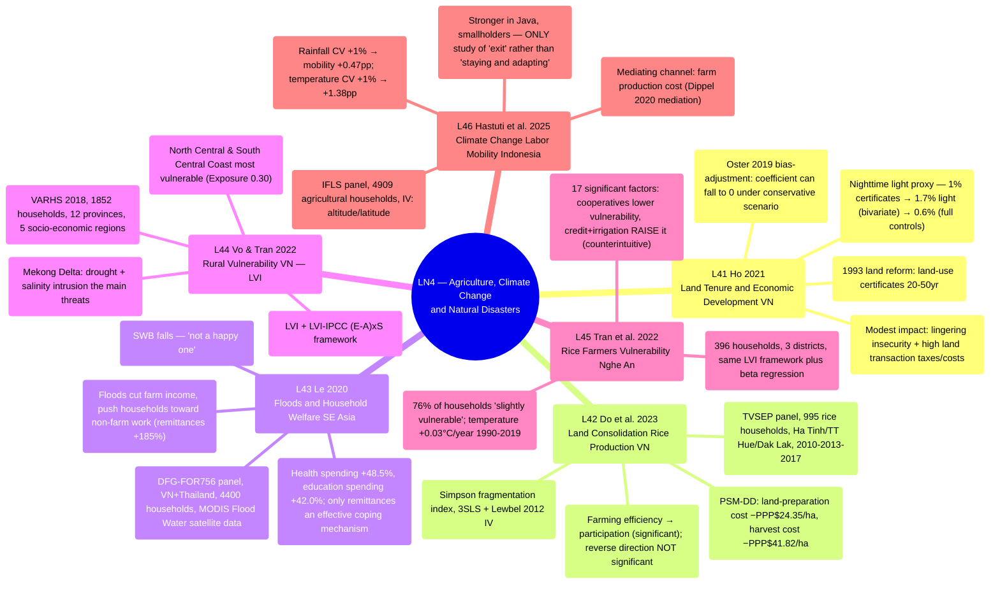

# LN4 — Agriculture, Climate Change and Natural Disasters

Lecture 4 in [[overview]] (detailed schedule: [[ln0-course-intro]]). A 57-page slide deck, dated
29/07/2026, covering 6 required readings — 5 on Vietnam, 1 on Indonesia.

## Lecture structure

The lecture moves through 6 papers in a fixed order: Ho 2021 (7 sections) → Do et al. 2023 (14
sections) → Le 2020 (14 sections) → Vo & Tran 2022 (6 sections) → Tran et al. 2022 (6 sections) →
Hastuti et al. 2025 (4 sections), closing with 2 "Take away" slides that recap each paper in turn.
The lecture's logical arc moves from **land institutions** (Ho, Do et al. — land tenure and land
fragmentation, not necessarily climate-related) to **natural disasters/climate change** (Le, Vo &
Tran, Tran et al., Hastuti et al. — floods, livelihood vulnerability, labor mobility). This is
worth flagging: the first two readings (L41, L42) are, in substance, purely "Agriculture" topics
(land institutions/productivity), while the last four (L43–L46) are properly about "Climate
Change and Natural Disasters" — the lecture title splices together two distinct thematic threads,
linked only through the shared setting of "rural households in Vietnam/Southeast Asia."

## Mindmap

## Main arguments by paper

### 1. Ho 2021 — [[l41-ho-2021-land-tenure-vietnam]]

- Vietnam's 1993 land reform granted land-use certificates (20–50 years) — an empirical test, in
  a within-country setting, of Acemoglu et al.'s private-property-rights argument. Nighttime
  light intensity serves as a proxy for commune-level economic development, since no commune-level
  GDP data exist.
- The bivariate coefficient of 1.7% (a 1% increase in certificates → 1.7% more nighttime light)
  falls to 0.6% once full controls and province fixed effects are added (Table 3, column 7); an
  Oster (2019) bias-adjustment shows the coefficient could fall to zero under the most
  conservative scenario.
- The modest impact stems from lingering insecurity (the state can still reclaim land-use
  certificates) and high land-transaction taxes/time costs — not because private tenure doesn't
  matter, but because this is INCOMPLETE private tenure.
- Direct theoretical link to LN2: [[institutions]], [[l21-acemoglu-2001-colonial-origins]],
  [[l23-besley-ghatak-2010-property-rights]].

### 2. Do, Nguyen & Grote 2023 — [[l42-do-2023-land-consolidation-vietnam]]

- Land fragmentation (scattered, intermixed plots, averaging 3.9 plots per household) is a legacy
  of the egalitarian land distribution of the late-1980s Doi Moi era. Land consolidation
  (legalized in 2014) was expected to improve economies of scale.
- A simultaneous-equation system (3SLS + Lewbel 2012 IV): farming efficiency → participation in
  consolidation is positive and significant, but the reverse direction — consolidation → farming
  efficiency — is NOT significant.
- PSM-DD: consolidation lowers land-preparation costs by PPP$24.35/ha and harvest costs by
  PPP$41.82/ha; it raises farm income and reduces poverty (FGT index).
- Uses the same TVSEP data as L43 (3 provinces: Ha Tinh, Thua Thien Hue, Dak Lak); differs from
  L41 in institutional channel (fragmentation/consolidation rather than property rights/tenure
  security).

### 3. Le 2020 — [[l43-le-2020-floods-household-welfare]]

- Uses objective MODIS Flood Water satellite data (reducing endogeneity relative to self-reports)
  combined with the DFG-FOR756 panel (Vietnam + Thailand, 4,400 households) to measure the
  multidimensional impact of floods under the Dell et al. (2014) framework: income, expenditure,
  coping strategies, subjective wellbeing (OECD 2013 framework).
- Floods reduce farm income (~97% for fisheries/aquaculture, ~37% for crops) but push households
  toward non-farm income (remittances +185%); they raise health spending by 48.5% and education
  spending by 42.0%.
- Among coping mechanisms, ONLY remittances have a statistically significant mitigating effect;
  SWB drops markedly in the short run.
- Bleak conclusion: "living in villages that are subject to flooding is not a happy one."

### 4. Vo & Tran 2022 — [[l44-vo-tran-2022-rural-vulnerability-vietnam]]

- Uses the LVI (Hahn et al. 2009) together with LVI-IPCC (E−A)×S on VARHS 2018 data (1,852
  households, 12 provinces, 5 socio-economic regions) to compare vulnerability across regions —
  purely descriptive statistics, with no regression.
- The North Central and South Central Coast are the most vulnerable (LVI-IPCC = 0.012, the only
  positive value) because high Exposure (0.30 — storms/floods/tropical depressions) outweighs
  otherwise decent adaptive capacity/sensitivity.
- The Red River Delta and Mekong Delta are especially vulnerable on the food/water dimensions;
  in the Mekong Delta, drought and salinity intrusion are identified as the main threats.
- See [[livelihood-vulnerability-index]] — the trunk concept for L44+L45.

### 5. Tran et al. 2022 — [[l45-tran-2022-rice-farmers-vulnerability-nghean]]

- Applies the same LVI formula as L44 but at household/district resolution (396 households, 3
  districts in Nghe An — precisely the "hottest" region per L44), adding a correlation matrix
  plus **beta regression** to identify drivers.
- 76% of households are "slightly vulnerable"; temperature rose 0.03°C/year (1990–2019, p<0.10).
- 17 significant factors: agricultural cooperatives, education, income diversification, and
  severe cold DECREASE vulnerability; floods, drought, male household head, family labor,
  **formal credit, and irrigation** (2 counterintuitive results — attributable to poor
  implementation quality rather than the instruments themselves being harmful) INCREASE
  vulnerability.
- A direct methodological pairing with L44: the same measurement tool (LVI), a different purpose
  (description vs. causal explanation), and a different resolution (region/province vs.
  district/household).

### 6. Hastuti et al. 2025 — [[l46-hastuti-2025-climate-labor-mobility-indonesia]]

- The only study outside Vietnam (Indonesia, IFLS panel 2000/2007/2014, 4,909 agricultural
  households). Labor mobility here means a shift ACROSS occupational SECTORS (not necessarily
  geographic migration). IV: altitude (for temperature), latitude (for rainfall) — strong
  first-stage tests (Kleibergen-Paap F ~58–61).
- A 1% increase in rainfall CV raises the probability of labor mobility by 0.47 percentage
  points; a 1% increase in temperature CV raises it by 1.38 percentage points (both p<0.01).
- Mediation analysis (Dippel et al. 2020): the farm-production-cost channel is significant for
  rainfall but NOT significant for temperature (temperature effects may operate through a
  different channel).
- Effects are stronger in Java and among smallholders; this is the ONLY paper in LN4 to treat
  mobility AS an adaptation strategy (exit) rather than as an outcome to be remedied — in
  contrast to L43–L45 (staying and adapting in place).

## Potential exam questions

1. Compare how L41 (Oster 2019 bias-adjustment), L42 (Lewbel 2012 heteroscedasticity-based
   internal IV), and L46 (exogenous altitude/latitude IV) each handle endogeneity — why does each
   paper require a different identification strategy when the treatment variable (land tenure,
   land consolidation, climate) is hard to instrument cleanly in every case?
2. Compare the "vulnerability to climate/disaster" measurement frameworks used by L43
   (outcome-based: OECD wellbeing plus reduced-form regression on actual income, expenditure, and
   SWB) and L44/L45 (index-based: the LVI/LVI-IPCC composite index, HDI-style). What are the
   strengths and weaknesses of each approach?
3. L44 and L45 use the same Hahn et al. (2009) LVI formula but differ in geographic resolution
   and analytical purpose. Explain the difference and why the two studies reach policy
   conclusions that differ in KIND (regional targeting vs. household-level intervention) despite
   sharing the same underlying method.
4. Why does private land tenure in Vietnam (Ho 2021) have only a "modest" impact on economic
   development, in contrast to the large impact found in Acemoglu et al.'s (AJR) cross-country
   research? Relate this to the concept of [[institutions]] and to INCOMPLETE property rights.
5. Tran et al. (2022) find that formal credit and irrigation INCREASE (rather than decrease)
   household vulnerability — a counterintuitive result. Propose a plausible interpretation and an
   alternative empirical strategy (if any) that could distinguish genuine causation from
   potential reverse causality.
6. Compare the two ways households respond to climate/disaster shocks that appear across LN4:
   "staying and adapting in place" (coping strategies in L43; vulnerability reduction in L44/L45)
   versus "exiting agriculture" (labor mobility in L46). What factors (land, education, region)
   determine which strategy a household chooses?

## Links

- [[overview]] · [[ln0-course-intro]] · [[almas-heshmati]]
- Concepts: [[livelihood-vulnerability-index]] · [[institutions]] (cross-lecture, LN2)
