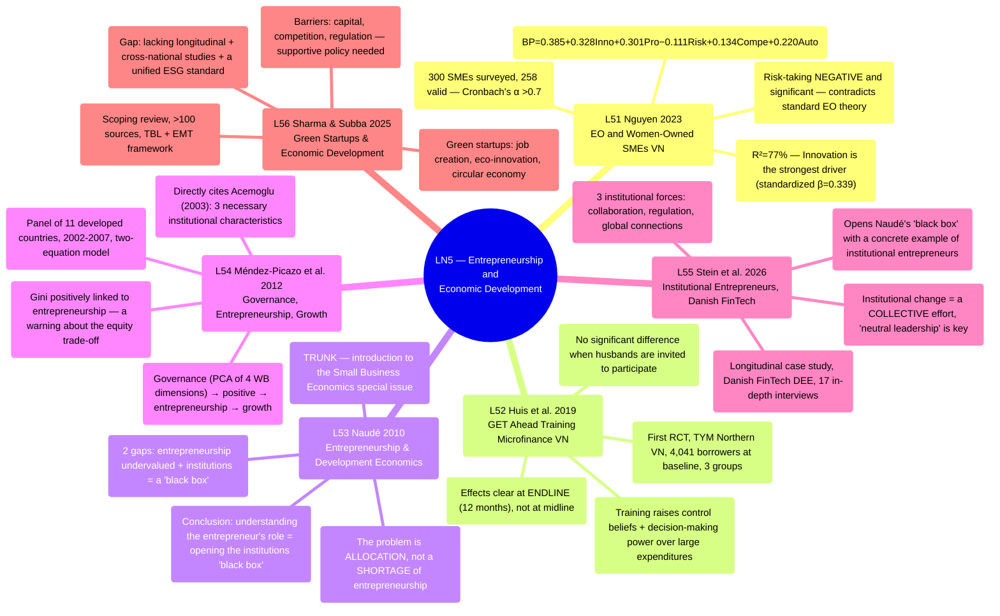

# LN5 — Entrepreneurship and Economic Development

Lecture 5 in [[overview]] (detailed schedule: [[ln0-course-intro]]). A 50-page slide deck,
dated 25/07/2026, covering 6 required readings.

## Lecture structure

The lecture moves through 6 papers in order: Nguyen 2023 (6 sections) → Huis, Lensink, Vu &
Hansen 2019 (13 sections) → Naudé 2010 (5 sections) → Méndez-Picazo, Galindo-Martín &
Ribeiro-Soriano 2012 (8 sections) → Stein, Evers & O'Gorman 2026 (6 sections) → Sharma & Subba
2025 (6 sections), closing with 2 "Take away" slides summarizing all six papers.

## Mindmap

## Main arguments by paper

### 1. Nguyen 2023 — [[l51-nguyen-2023-entrepreneurial-orientation-women-smes-vietnam]]

- Surveys 300 women-owned SMEs in Vietnam (258 valid responses); 5 dimensions of EO
  (innovation, proactiveness, risk-taking, competitive aggressiveness, autonomy) → business
  performance.
- The model explains 76.7% of the variance in BP; 4 of the 5 dimensions are significantly
  positive, while **risk-taking is negative and significant** — the opposite of standard EO
  theory.
- Context: SMEs = 98% of Vietnamese enterprises, and women-owned firms = 26.5% of currently
  operating enterprises.

### 2. Huis, Lensink, Vu & Hansen 2019 — [[l52-huis-2019-get-training-microfinance-vietnam]]

- The first RCT evaluating the GET Ahead training program (ILO) among female borrowers of TYM,
  the largest microfinance institution (MFI) in Northern Vietnam — 3 groups (training with
  husbands invited, individual training, control).
- Training increases control beliefs and financial decision-making power (over large
  expenditures), and reduces relational friction/oppression — but the effect is clearly
  visible only at endline (12 months), suggesting that empowerment accumulates gradually over
  time.
- No significant difference was found when husbands were invited to participate jointly.

### 3. Naudé 2010 — [[l53-naude-2010-entrepreneurship-development-economics]]

Central to [[entrepreneurship-and-development]] — the TRUNK/programmatic paper of the entire
lecture:

- The introductory essay for Small Business Economics special issue 34(1), 2010, integrating
  entrepreneurship into development economics — not an empirical study.
- Two gaps: (i) entrepreneurship is undervalued within development economics; (ii)
  institutions remain a "black box" despite both fields recognizing their importance.
- The problem is not a SHORTAGE of entrepreneurship in developing countries (measured rates
  are actually higher than in developed countries) but a **misallocation** (productive vs.
  unproductive/destructive, Baumol 1990).
- Conclusion: understanding the entrepreneur's role in development means "unpacking the black
  box" of institutional explanations.

### 4. Méndez-Picazo, Galindo-Martín & Ribeiro-Soriano 2012 — [[l54-mendez-picazo-2012-governance-entrepreneurship-growth]]

- A two-equation panel model, 11 developed countries, 2002–2007: GDP = f(innovation,
  entrepreneurship, investment); entrepreneurship = f(Gini, governance, public expenditure,
  money supply).
- **Directly cites Acemoglu (2003)** — the three institutional characteristics needed to
  promote growth (the same framework as [[l21-acemoglu-2001-colonial-origins]], LN2).
- Governance (measured via principal components of 4 World Bank dimensions) → positive →
  entrepreneurship → positive indirect → growth; but Gini and inflation are "negative effects"
  that need to be managed.

### 5. Stein, Evers & O'Gorman 2026 — [[l55-stein-2026-digital-entrepreneurship-fintech-denmark]]

- A longitudinal qualitative case study, the Danish FinTech Digital Entrepreneurial Ecosystem
  (DEE), 17 in-depth interviews, data spanning 2009–2024.
- 3 institutional forces shaping the DEE: collaboration dynamics (incumbent–start-up),
  adaptation of the regulatory framework, and global connections.
- Institutional change is a **collective** effort by many institutional entrepreneurs over
  time; **neutral leadership** is pivotal; both system-level and organisation-level agency are
  simultaneously necessary.
- Opens Naudé's (L53) "black box" with concrete evidence: institutional entrepreneurs actively
  change institutions rather than merely reacting passively to them.

### 6. Sharma & Subba 2025 — [[l56-sharma-subba-2025-green-startups-sustainability]]

- A scoping review (>100 academic and grey-literature sources), using a Triple Bottom Line +
  Ecological Modernization Theory framework.
- Green startups contribute to job creation, eco-innovation, and the circular economy, but
  face barriers of capital, competition, regulation, infrastructure, and the lack of a unified
  ESG standard.
- Research gap: a shortage of longitudinal studies, cross-national comparisons, and
  harmonized ESG standards.

## Potential exam questions

1. According to Nguyen (2023), why does risk-taking have a NEGATIVE effect on the business
   performance of women-owned SMEs in Vietnam, contrary to the expectations of standard EO
   theory (Lumpkin & Dess 1996)? Cite the specific regression figures (coefficient,
   significance level).
2. Compare the methodology and research question of Nguyen (2023, L51) and Huis et al. (2019,
   L52) — both study women's economic empowerment in Vietnam, but how do they differ in
   research design (cross-sectional survey/regression vs. RCT) and their ability to infer
   causality?
3. Naudé (2010) describes institutions as a "black box" in development economics. How do
   Stein et al. (2026) "open" this black box through their Danish FinTech case study? Name 3
   specific institutional forces and explain the roles of "collective movement" and "neutral
   leadership".
4. Méndez-Picazo et al. (2012) directly cite Acemoglu's (2003) three institutional
   characteristics. Compare this with [[l21-acemoglu-2001-colonial-origins]] (LN2) — at what
   different levels/units of analysis do the two papers apply the Acemoglu framework
   (long-run historical persistence vs. a modern entrepreneurship panel)?
5. According to Sharma & Subba (2025), what are the main barriers preventing green startups
   from scaling up, and what policies are proposed to address them? Name at least 3 research
   gaps identified in the paper.
6. Naudé (2010) argues that the problem is not a SHORTAGE of entrepreneurship in developing
   countries but a matter of ALLOCATION. Compare this argument with Méndez-Picazo et al.'s
   (2012) finding that inequality (Gini) is POSITIVELY correlated with entrepreneurship
   activity — do these two findings create tension with the poverty/inequality-reduction goal
   that Naudé places at the center of his argument?

## Links

- [[overview]] · [[ln0-course-intro]] · [[almas-heshmati]]
- Concepts: [[entrepreneurship-and-development]], [[institutions]]
