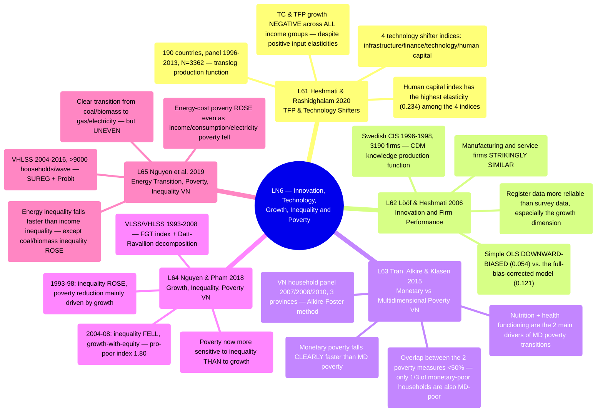

# LN6 — Innovation, Technology, Growth, Inequality and Poverty

Lecture 6 in [[overview]] (detailed schedule: [[ln0-course-intro]]). A 61-page slide deck, dated
01/08/2026, covering 5 required readings — 2 methodological papers on technology/productivity (by
Prof. Heshmati himself), then 3 empirical papers on growth-inequality-poverty in Vietnam.

## Lecture structure

Works through 5 papers in order: Heshmati & Rashidghalam 2020 (9 sections) → Lööf & Heshmati 2006
(11 sections) → Tran, Alkire & Klasen 2015 (10 sections) → Nguyen & Pham 2018 (12 sections) →
Nguyen et al. 2019 (10 sections), closing with 2 "Take away" slides summarizing all 5 papers, plus
1 slide introducing the **UNU-WIDER World Income Inequality Database (WIID) 2026 update** (not a
required reading, just a reference resource the professor adds).

The first two papers (L61, L62) form a methodological pair on measuring technology/productivity —
authored by the professor himself — laying the TFP/technical-change/innovation groundwork before
the lecture shifts to 3 empirical Vietnam papers on poverty/inequality in its second half.

## Mindmap

## Main arguments by paper

### 1. Heshmati & Rashidghalam 2020 — [[l61-heshmati-rashidghalam-2020-tfp-technology-shifters]]

- Models TFP growth via a translog production function, decomposed into 3 components:
  unobserved time-trend technical change (TC), scale economies, and observable technology
  shifter index — panel data of 190 countries 1996–2013 (N=3362).
- A surprising result: TC and TFP growth are **NEGATIVE across ALL country income groups and
  years** in the best-fit technology index model (Model 4, mean TFP −3.6%), despite positive
  input elasticities (labor/capital/energy) and increasing returns to scale.
- The human capital index (health + education expenditure + tertiary enrollment) has the
  highest TFP elasticity (0.234) among the 4 technology shifter indices; conversely the
  technology index (R&D/hi-tech exports/patents) has a slightly NEGATIVE elasticity (−0.043) —
  counterintuitive.

### 2. Lööf & Heshmati 2006 — [[l62-loof-heshmati-2006-innovation-performance]]

- Sensitivity analysis of the innovation–firm performance relationship, using a 4-equation
  CDM-style (Crépon, Duguet & Mairesse 1998) knowledge production function to correct
  selectivity + simultaneity bias — Swedish CIS data 1996–1998, 3190 firms (1309 innovative).
- Simple OLS gives a **downward-biased** elasticity (0.054, level) versus the full-bias-corrected
  model (0.121); simultaneity bias is confirmed to matter more than selectivity bias.
- A notable finding: manufacturing and service firms show a **strikingly similar**
  innovation→productivity relationship — not previously well documented; employment increases
  with innovation output only for service firms.

### 3. Tran, Alkire & Klasen 2015 — [[l63-tran-alkire-klasen-2015-monetary-multidimensional-poverty-vietnam]]

- Compares monetary poverty and multidimensional poverty (Alkire-Foster method) both statically
  and dynamically — Vietnamese household panel data 2007/2008/2010, 3 provinces (Ha Tinh, Thua
  Thien Hue, Dak Lak).
- Overlap between the two measures is **under 50%** — of monetary-poor households, only 1/3 are
  also multidimensionally poor; monetary poverty falls CLEARLY faster than multidimensional
  poverty over time.
- Nutrition and health functioning are the two main drivers of MD poverty transitions —
  nutrition actually WORSENED slightly over time even as other indicators (clean water,
  sanitation, electricity) continuously improved.

### 4. Nguyen & Pham 2018 — [[l64-nguyen-pham-2018-growth-inequality-poverty-vietnam]]

- Growth-redistribution decomposition (Datt-Ravallion 1991; Kolenikov-Shorrocks 2005) +
  pro-poor growth index (Kakwani-Pernia 2000) for Vietnam 1993–2008, using 4 household surveys
  (VLSS 1993/1998, VHLSS 2004/2008).
- 1993–98 period: inequality ROSE (Gini 0.33→0.35), poverty reduction driven mainly by growth
  (pro-poor index 0.90, below the "pro-poor" threshold); 2004–08 period: inequality FELL (Gini
  0.37→0.356), growth-with-equity, pro-poor index 1.80 (highly pro-poor).
- Poverty is now more sensitive to inequality than to growth (elasticity to inequality rose from
  0.15 in 1993 to 1.78 in 2008) — implying inequality-reduction policy now has higher leverage.

### 5. Nguyen, Nguyen, Hoang, Wilson & Managi 2019 — [[l65-nguyen-2019-energy-transition-poverty-inequality-vietnam]]

- VHLSS survey 2004–2016 (>9000 households/wave), classifying energy into 4 categories (coal &
  biomass, oil, gas, electricity), using SUREG (2 related equations) + Probit to identify
  influencing factors.
- Energy transition is clear but UNEVEN: poor + ethnic minority households in the Northern
  region actually increased coal/biomass expenditure; energy-cost poverty **ROSE 5 percentage
  points** even as income/consumption/electricity poverty all fell.
- Overall energy inequality falls faster than income/consumption inequality, but
  coal-and-biomass-specific inequality ROSE sharply (Gini 0.52→0.79) — a distributional paradox.

## Potential exam questions

1. Heshmati & Rashidghalam (2020) find NEGATIVE TC and TFP growth across ALL country income
   groups in the technology index model, despite positive input elasticities and RTS > 1.
   Explain this paradox and its policy implication — which technology shifter has the highest
   TFP elasticity?
2. Lööf & Heshmati (2006) compare 4 different estimation procedures for the innovation–
   performance relationship. Explain why simple OLS gives a downward-biased coefficient, and how
   simultaneity bias differs from selectivity bias in the knowledge production function context.
3. Tran, Alkire & Klasen (2015) find the overlap between monetary poor and multidimensionally
   poor in Vietnam under 50%. Name 2 indicators that are the main drivers of multidimensional
   poverty transitions, and explain why monetary poverty falls faster than multidimensional
   poverty.
4. Compare the two periods 1993–98 and 2004–08 in Nguyen & Pham (2018) using the Datt-Ravallion
   growth-component vs. inequality-component decomposition. Which period is "pro-poor growth"
   per the Kakwani-Pernia index, and why?
5. Nguyen et al. (2019) find energy-cost poverty ROSE even as income poverty, consumption
   poverty, and electricity poverty all FELL in Vietnam 2004–2016. Contrast this finding with
   Tran, Alkire & Klasen's (2015, L63) argument about divergence between different poverty
   measures — do the two papers support each other?
6. Both L61 and L62 are Prof. Heshmati's own methodological papers on measuring
   technology/innovation. Compare their unit of analysis (country vs. firm) and how each handles
   endogeneity — which approach is closer to the SGMM used by Huynh & Tran (2025, L26, LN2)?

## Links

- [[overview]] · [[ln0-course-intro]] · [[almas-heshmati]] (author of L61 and L62 — note this
  person page needs a link added)
- Concepts: [[technology-change-and-tfp-growth]], [[growth-inequality-poverty-nexus]],
  [[technology-upgrading]], [[middle-innovation-trap]], [[creative-accumulation]]
