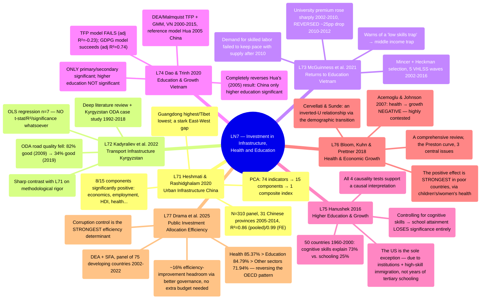

# LN7 — Investment in Development Infrastructure, Health and Education

Lecture 7 in [[overview]] (detailed schedule: [[ln0-course-intro]]). A 57-page slide deck, dated
01/08/2026, covering 7 required readings — the first lecture to combine ALL 3
development-investment pillars (infrastructure, education, health) in a single session, unlike
prior LNs which each focus on one topic.

## Lecture structure

Works through 7 papers in order: Heshmati & Rashidghalam 2020 (11 sections) → Kadyraliev et al.
2022 (5 sections) → McGuinness et al. 2021 (10 sections) → Dao & Trinh 2020 (7 sections) →
Hanushek 2016 (11 sections) → Bloom, Kuhn & Prettner 2018 (5 sections) → Drama et al. 2025 (2
sections), closing with 2 "Take away" slides summarizing all 7 papers. The slide structure
mirrors the lecture's logical sequence: opening with INFRASTRUCTURE (2 papers, Chinese
urbanization + transport), moving to EDUCATION (3 papers, VN×2 + cross-country), then HEALTH (1
paper, a comprehensive review), and closing with a SYNTHESIS paper covering both education+health
through the lens of public-investment allocative efficiency.

## Mindmap

## Main arguments by paper

### 1. Heshmati & Rashidghalam 2020 — [[l71-heshmati-rashidghalam-2020-urban-infrastructure-china]]

- Builds a composite urban-infrastructure index via PCA (74 indicators → 15 components → 1
  index) for 31 Chinese provinces 2005–2014, then regresses its effect on the urbanization rate
  (a N=310 panel, pooled OLS and fixed-effects).
- 8/15 infrastructure components (economics, employment, human development, health, housing,
  security, utilities, technology) have a significant POSITIVE effect on urbanization;
  education/environment are not significant — the "economic pull factor" matters more than the
  "indirect welfare pull factor".
- Marked provincial/regional gaps (Guangdong highest, Tibet lowest; the Eastern region dominant)
  — recommending each province needs its own urbanization plan, with the central government
  improving resource allocation between rich/poor provinces.

### 2. Kadyraliev et al. 2022 — [[l72-kadyraliev-2022-transport-infrastructure-investment]]

- A broad literature review on transport infrastructure–growth (Aschauer 1989, Calderon & Servén
  2004) combined with a Kyrgyzstan case study: foreign aid (ODA) 1992–2018 for transport
  infrastructure (averaging 11.2% of GDP/year).
- The empirical regression has only n=7 observations (2013–2019), reporting NO t-statistic/R²/
  significance test whatsoever — a clear methodological weakness, directly contrasting with
  L71's rigor.
- The more noteworthy findings are qualitative: ODA-funded road quality fell from 82% "good"
  (2009) to 34% "good" (2019), transport infrastructure debt (USD 1.463 billion) has a shorter
  term than road lifespan — a repayment risk arising before the infrastructure's useful life
  ends.

### 3. McGuinness et al. 2021 — [[l73-mcguinness-2021-returns-to-education-vietnam]]

- Estimates returns to education (Mincer + Heckman selection) in Vietnam across 5 VHLSS waves
  (2002, 2008, 2010, 2012, 2016), with a relative labor-demand analysis (Katz & Autor 1999).
- Finds a major turning point: university-education premiums rose sharply 2002–2010 (excess
  demand for skilled labor), then SHARPLY REVERSED (~25 percentage points) 2010–2012 despite the
  economy STILL growing, stabilizing lower 2012–2016.
- Warns of a "low skills trap" risk: low premiums → reduced human-capital investment incentive →
  attracting more low-skill FDI → further eroding premiums — potentially contributing to a
  middle income trap.

### 4. Dao & Trinh 2020 — [[l74-dao-2020-education-economic-growth-vietnam]]

- Tests the effect of education (3 levels) on VN growth 2000–2015, using Hua's (2005, China)
  reference model: TFP (DEA/Malmquist) + GDP growth, GMM estimation.
- The TFP model FAILS openly (adjusted R²=−0.23, the author admits it's "questionable"); the
  GDPG model succeeds (adjusted R²=0.74) — ONLY primary/secondary education are statistically
  significant, higher education is NOT (t=1.079).
- Completely reverses Hua's (2005) result for China (only higher education significant) —
  evidence that "returns to education by level" depend on development stage, not a universal
  constant.

### 5. Hanushek 2016 — [[l75-hanushek-2016-higher-education-economic-growth]]

- Rebuts the popular policy argument "expanding higher education → faster growth", using
  cross-country growth data for 50 countries 1960–2000 with a new measure: **knowledge capital**
  (international math/science test scores) instead of years of schooling.
- Cognitive skills explain 73.3% of growth variation (vs. 25.2% for school attainment); ONCE
  cognitive skills are controlled for, both tertiary and non-tertiary schooling LOSE ALL
  SIGNIFICANCE.
- The US is the sole exception with significant tertiary schooling (10%) but entirely due to
  strong institutions + attracting highly skilled immigrant talent (55% of US STEM PhDs are
  foreign-born), not years of tertiary schooling itself.

### 6. Bloom, Kuhn & Prettner 2018 — [[l76-bloom-2018-health-economic-growth]]

- A comprehensive review of theoretical + empirical literature on the health–growth
  relationship, organized around the Preston curve and 3 central issues: bidirectional
  causality, variation by development stage, differences by health dimension.
- A notable dispute: Acemoglu & Johnson (2007) find health → growth is NEGATIVE (using the
  epidemiological transition as an IV); Aghion et al. (2011)/Bloom et al. (2014) show the
  negative effect disappears when controlling for initial health; Cervellati & Sunde resolve it
  via a demographic-transition framework (an inverted-U-like relationship).
- The positive effect is STRONGEST for less-developed, post-transition countries, via
  children's/women's health (a demographic dividend); developed countries face
  "flat-of-the-curve medicine" and need social-security designs matching rising longevity.

### 7. Drama et al. 2025 — [[l77-drama-2025-public-investment-allocation-efficiency]]

- Measures cross-sectoral public-investment allocative efficiency (education vs. health vs.
  other) on a panel of 75 developing countries 2002–2022, using DEA (non-parametric) + SFA
  (parametric) + a two-stage Tobit simultaneously.
- Health (85.37%) and education (84.79%) are MORE efficient than other sectors/infrastructure
  (71.94%) — REVERSING the OECD pattern (Afonso & Aubyn 2006: education 85% > health 72% in rich
  countries).
- **Corruption control is the STRONGEST efficiency determinant** (strongest for infrastructure,
  coefficient 0.085) — with ~16% efficiency-improvement headroom via better governance WITHOUT
  more budget.

## Potential exam questions

1. Per Heshmati & Rashidghalam (2020), which 8/15 urban-infrastructure components have a
   significant positive effect on China's urbanization, and why are education/environment NOT
   significant? State the R² of the pooled OLS vs. fixed-effects models and explain the gap.
2. Compare the methodological rigor between Heshmati & Rashidghalam (2020, L71, a N=310 panel +
   PCA) and Kadyraliev et al. (2022, L72, an n=7 OLS with no significance testing) — why does the
   same production-function theoretical framework yield completely different empirical
   credibility?
3. McGuinness et al. (2021) find Vietnam's higher-education wage return sharply reversed
   2010–2012 despite the economy STILL growing. State the paper's explanatory mechanism (skilled
   labor supply-demand) and relate it to the "low skills trap"/[[middle-income-trap]] concept.
4. Dao & Trinh (2020) use Hua's (2005, China) reference model but obtain a COMPLETELY OPPOSITE
   result for Vietnam (primary/secondary significant vs. only higher education significant in
   China). Cross-reference with Hanushek's (2016, L75) argument — do the two papers contradict
   each other, or complement each other at what level?
5. Hanushek (2016) argues "school attainment" is a biased measure of human capital, proposing
   "knowledge capital" instead. State the 2 methodological problems with school attainment the
   paper identifies, and summarize at least 2/4 causality-testing strategies for cognitive
   skills → growth the paper uses.
6. Acemoglu & Johnson (2007), synthesized in Bloom, Kuhn & Prettner (2018, L76), find health
   improvements have a NEGATIVE effect on growth — contrary to most of the literature. Explain
   the mechanism (Solow-style capital dilution) and how Cervellati & Sunde (2011) reconcile this
   contradiction via a demographic-transition framework.
7. Drama et al. (2025) find health/education MORE efficient than infrastructure/other sectors in
   developing countries — REVERSING the pattern observed in the OECD. State the 2 strongest
   efficiency determinants per the paper's Tobit model, and explain why "other sectors"
   (infrastructure) is more corruption-sensitive than health/education.

## Links

- [[overview]] · [[ln0-course-intro]] · [[almas-heshmati]] (author of
  [[l71-heshmati-rashidghalam-2020-urban-infrastructure-china]])
- Concepts: [[infrastructure-investment-and-growth]], [[human-capital-returns-to-education]],
  [[health-and-growth]], [[public-investment-allocation-efficiency]]
