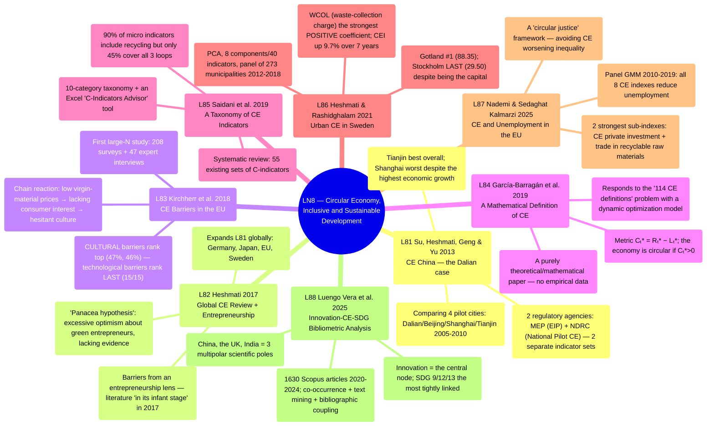

# LN8 — Circular Economy, Inclusive and Sustainable Development

Lecture 8 in [[overview]] (detailed schedule: [[ln0-course-intro]]). A 55-page slide deck, dated
1/8/2026, covering 8 required readings (6 papers from the original syllabus outline + 2 papers
L87/L88 the professor added later).

## Lecture structure

9 parts per the "Outline of Presentation" (slide 4): **The concept of CE** (slides 5-6, Pearce &
Turner's 1990 definition + 3R + 10 R-strategies) → **The Pearce & Turner model** (slides 7-11,
linear vs. circular economy diagrams, renewable/non-renewable resources) → **Why CE (the China
case)** (slides 12-24, 5 reasons A-E: environmental/human health, resource scarcity, green
standards/competitiveness, national security, solving other problems — leading directly into
[[l81-su-2013-circular-economy-china]] + the NDRC/MEP evaluation indicator systems + China's
barriers) → **A global CE review** (slides 25-33, based on
[[l82-heshmati-2017-review-circular-economy-implementation]]: aim, expected outcomes, CE as a
sustainable-development strategy, practices, the Sweden case, the OECD Green Growth evaluation
standard) → **OECD Green Growth Indicators** (slides 34-36) → **8 individually summarized
readings** (slides 37-54, each paper 1-3 slides in bullet-point form) → **Closing** (slide 55).

A notable feature: slides 12-24 (the China case) and 25-33 (the global review) do not just
introduce the readings but DEEPLY DISCUSS the content of [[l81-su-2013-circular-economy-china]]
and [[l82-heshmati-2017-review-circular-economy-implementation]] directly within the lecture
body — those 2 papers serve as the framework for 3/4 of the slide deck's opening, before
switching to individually summarizing all 8 papers (including those 2) at the end.

## Mindmap

## Main arguments by paper

### 1. Su, Heshmati, Geng & Yu 2013 — [[l81-su-2013-circular-economy-china]]

- A comprehensive review of CE in China + a quantitative case study: comparing Dalian's CE
  performance against Beijing, Shanghai, Tianjin via 10 indicators, 2005–2010.
- China manages CE through 2 central agencies (MEP, NDRC) publishing 2 different EIP evaluation
  indicator systems; **Tianjin performs best overall, Shanghai worst** despite the highest
  economic growth — rapid growth does not automatically come with good CE management.

### 2. Heshmati 2017 — [[l82-heshmati-2017-review-circular-economy-implementation]]

- Expands the CE review globally (Germany, Japan, EU, Sweden), adding an entirely new
  perspective: entrepreneurship and CE as an innovative national development strategy.
- The "panacea hypothesis" — an unevidenced belief that green entrepreneurs will automatically
  drive sustainable transformation; the entrepreneurship-CE literature was then "still in its
  infant stage."

### 3. Kirchherr et al. 2018 — [[l83-kirchherr-2018-barriers-circular-economy-eu]]

- The first large-N study on CE barriers in the EU (208 surveys + 47 interviews) — **rebutting**
  the common view that technological barriers are primary.
- Cultural barriers (lacking consumer interest, hesitant company culture) rank top;
  technological barriers rank LAST (15/15) — a complete reversal of prior literature.

### 4. García-Barragán, Eyckmans & Rousseau 2019 — [[l84-garcia-barragan-2019-defining-measuring-circular-economy]]

- A purely theoretical/mathematical paper: building a dynamic material-flow optimization model
  to give UNAMBIGUOUS definitions of linear/circular/circular-growth economies.
- The metric Cₜ* = optimal recycling activity minus optimal linear activity; the economy is
  circular if Cₜ*>0 — encompassing both recycling and product-lifetime extension/new business
  models.

### 5. Saidani, Yannou, Leroy, Cluzel & Kendall 2019 — [[l85-saidani-2019-taxonomy-circular-economy-indicators]]

- A systematic review identifying 55 existing circularity-indicator (C-indicator) sets, building
  a 10-category taxonomy + an Excel selection tool.
- 90% of micro-level indicators include recycling but only 45% cover all 3 main CE loops; 60%
  use only a single number to aggregate.

### 6. Heshmati & Rashidghalam 2021 — [[l86-heshmati-rashidghalam-2021-urban-circular-economy-sweden]]

- Building a composite CE index (CEI, PCA, 8 components/40 indicators) for 273 Swedish
  municipalities 2012–2018, regressing panel data to identify determinants.
- Gotland ranks #1, Stockholm ranks LAST despite being the most developed capital — high
  population density and unemployment REDUCE CEI; the waste collection charge is the STRONGEST
  policy lever.

### 7. Nademi & Sedaghat Kalmarzi 2025 — [[l87-nademi-kalmarzi-2025-circular-economy-unemployment]]

- Panel GMM across 8 models, European countries 2010–2019: **all 8 CE indexes significantly
  reduce unemployment**; the authors' own composite (PCA) CE index has the strongest effect.
- A "circular justice" framework — warning that social impacts on marginalized groups must be
  addressed to avoid CE worsening existing inequality.

### 8. Luengo Vera, Gómez Gandía, de Lucas Ancillo & del Val Núñez 2025 — [[l88-vera-2025-innovation-circular-economy-sdgs]]

- A bibliometric + conceptual analysis of 1630 Scopus articles 2020–2024 at the innovation × CE
  × SDGs intersection — 3 explicit research questions on how innovation connects CE to the SDGs.
- Innovation is the central node/"systemic enabler"; China, the UK, India are the 3 main
  scientific poles — a multipolar yet uneven landscape.

## Potential exam questions

1. Kirchherr et al. (2017) find 114 different CE definitions in the literature. How do L83, L84,
   and L85 respond differently to this problem — specify each paper's concrete approach
   (accepting/eliminating/organizing the ambiguity) and evaluate the pros/cons of each.
2. Compare the CE-barrier findings between [[l81-su-2013-circular-economy-china]]/
   [[l82-heshmati-2017-review-circular-economy-implementation]] (China context) and
   [[l83-kirchherr-2018-barriers-circular-economy-eu]] (EU context) — why are technological
   barriers seen as primary in one source but last in the other? Propose an explanation based
   on economic development level.
3. Contrast China's CE governance model ([[l81-su-2013-circular-economy-china]], top-down, 2
   central agencies) with Sweden's
   ([[l86-heshmati-rashidghalam-2021-urban-circular-economy-sweden]], decentralized, price
   levers) — specify each model's mechanism and assess which fits Vietnam's institutional
   context better.
4. Per [[l86-heshmati-rashidghalam-2021-urban-circular-economy-sweden]], why does Stockholm
   (Sweden's most developed capital) have the lowest CEI while peripheral municipalities
   (Gotland, Härjedalen) rank top? Specify the significant regression variables explaining this
   pattern.
5. Compare the PCA composite-index methodology used by
   [[l86-heshmati-rashidghalam-2021-urban-circular-economy-sweden]] (LN8),
   [[l71-heshmati-rashidghalam-2020-urban-infrastructure-china]] (LN7), and
   [[l61-heshmati-rashidghalam-2020-tfp-technology-shifters]] (LN6) — specify the common
   features (the author's "methodological signature") and each paper's differing dependent
   variable/context.
6. Per [[l87-nademi-kalmarzi-2025-circular-economy-unemployment]], through which channels does
   CE reduce unemployment in Europe? Contrast this "CE clearly reduces unemployment" macro-level
   finding with the more complex green-jobs picture in
   [[l56-sharma-subba-2025-green-startups-sustainability]] (LN5, micro-level) — do these two
   findings conflict, or reflect a difference in level of analysis?
7. Per [[l85-saidani-2019-taxonomy-circular-economy-indicators]], why is using the recycling
   rate directly as a CE proxy "methodologically unsatisfactory"? Connect this to
   [[l84-garcia-barragan-2019-defining-measuring-circular-economy]]'s mathematical definition to
   explain the difference between "measuring activity" and "measuring maximized value."
8. [[l88-vera-2025-innovation-circular-economy-sdgs]] finds China, the UK, and India are the 3
   main scientific poles on CE-innovation-SDG. Contrast this with China's central role across
   LN8's other qualitative case studies ([[l81-su-2013-circular-economy-china]],
   [[l82-heshmati-2017-review-circular-economy-implementation]]) — what claim about China's
   global CE leadership does this bibliometric evidence reinforce?

## Links

- [[overview]] · [[ln0-course-intro]] · [[almas-heshmati]]
- Full slide-by-slide translation: [[ln8-slides]]
- Concept: [[circular-economy]]
