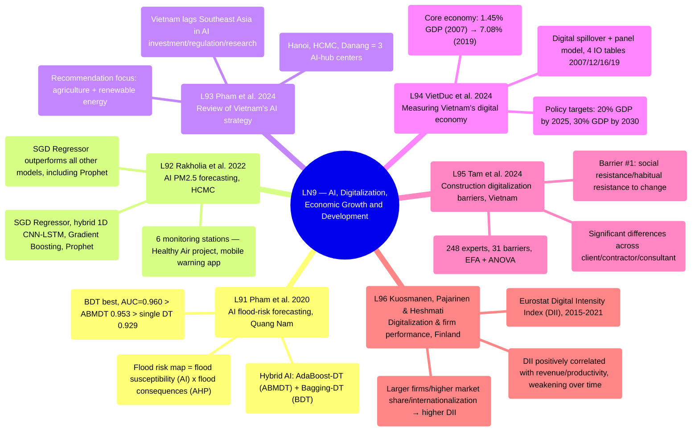

# LN9 — Artificial Intelligence, Digitalization and Economic Growth and Development

Lecture 9 in [[overview]] (detailed schedule: [[ln0-course-intro]]). A 38-page slide deck, dated 6/8/2026, covering 6 required readings (L91–L96) — the first 2 papers apply AI to environmental/disaster risk management in Vietnam, the remaining 4 shift to measuring digitalization's impact on the economy and firm performance.

## Lecture structure

The deck has no explicit "Outline of Presentation" section like LN7/LN8 — a simpler structure: **the list of 6 readings** (slide 3, with full citations) → **6 individually summarized readings in order** (slides 4–30, each paper 1–6 bullet-point slides) → **"Recent useful research and reading"** (slides 31–37, 3 supplementary papers with NO PDF in `raw/` — Tu et al. 2026 on AI industrial policy in China, Lin-Xu 2025 on digital transformation & China's high-quality growth, Rashidghalam et al. 2026 IZA DP on AI in the Vietnamese economy — only a slide summary exists, not deep-ingested as separate `source` pages since the underlying papers are unavailable) → **Closing** (slide 38).

A notable feature: this lecture has 2 CLEARLY SEPARATE thematic clusters within a single session — (1) AI for disaster/environmental risk management in Vietnam (L91 flooding, L92 air quality), and (2) measuring/assessing digitalization's impact on the economy and firms (L93 national AI strategy, L94 digital economy scale, L95 construction digitalization barriers, L96 digitalization & firm performance) — unlike prior lectures, these 2 clusters have no "trunk" paper linking them, sharing only the broad "AI & Digitalization" theme.

## Mindmap

## Main arguments by paper

### 1. Pham et al. 2020 — [[l91-pham-2020-flood-risk-ai-vietnam]]

- Combines 2 hybrid AI models (ABMDT, BDT) with Decision Table as the base classifier to map flood susceptibility in Quang Nam, using 847 historical flood locations + 14 influencing factors.
- The BDT model performs best (AUC=0.960); the final flood-risk map combines the susceptibility map (AI) with a consequences map (AHP method) — a reusable 2-layer framework applicable to other flood-prone areas.

### 2. Rakholia et al. 2022 — [[l92-rakholia-2022-air-quality-ai-hcmc]]

- Compares 4 ML algorithms (SGD Regressor, hybrid 1D CNN-LSTM, Gradient Boosting, Prophet) forecasting hourly PM2.5 across 6 HCMC monitoring stations, proposing a dedicated training protocol to address the non-stationarity of the PM2.5 time series.
- The SGD Regressor outperforms all other models including the popular Prophet; results feed directly into the "Healthy Air" early-warning mobile app.

### 3. Pham et al. 2024 — [[l93-pham-2024-ai-development-vietnam-review]]

- A critical review comparing Vietnam's AI investment/regulatory/research framework against other Southeast Asian countries — Vietnam is assessed as lagging on all 3 pillars.
- Recommends concentrating resources on agriculture + renewable energy, building Ministerial-level research linkage mechanisms; Hanoi, HCMC, and Danang are the 3 potential AI-hub centers.

### 4. VietDuc et al. 2024 — [[l94-vietduc-2024-digital-economy-vietnam]]

- Measures the scale of Vietnam's digital economy using digital spillover + a panel model on 4 national Input-Output tables (2007/2012/2016/2019).
- The core digital economy grew from 1.45% of GDP (2007) to 7.08% (2019); the digitalized economy reached 11.56% of GDP in 2016–2019 — implying the need for policy to hit the 20%-of-GDP (2025)/30%-of-GDP (2030) targets.

### 5. Tam et al. 2024 — [[l95-tam-2024-construction-digitalization-barriers-vietnam]]

- Surveys 248 Vietnamese construction professionals (client/contractor/consultant) on 31 digitalization barriers, using reliability tests + EFA + ANOVA.
- The biggest barrier is social/habitual resistance to change, followed by high software/hardware costs, lack of market data, security concerns, and lack of standardization.

### 6. Kuosmanen, Pajarinen & Heshmati — [[l96-kuosmanen-2026-digital-adoption-firm-performance-finland]]

- Uses the Eurostat Digital Intensity Index (DII) on Finnish service-firm data 2015–2021, merged with a financial-statement panel to measure the digitalization–performance relationship.
- The DII–revenue correlation stays positive persisting through COVID-19; the DII–productivity correlation weakens over time; larger firms/higher market share/international activity have higher DII.

## Potential exam questions

1. Compare the 2 AI-for-risk-management applications in Vietnam — [[l91-pham-2020-flood-risk-ai-vietnam]] (flooding) and [[l92-rakholia-2022-air-quality-ai-hcmc]] (air quality) — on their goals, the AI models used, and how results feed into real-world applications.
2. Per [[l93-pham-2024-ai-development-vietnam-review]] and [[l94-vietduc-2024-digital-economy-vietnam]], where does Vietnam stand in digital transformation relative to the region, and what policies do the 2 papers propose to hit the 20–30%-of-GDP digitalized-economy targets?
3. [[l95-tam-2024-construction-digitalization-barriers-vietnam]] finds cultural/habitual resistance is the largest barrier, NOT technological barriers — compare with the similar cultural-barrier finding in [[l83-kirchherr-2018-barriers-circular-economy-eu]] (LN8, CE barriers in the EU). What do these 2 findings share about the nature of "transition barriers" across different countries/sectors?
4. Per [[l96-kuosmanen-2026-digital-adoption-firm-performance-finland]], why does the digitalization–productivity correlation weaken over time even as the digitalization–revenue correlation stays robust? Connect this possibility to the "negative TC/TFP" finding in [[l61-heshmati-rashidghalam-2020-tfp-technology-shifters]] (LN6) — what do both papers jointly suggest about the limits of technology in raising productivity?
5. Vietnam is the shared context of 4/6 LN9 readings (L91, L92, L93, L95) — synthesize these findings into a picture of Vietnam's digital/AI transformation capacity: strengths (specific technical applications like L91/L92), weaknesses (policy/investment like L93, behavioral barriers like L95).

## Links

- [[overview]] · [[ln0-course-intro]] · [[almas-heshmati]]
- Full slide-by-slide translation: [[ln9-slides]]
- Concept: [[ai-for-environmental-risk-vietnam]], [[digital-transformation-and-productivity]]
