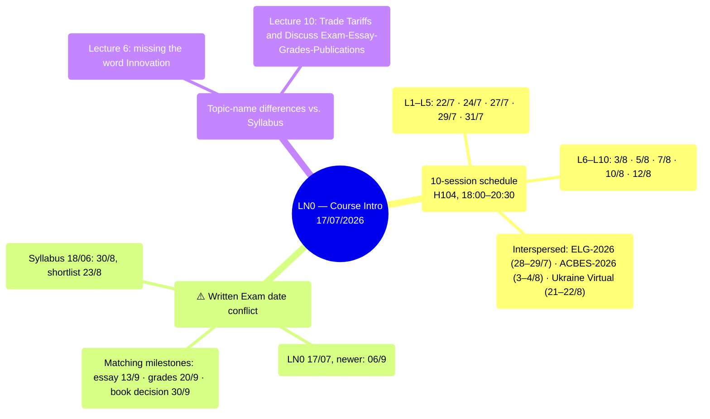

# LN0 — Course Intro (17/07/2026)

A 14-slide deck: detailed class schedule plus the full reading list for all 10 lectures.
Original title "Development Economics vs Economic Development," but the content is mostly
administrative.

## Mindmap

## Class Schedule (18:00–20:30, Room H104)

| #   | Date     |     | #   | Date     |
| --- | -------- | --- | --- | -------- |
| L1  | Wed 22/7 |     | L6  | Mon 3/8  |
| L2  | Fri 24/7 |     | L7  | Wed 5/8  |
| L3  | Mon 27/7 |     | L8  | Fri 7/8  |
| L4  | Wed 29/7 |     | L9  | Mon 10/8 |
| L5  | Fri 31/7 |     | L10 | Wed 12/8 |

Interspersed: the ELG-2026 Conference (28–29/7), ACBES-2026 (3–4/8), Ukraine Virtual Conference
(21–22/8).

## ⚠️ CONFLICT with the Syllabus — Written Exam Date

| Source | Exam Date |
|---|---|
| [[syllabus-2026]] (18/06/2026) | **30/8** (shortlist of 20 articles: 23/8) |
| LN0 (17/07/2026 — **newer**) | **Sept 06** |

Since LN0 is newer, **06/9** is treated as the current date for now, but this NEEDS
CONFIRMATION from the professor/class. Other milestones match: essay 13/9, grades 20/9, book
decision 30/9.

## Minor Differences in Topic Names vs. the Syllabus

- Lecture 6: "Technology, Growth, Inequality and Poverty" (the syllabus additionally includes
  "Innovation").
- Lecture 10: "Trade Tariffs and Discuss Exam-Essay-Grades-Publications."

## Links

- [[overview]] · [[ln1-economic-development]] · [[almas-heshmati]]
