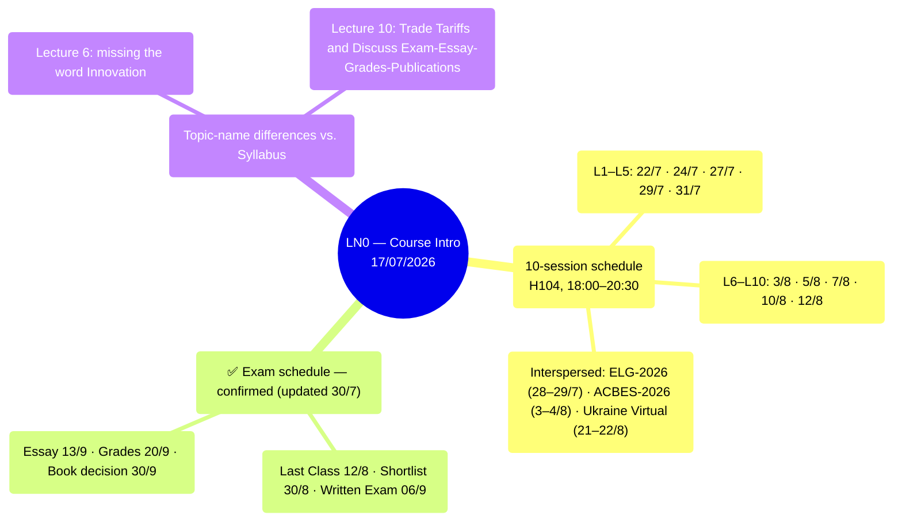

# LN0 — Course Intro (17/07/2026)

A 14-slide deck: detailed class schedule plus the full reading list for all 10 lectures.
Original title "Development Economics vs Economic Development," but the content is mostly
administrative.

## Mindmap

## Class Schedule (18:00–20:30, Room H104)

| #   | Date     |     | #   | Date     |
| --- | -------- | --- | --- | -------- |
| L1  | Wed 22/7 |     | L6  | Mon 3/8  |
| L2  | Fri 24/7 |     | L7  | Wed 5/8  |
| L3  | Mon 27/7 |     | L8  | Fri 7/8  |
| L4  | Wed 29/7 |     | L9  | Mon 10/8 |
| L5  | Fri 31/7 |     | L10 | Wed 12/8 |

Interspersed: the ELG-2026 Conference (28–29/7), ACBES-2026 (3–4/8), Ukraine Virtual Conference
(21–22/8).

## ✅ Exam Schedule — Confirmed (Updated 30/7)

The professor presented an updated "Planning Schedule" slide directly in class (screenshot,
see `also_covers` in the frontmatter) — this is the **most recent** source, superseding both
the syllabus (18/06) and the original LN0 deck (17/07) wherever they differ:

| Milestone | Syllabus (18/06) | Original LN0 (17/07) | **Planning Schedule (most recent)** |
|---|---|---|---|
| Last Class | — | 12/8 (L10) | **12/8** — matches |
| Shortlist of 20 | 23/8 | — | **30/8** — ⚠️ changed vs. syllabus |
| Written Exam | 30/8 | 06/9 | **06/9** — confirms the LN0 date, NOT the syllabus |
| Essay deadline | 13/9 | 13/9 | **13/9** — matches |
| Grades submitted | 20/9 | 20/9 | **20/9** — matches |
| Book publication decision | 30/9 | 30/9 | **30/9** — matches |

**The earlier syllabus-vs-LN0 exam-date conflict is now resolved**: the Written Exam is
officially **06/9** (not 30/8 as the syllabus originally stated). One more thing to note: the
shortlist-of-20 date has **moved from 23/8 to 30/8** — a week later than the syllabus's
original plan, leaving only ~1 week between receiving the shortlist and the exam (06/9).

## Minor Differences in Topic Names vs. the Syllabus

- Lecture 6: "Technology, Growth, Inequality and Poverty" (the syllabus additionally includes
  "Innovation").
- Lecture 10: "Trade Tariffs and Discuss Exam-Essay-Grades-Publications."

## Links

- [[overview]] · [[ln1-economic-development]] · [[almas-heshmati]]
