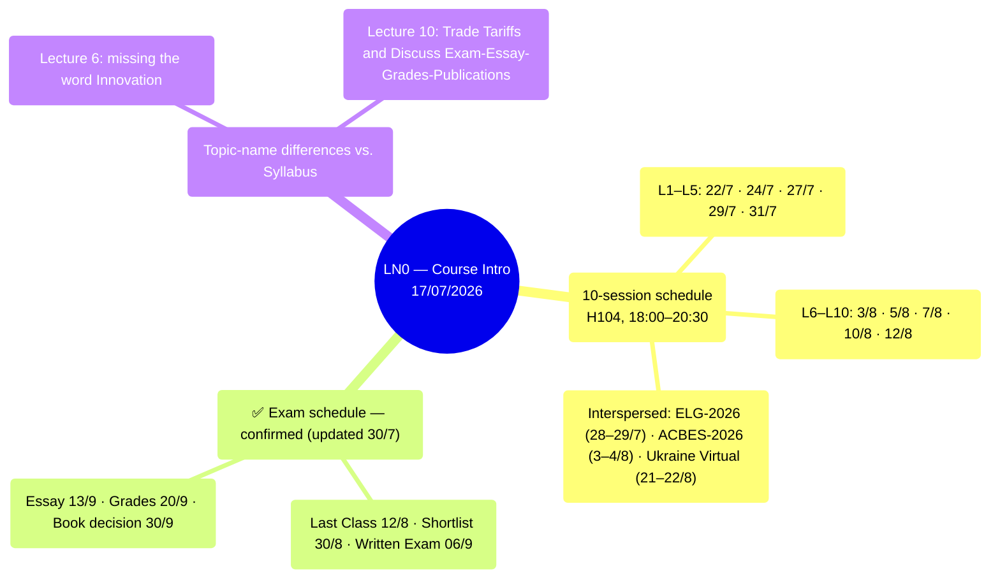

# LN0 — Course Intro (17/07/2026)

A 14-slide deck: detailed class schedule plus the full reading list for all 10 lectures.
Original title "Development Economics vs Economic Development," but the content is mostly
administrative.

## Mindmap

## Class Schedule (18:00–20:30, Room H104)

| #   | Date     |     | #   | Date     |
| --- | -------- | --- | --- | -------- |
| L1  | Wed 22/7 |     | L6  | Mon 3/8  |
| L2  | Fri 24/7 |     | L7  | Wed 5/8  |
| L3  | Mon 27/7 |     | L8  | Fri 7/8  |
| L4  | Wed 29/7 |     | L9  | Mon 10/8 |
| L5  | Fri 31/7 |     | L10 | Wed 12/8 |

Interspersed: the ELG-2026 Conference (28–29/7), ACBES-2026 (3–4/8), Ukraine Virtual Conference
(21–22/8).

## ✅ Exam Schedule — Confirmed (Updated 30/7)

The professor presented an updated "Planning Schedule" slide directly in class (screenshot,
see `also_covers` in the frontmatter) — this is the **most recent** source, superseding all
earlier dates in the syllabus (18/06) and the original LN0 deck (17/07):

- **Written Exam: 06/9** — official, confirms the original LN0 date, NOT 30/8 as the syllabus
  originally stated.
- **Shortlist of 20: 30/8** — moved from 23/8 (syllabus) to 30/8, a week later than the
  original plan, leaving only ~1 week between receiving the shortlist and the exam.
- Last Class **12/8** · Essay deadline **13/9** · Grades submitted **20/9** · Book publication
  decision **30/9** — these dates match across all 3 sources (syllabus/LN0/Planning Schedule),
  unchanged.

## ✅ Written-Exam Structure — Announced in Class (8/11/2026)

⚠️ **Source**: the professor announced this verbally in class, relayed by the user — there is NO
file/screenshot in `raw/` as documentary evidence (unlike the exam-schedule section above, which
has a slide screenshot). Recorded here as a single reference point, but with lower certainty than
the dates backed by photo/PDF evidence.

- **2 parts**: Part 1 is **2 compulsory questions**; Part 2 is **elective, answer 4 questions**
  (from a larger question set — the exact number of elective questions offered is not yet known,
  only that 4 must be answered).
- **Duration**: tentatively **2 hours**.
- **Format**: closed-book — consistent with [[k31-final-exam]] (K31's exam was also
  closed-book).
- **The professor's recommended paper-reading strategy**: when reading each shortlisted paper,
  focus on the **Abstract, Methodology, Discussion, and Conclusion** to derive the policy
  implications yourself — this is exactly the type of question the exam tends to ask (see the
  example in [[k31-final-exam]]). Alternative/supplement: read the **lecture note** carefully
  (the professor's own slide summaries) if there isn't enough time to read every original PDF
  in full.
- ⚠️ **Important for shortlist prediction**: the professor confirmed he will **NOT reuse the
  exact same 20 papers chosen for K31 (2025)** — this year's picks will differ. This reverses the
  previous prediction method in [[shortlist-prediction]] (the 2026-08-08 version had assumed the
  professor would repeat the K31 shortlist exactly) — see that page for the new prediction method
  (excluding the 20 K31 papers, inferring from the remaining 42).

## Minor Differences in Topic Names vs. the Syllabus

- Lecture 6: "Technology, Growth, Inequality and Poverty" (the syllabus additionally includes
  "Innovation").
- Lecture 10: "Trade Tariffs and Discuss Exam-Essay-Grades-Publications."

## Links

- [[overview]] · [[ln1-economic-development]] · [[almas-heshmati]]
