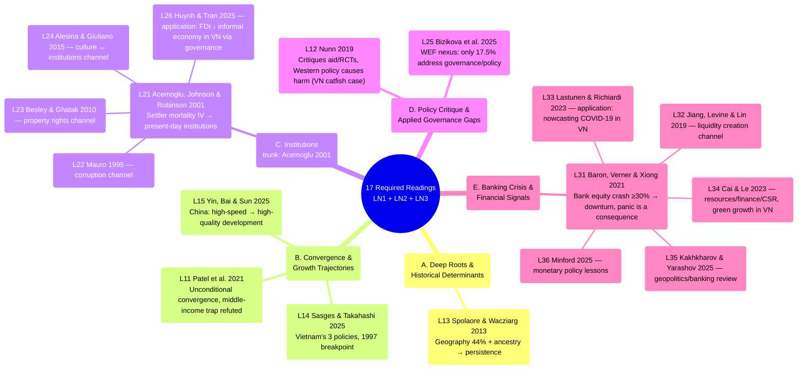

# Mindmap of All Required Readings — LN1, LN2 & LN3

Synthesized from [[ln1-economic-development]], [[ln2-governance-institutions-policy-making]] and
[[ln3-financial-crisis-and-pandemics]] (17 papers; lectures 4–10 have no material in `raw/` yet
— see [[overview]]). Unlike the per-lecture mindmaps (which follow the professor's exact slide
order), this page groups the 17 papers into **5 thematic clusters that cut across lectures** to
surface connections that don't fit neatly within a single class session — especially the
Institutions cluster, where Acemoglu et al. (2001) serves as the theoretical "trunk" that 3
other LN2 papers build on via 3 specific channels, and the Banking Crisis cluster, where Baron,
Verner & Xiong (2021) plays the same role for the other 5 LN3 papers.

## Mindmap by thematic cluster

## The 5 clusters explained

### A. Deep Roots & Historical Determinants

Only 1 paper is a pure deep-roots theory piece ([[l13-spolaore-2013-deep-roots]]), but **L21
Acemoglu is also a deep-roots argument** — it just differs in transmission channel: Spolaore
uses ancestry/geography directly, while Acemoglu uses institutions as the mediating variable
(historical settler mortality → institutions persisting to the present). See
[[deep-roots-of-development]].

### B. Convergence & Growth Trajectories

3 papers all answer "which countries are catching up, and why": Patel at the global level
([[unconditional-convergence]]), Yin within China (East vs Central/West —
[[high-quality-development]]), Sasges within Vietnam via 3 specific policies. All three suggest
an essay could examine growth inequality **within a single country** (VN provinces, Chinese
regions) rather than just comparing across countries.

### C. Institutions — 4 specific channels

This is the densest cluster in LN1+LN2 (5/11 papers) and has the clearest hierarchical
structure: [[institutions]] (Acemoglu) is the original theoretical framework, and each of the 3
subsequent papers explores a different **transmission channel** from institutions to economic
outcomes — corruption (Mauro), property rights (Besley & Ghatak), culture (Alesina & Giuliano)
— while Huynh & Tran is the only paper in this cluster that **tests directly on Vietnamese
data** (63 provinces, 2006–2021).

### D. Policy Critique & Applied Governance Gaps

2 papers fall outside the convergence/institutions theoretical framework, instead critiquing the
gap between research and policy: Nunn critiques aid + RCTs at the macro level, Bizikova
identifies a governance gap in the WEF nexus literature (only 17.5% of studies actually address
policy). Both are a reminder that "knowing the cause" (clusters A–C) doesn't necessarily lead to
"the right policy."

### E. Banking Crisis & Financial Signals

A new cluster from LN3 (6/17 papers), with a hierarchical structure similar to cluster C:
[[banking-crisis]] (Baron, Verner & Xiong 2021) is the theoretical trunk — demonstrating that a
bank equity crash by itself already predicts a downturn, with panic being merely an amplifying
consequence — while each of the other 5 papers explores a different angle: Jiang et al. digs
into the liquidity creation channel (bank competition), Lastunen & Richiardi apply the same
"financial data as an early signal" logic to forecasting Vietnam's COVID-19 recovery, Cai & Le
look at the resources–finance–green growth angle in Vietnam, and Kakhkharov & Yarashov and
Minford are two review/macro-policy papers that frame the geopolitical and long-run monetary
history context for the whole cluster.

## Comparison with the per-lecture mindmaps

- The mindmaps within [[ln1-economic-development]],
  [[ln2-governance-institutions-policy-making]] and [[ln3-financial-crisis-and-pandemics]]:
  follow the **exact order the professor taught the slides**, useful for reviewing session by
  session.
- The mindmap on this page: organized by **cross-lecture theme**, useful for seeing which papers
  answer the same theoretical question even though they sit in different lectures — for example
  when studying for comparison-style questions ("compare how papers X and Y explain Z").

## Links

- [[overview]] · [[ln1-economic-development]] · [[ln2-governance-institutions-policy-making]] ·
  [[ln3-financial-crisis-and-pandemics]]
- Concepts: [[deep-roots-of-development]], [[unconditional-convergence]],
  [[high-quality-development]], [[institutions]], [[middle-income-trap]], [[banking-crisis]]
