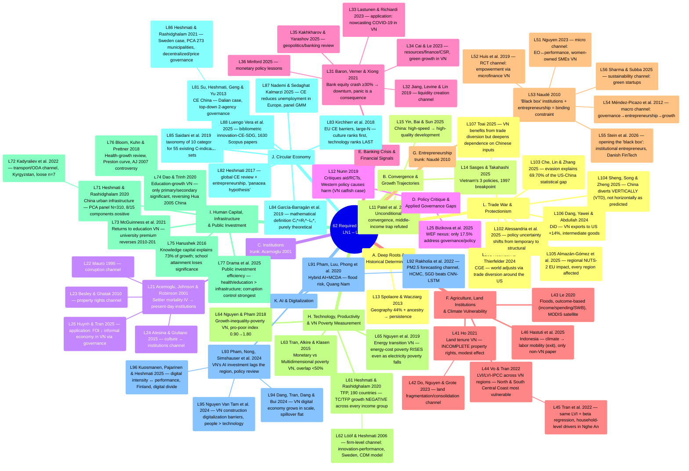

# Mindmap of All Required Readings — LN1–LN10

Synthesized from [[ln1-economic-development]], [[ln2-governance-institutions-policy-making]],
[[ln3-financial-crisis-and-pandemics]], [[ln4-agriculture-climate-change-natural-disasters]],
[[ln5-entrepreneurship-economic-development]], [[ln6-technology-growth-inequality-poverty]],
[[ln7-investment-infrastructure-health-education]],
[[ln8-circular-economy-inclusive-sustainable-development]],
[[ln9-ai-digitalization-economic-development-growth]] and
[[ln10-impacts-trade-war-vietnamese-economy]] (62 papers; all 10 lectures fully deep-ingested —
see [[overview]]). Unlike the per-lecture mindmaps (which follow the professor's exact slide
order), this page groups the 62 papers into **12 thematic clusters that cut across lectures** to
surface connections that don't fit neatly within a single class session — especially the
Institutions cluster, where Acemoglu et al. (2001) serves as the theoretical "trunk" that several
other papers (LN2, and now LN4/LN5/LN7 too) build on; the Banking Crisis cluster, where Baron,
Verner & Xiong (2021) plays the same role for the other 5 LN3 papers; the Entrepreneurship
cluster, where Naudé (2010) serves as the programmatic trunk for the other 5 LN5 papers; 3
clusters from LN6-8 — Technology/Productivity/VN Poverty Measurement (LN6, 2 independent axes),
Human Capital/Infrastructure/Public Investment (LN7, 4 sub-themes), and Circular Economy (LN8, 2
same-author empirical cases + 3 definition/measurement papers + 2 emerging channels); and 2 new
clusters from LN9-10 — AI & Digitalization (LN9, 2 independent axes) and Trade War &
Protectionism (LN10, global mechanisms + Vietnam evidence).

## Mindmap by Thematic Cluster

## The 12 Clusters Explained

### A. Deep Roots & Historical Determinants

Only 1 paper is a pure deep-roots theory piece ([[l13-spolaore-2013-deep-roots]]), but **L21
Acemoglu is also a deep-roots argument** — it just differs in transmission channel: Spolaore
uses ancestry/geography directly, while Acemoglu uses institutions as the mediating variable
(historical settler mortality → institutions persisting to the present). See
[[deep-roots-of-development]].

### B. Convergence & Growth Trajectories

3 papers all answer "which countries are catching up, and why": Patel at the global level
([[unconditional-convergence]]), Yin within China (East vs Central/West —
[[high-quality-development]]), Sasges within Vietnam via 3 specific policies. All three suggest
an essay could examine growth inequality **within a single country** (VN provinces, Chinese
regions) rather than just comparing across countries.

### C. Institutions — 4 Specific Channels

This is the densest cluster in LN1+LN2 (5/11 papers) and has the clearest hierarchical
structure: [[institutions]] (Acemoglu) is the original theoretical framework, and each of the 3
subsequent papers explores a different **transmission channel** from institutions to economic
outcomes — corruption (Mauro), property rights (Besley & Ghatak), culture (Alesina & Giuliano)
— while Huynh & Tran is the only paper in this cluster that **tests directly on Vietnamese
data** (63 provinces, 2006–2021).

### D. Policy Critique & Applied Governance Gaps

2 papers fall outside the convergence/institutions theoretical framework, instead critiquing the
gap between research and policy: Nunn critiques aid + RCTs at the macro level, Bizikova
identifies a governance gap in the WEF nexus literature (only 17.5% of studies actually address
policy). Both are a reminder that "knowing the cause" (clusters A–C) doesn't necessarily lead to
"the right policy."

### E. Banking Crisis & Financial Signals

A new cluster from LN3 (6/62 papers), with a hierarchical structure similar to cluster C:
[[banking-crisis]] (Baron, Verner & Xiong 2021) is the theoretical trunk — demonstrating that a
bank equity crash by itself already predicts a downturn, with panic being merely an amplifying
consequence — while each of the other 5 papers explores a different angle: Jiang et al. digs
into the liquidity creation channel (bank competition), Lastunen & Richiardi apply the same
"financial data as an early signal" logic to forecasting Vietnam's COVID-19 recovery, Cai & Le
look at the resources–finance–green growth angle in Vietnam, and Kakhkharov & Yarashov and
Minford are two review/macro-policy papers that frame the geopolitical and long-run monetary
history context for the whole cluster.

### F. Agriculture, Land Institutions & Climate Vulnerability

A new cluster from LN4 (6/62 papers), structured DIFFERENTLY from the two trunk-based clusters
above — it combines two independent axes united by a common setting, "rural households in
Vietnam/Southeast Asia": (i) **land institutions** — L41 (Ho 2021, property rights/tenure
security, a modest effect because rights are incomplete) and L42 (Do, Nguyen & Grote 2023, land
fragmentation/consolidation) — both about Vietnamese land, but two independent channels, see
[[institutions]]; (ii) **natural disasters/climate change** — L43 (Le 2020, floods, measured via
outcomes), L44+L45 (Vo & Tran 2022; Tran et al. 2022, sharing the LVI/LVI-IPCC instrument but
differing in resolution/purpose, see [[livelihood-vulnerability-index]]), and L46 (Hastuti et al.
2025, Indonesia — the only paper treating labor mobility as an "exit" strategy rather than local
adaptation).

### G. Entrepreneurship & Institutions

A new cluster from LN5 (6/62 papers), with a trunk structure similar to clusters C/E:
[[entrepreneurship-and-development]] (Naudé 2010) is the programmatic trunk — setting out two
research gaps (entrepreneurship being under-studied; institutions as a "black box") that the
other 5 papers each concretize through a different channel: Nguyen (2023) and Huis et al. (2019)
are two Vietnamese micro/household-level channels (EO↔performance for women-owned SMEs; RCT
empowerment via microfinance), Méndez-Picazo et al. (2012) is the macro channel
(governance→entrepreneurship→growth, directly citing Acemoglu's 2003 framework — a clear bridge
back to [[institutions]] in LN2), Stein et al. (2026) "opens" the very black box Naudé poses,
through a concrete case study of institutional entrepreneurs (Danish FinTech), and Sharma & Subba
(2025) extends the logic to sustainability/green startups.

### H. Technology, Productivity & Vietnam Poverty Measurement

A new cluster from LN6 (5/62 papers), with a structure DIFFERENT from the trunk-based clusters
above — 2 independent axes within the same lecture: (i) **technology/productivity** — L61
(Heshmati & Rashidghalam 2020, 190-country TFP, TC/TFP growth NEGATIVE across every income
group, see [[technology-change-and-tfp-growth]]) + L62 (Lööf & Heshmati 2006, Swedish
innovation-firm performance) — a same-author (Prof. Heshmati) methodological pair, differing in
unit of analysis (country vs. firm); (ii) a **"Vietnam poverty-measurement triangle"** — L63
(Tran, Alkire & Klasen 2015, multidimensional/Alkire-Foster), L64 (Nguyen & Pham 2018, monetary/
FGT + Datt-Ravallion, exactly the paper behind [[k31-final-exam]] Q2), L65 (Nguyen et al. 2019,
energy/SUREG) — 3 independent lenses all converging on "poverty measures diverge," see
[[growth-inequality-poverty-nexus]].

### I. Human Capital, Infrastructure & Public Investment

A new cluster from LN7 (7/62 papers), the first lecture to combine ALL 3 development-investment
pillars in one session: **infrastructure** — L71 (Heshmati & Rashidghalam 2020, Chinese
urbanization, rigorous PCA panel N=310) + L72 (Kadyraliev et al. 2022, Kyrgyzstan transport/ODA,
a loose n=7 — a methodological-rigor contrast pair, see
[[infrastructure-investment-and-growth]]); **education** — L73 (McGuinness et al. 2021, VN wage
premium), L74 (Dao & Trinh 2020, VN GDP growth), L75 (Hanushek 2016, cross-country knowledge
capital) — 3 angles of skepticism toward "expanding higher education" via 3 different
mechanisms, see [[human-capital-returns-to-education]]; **health** — L76 (Bloom, Kuhn & Prettner
2018, a health-growth review, the Preston curve, see [[health-and-growth]]); **synthesis** — L77
(Drama et al. 2025, cross-sectoral public-investment allocative efficiency, corruption control
strongest, a direct bridge to [[institutions]] LN2, see
[[public-investment-allocation-efficiency]]).

### J. Circular Economy

A new cluster from LN8 (8/62 papers), with NO single trunk paper: 2 **same-author empirical
cases** (Prof. Heshmati) as pillars — L81 (Su, Heshmati, Geng & Yu 2013, China, top-down
governance via 2 agencies MEP/NDRC) + L86 (Heshmati & Rashidghalam 2021, Sweden,
decentralized/price-lever governance, a PCA index for 273 municipalities) — opposing governance
models; L82 (Heshmati 2017) is a global review bridging the 2 cases + adding an entrepreneurship
lens ("panacea hypothesis"); 3 **definition/measurement** papers — L83 (Kirchherr et al. 2018,
accepting the composite definition, measuring EU barriers via a large-N survey), L84
(García-Barragán et al. 2019, eliminating ambiguity via a mathematical definition), L85 (Saidani
et al. 2019, organizing plurality via a 55-indicator taxonomy) — see [[circular-economy]]
(Debates section); 2 **emerging channels** — L87 (Nademi & Sedaghat Kalmarzi 2025,
CE-unemployment in Europe), L88 (Luengo Vera et al. 2025, innovation-CE-SDG bibliometrics).

### K. AI & Digitalization

A new cluster from LN9 (6/62 papers), 2 independent axes within the same lecture: (i) **AI for
environmental risk in Vietnam** — L91 (Pham et al. 2020, hybrid AI+MCDA, flood risk in Quang
Nam) + L92 (Rakholia et al. 2022, PM2.5 forecasting in HCMC — the simple linear SGD beats
CNN-LSTM/Prophet, see [[ai-for-environmental-risk-vietnam]]); (ii) **digital transformation &
productivity** — L93 (Pham, Nong, Simshauser et al. 2024, Vietnam's AI investment lags the
region, a policy review) + L94 (Dang, Tran, Dang & Bui 2024, Vietnam's digital economy grows in
scale but spillover stays flat) + L95 (Nguyen Van Tam et al. 2024, construction-digitalization
barriers in Vietnam — people > technology) + L96 (Kuosmanen, Pajarinen & Heshmati 2025, digital
intensity ↔ firm performance in Finland, a "digital divide" — sharing an author, Prof. Heshmati,
with L61/L71/L86, see [[digital-transformation-and-productivity]]).

### L. Trade War & Protectionism

A new cluster from LN10 (7/62 papers), with NO single trunk paper, 2 axes: (i)
**global/theoretical mechanisms** — L101 (Robinson & Thierfelder 2024, CGE, the world adjusts via
trade diversion around the US), L102 (Alessandria et al. 2025, policy uncertainty shifting from
temporary to structural), L103 (Che, Lin & Zhang 2025, evasion explains 69.70% of the US-China
statistical gap), L104 (Sheng, Song & Zheng 2025, China diverts VERTICALLY — VTD — not
horizontally as predicted), L105 (Almazán-Gómez et al. 2025, regional NUTS-2 European impact,
every region affected); (ii) **Vietnam evidence** — L106 (Dang, Yawei & Abdullah 2024, DiD,
Vietnamese exports to the US +14%, concentrated in intermediate goods) + L107 (Toai 2025, a
review, Vietnam benefits from trade diversion but deepens dependence on Chinese inputs +
transshipment risk) — see [[trade-war-and-protectionism]]. Notable nuance: L104 confirms Vietnam
is NOT a primary destination of China's VTD flow — the mechanism by which Vietnam benefits in
L106/L107 (direct US-China tariff evasion) differs entirely from L104's VTD mechanism.

## Comparison with the Per-Lecture Mindmaps

- The mindmaps in [[ln1-economic-development]],
  [[ln2-governance-institutions-policy-making]], [[ln3-financial-crisis-and-pandemics]],
  [[ln4-agriculture-climate-change-natural-disasters]],
  [[ln5-entrepreneurship-economic-development]], [[ln6-technology-growth-inequality-poverty]],
  [[ln7-investment-infrastructure-health-education]],
  [[ln8-circular-economy-inclusive-sustainable-development]],
  [[ln9-ai-digitalization-economic-development-growth]] and
  [[ln10-impacts-trade-war-vietnamese-economy]]: follow the professor's exact **slide order**,
  useful for reviewing session by session.
- The mindmap on this page: organized by **cross-lecture theme**, useful for seeing which papers
  answer the same theoretical question even though they sit in different lectures — for example
  when studying for comparison-style questions ("compare how papers X and Y explain Z"). Clusters
  F and G are especially notable since both bridge back to [[institutions]] (LN2) — L41/L42/L54
  all build directly on the Acemoglu framework; new cluster I bridges similarly via L77
  (corruption control), and cluster J via its top-down/decentralized governance models directly
  contrasting [[institutions]]. Cluster K (LN9) repeats the "scale growth ≠ quality improvement"
  motif already seen in cluster H (L61, the same author, Prof. Heshmati) — see 3.26 in
  [[exam-prep]]; cluster L (LN10) is the first cluster that does NOT bridge directly to
  [[institutions]], instead connecting to cluster C via the "evading formal policy" motif (L103
  vs. L26 — see 3.29).

## Links

- [[overview]] · [[ln1-economic-development]] · [[ln2-governance-institutions-policy-making]] ·
  [[ln3-financial-crisis-and-pandemics]] · [[ln4-agriculture-climate-change-natural-disasters]] ·
  [[ln5-entrepreneurship-economic-development]] · [[ln6-technology-growth-inequality-poverty]] ·
  [[ln7-investment-infrastructure-health-education]] ·
  [[ln8-circular-economy-inclusive-sustainable-development]] ·
  [[ln9-ai-digitalization-economic-development-growth]] ·
  [[ln10-impacts-trade-war-vietnamese-economy]] · [[exam-prep]]
- Concepts: [[deep-roots-of-development]], [[unconditional-convergence]],
  [[high-quality-development]], [[institutions]], [[middle-income-trap]], [[banking-crisis]],
  [[livelihood-vulnerability-index]], [[entrepreneurship-and-development]],
  [[technology-change-and-tfp-growth]], [[growth-inequality-poverty-nexus]],
  [[infrastructure-investment-and-growth]], [[human-capital-returns-to-education]],
  [[health-and-growth]], [[public-investment-allocation-efficiency]], [[circular-economy]],
  [[ai-for-environmental-risk-vietnam]], [[digital-transformation-and-productivity]],
  [[trade-war-and-protectionism]]
