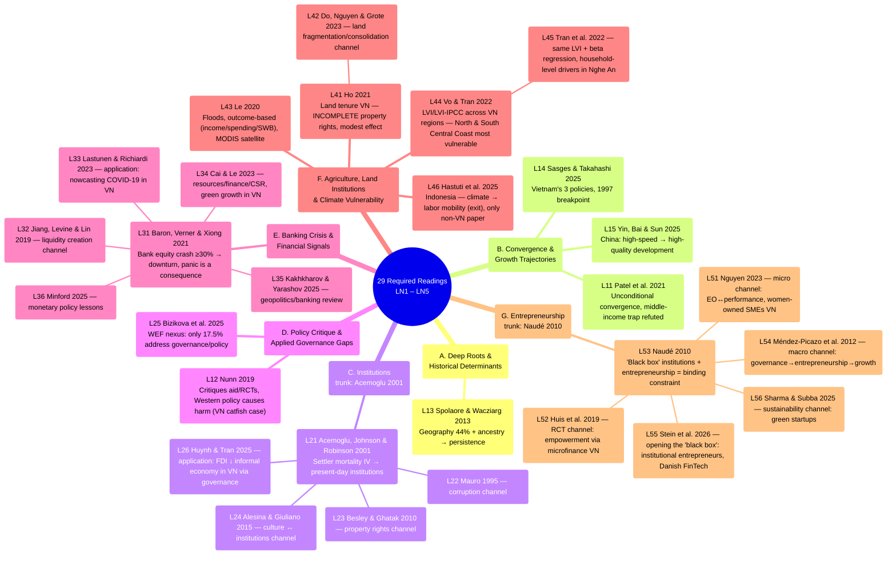

# Mindmap of All Required Readings — LN1–LN5

Synthesized from [[ln1-economic-development]], [[ln2-governance-institutions-policy-making]],
[[ln3-financial-crisis-and-pandemics]], [[ln4-agriculture-climate-change-natural-disasters]] and
[[ln5-entrepreneurship-economic-development]] (29 papers; lectures 6–10 have no material in
`raw/` yet — see [[overview]]). Unlike the per-lecture mindmaps (which follow the professor's
exact slide order), this page groups the 29 papers into **7 thematic clusters that cut across
lectures** to surface connections that don't fit neatly within a single class session —
especially the Institutions cluster, where Acemoglu et al. (2001) serves as the theoretical
"trunk" that several other papers (LN2, and now LN4/LN5 too) build on; the Banking Crisis
cluster, where Baron, Verner & Xiong (2021) plays the same role for the other 5 LN3 papers; and
the new Entrepreneurship cluster, where Naudé (2010) serves as the programmatic trunk for the
other 5 LN5 papers.

## Mindmap by thematic cluster

## The 7 clusters explained

### A. Deep Roots & Historical Determinants

Only 1 paper is a pure deep-roots theory piece ([[l13-spolaore-2013-deep-roots]]), but **L21
Acemoglu is also a deep-roots argument** — it just differs in transmission channel: Spolaore
uses ancestry/geography directly, while Acemoglu uses institutions as the mediating variable
(historical settler mortality → institutions persisting to the present). See
[[deep-roots-of-development]].

### B. Convergence & Growth Trajectories

3 papers all answer "which countries are catching up, and why": Patel at the global level
([[unconditional-convergence]]), Yin within China (East vs Central/West —
[[high-quality-development]]), Sasges within Vietnam via 3 specific policies. All three suggest
an essay could examine growth inequality **within a single country** (VN provinces, Chinese
regions) rather than just comparing across countries.

### C. Institutions — 4 specific channels

This is the densest cluster in LN1+LN2 (5/11 papers) and has the clearest hierarchical
structure: [[institutions]] (Acemoglu) is the original theoretical framework, and each of the 3
subsequent papers explores a different **transmission channel** from institutions to economic
outcomes — corruption (Mauro), property rights (Besley & Ghatak), culture (Alesina & Giuliano)
— while Huynh & Tran is the only paper in this cluster that **tests directly on Vietnamese
data** (63 provinces, 2006–2021).

### D. Policy Critique & Applied Governance Gaps

2 papers fall outside the convergence/institutions theoretical framework, instead critiquing the
gap between research and policy: Nunn critiques aid + RCTs at the macro level, Bizikova
identifies a governance gap in the WEF nexus literature (only 17.5% of studies actually address
policy). Both are a reminder that "knowing the cause" (clusters A–C) doesn't necessarily lead to
"the right policy."

### E. Banking Crisis & Financial Signals

A cluster from LN3 (6/29 papers), with a hierarchical structure similar to cluster C:
[[banking-crisis]] (Baron, Verner & Xiong 2021) is the theoretical trunk — demonstrating that a
bank equity crash by itself already predicts a downturn, with panic being merely an amplifying
consequence — while each of the other 5 papers explores a different angle: Jiang et al. digs
into the liquidity creation channel (bank competition), Lastunen & Richiardi apply the same
"financial data as an early signal" logic to forecasting Vietnam's COVID-19 recovery, Cai & Le
look at the resources–finance–green growth angle in Vietnam, and Kakhkharov & Yarashov and
Minford are two review/macro-policy papers that frame the geopolitical and long-run monetary
history context for the whole cluster.

### F. Agriculture, Land Institutions & Climate Vulnerability

A new cluster from LN4 (6/29 papers), structured DIFFERENTLY from the two trunk-based clusters
above — it combines two independent axes united by a common setting, "rural households in
Vietnam/Southeast Asia": (i) **land institutions** — L41 (Ho 2021, property rights/tenure
security, a modest effect because rights are incomplete) and L42 (Do, Nguyen & Grote 2023, land
fragmentation/consolidation) — both about Vietnamese land, but two independent channels, see
[[institutions]]; (ii) **natural disasters/climate change** — L43 (Le 2020, floods, measured via
outcomes), L44+L45 (Vo & Tran 2022; Tran et al. 2022, sharing the LVI/LVI-IPCC instrument but
differing in resolution/purpose, see [[livelihood-vulnerability-index]]), and L46 (Hastuti et al.
2025, Indonesia — the only paper treating labor mobility as an "exit" strategy rather than local
adaptation).

### G. Entrepreneurship & Institutions

A new cluster from LN5 (6/29 papers), with a trunk structure similar to clusters C/E:
[[entrepreneurship-and-development]] (Naudé 2010) is the programmatic trunk — setting out two
research gaps (entrepreneurship being under-studied; institutions as a "black box") that the
other 5 papers each concretize through a different channel: Nguyen (2023) and Huis et al. (2019)
are two Vietnamese micro/household-level channels (EO↔performance for women-owned SMEs; RCT
empowerment via microfinance), Méndez-Picazo et al. (2012) is the macro channel
(governance→entrepreneurship→growth, directly citing Acemoglu's 2003 framework — a clear bridge
back to [[institutions]] in LN2), Stein et al. (2026) "opens" the very black box Naudé poses,
through a concrete case study of institutional entrepreneurs (Danish FinTech), and Sharma & Subba
(2025) extends the logic to sustainability/green startups.

## Comparison with the per-lecture mindmaps

- The mindmaps within [[ln1-economic-development]],
  [[ln2-governance-institutions-policy-making]], [[ln3-financial-crisis-and-pandemics]],
  [[ln4-agriculture-climate-change-natural-disasters]] and
  [[ln5-entrepreneurship-economic-development]]: follow the **exact order the professor taught
  the slides**, useful for reviewing session by session.
- The mindmap on this page: organized by **cross-lecture theme**, useful for seeing which papers
  answer the same theoretical question even though they sit in different lectures — for example
  when studying for comparison-style questions ("compare how papers X and Y explain Z"). Clusters
  F and G are especially worth noting because both bridge back to [[institutions]] (LN2) —
  L41/L42/L54 all build directly on the Acemoglu framework.

## Links

- [[overview]] · [[ln1-economic-development]] · [[ln2-governance-institutions-policy-making]] ·
  [[ln3-financial-crisis-and-pandemics]] · [[ln4-agriculture-climate-change-natural-disasters]] ·
  [[ln5-entrepreneurship-economic-development]]
- Concepts: [[deep-roots-of-development]], [[unconditional-convergence]],
  [[high-quality-development]], [[institutions]], [[middle-income-trap]], [[banking-crisis]],
  [[livelihood-vulnerability-index]], [[entrepreneurship-and-development]]
