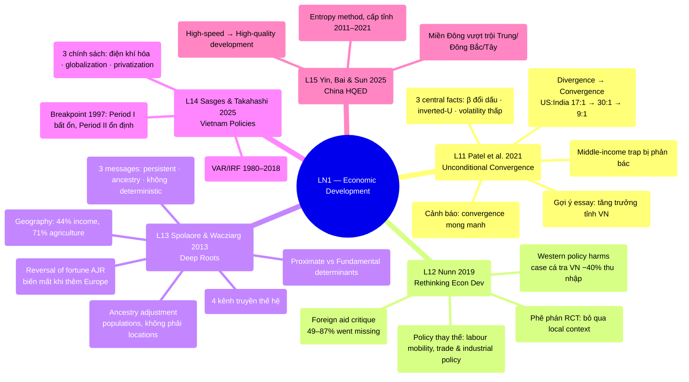

# LN1 — Economic Development

Lecture 1 (dự kiến Wed 22/7, 18:00–20:30, H104 — xem [[ln0-course-intro]]). Slide deck 53
trang, ngày 17/07/2026, cover 5 required readings. Vị trí trong course: chủ đề mở màn của
[[overview]]. Lecture 1 (scheduled Wed 22/7, 18:00–20:30, H104 — see
[[ln0-course-intro]]). A 53-page slide deck, dated 17/07/2026, covering 5 required readings.
Position in the course: the opening topic of [[overview]].

## Cấu trúc bài giảng - Lecture structure

Bài giảng đi qua 5 papers theo thứ tự: Spolaore & Wacziarg (16 phần) → Nunn (9 phần) →
Patel et al. (14 phần) → Sasges & Takahashi (2 phần) → Yin et al. (6 phần), kết bằng
2 slide "Take away". The lecture works through 5 papers in order: Spolaore
& Wacziarg (16 sections) → Nunn (9 sections) → Patel et al. (14 sections) → Sasges & Takahashi
(2 sections) → Yin et al. (6 sections), closing with 2 "Take away" slides.

## Mindmap

## Luận điểm chính theo paper - Main arguments by paper

### 1. Spolaore & Wacziarg 2013 — [[l13-spolaore-2013-deep-roots]]

Literature tăng trưởng chuyển từ **proximate determinants** (tích lũy vốn, công nghệ ngoại
sinh) → **fundamental factors** bắt rễ trong lịch sử dài hạn ([[deep-roots-of-development]]).
Điểm nhấn của slides: The growth literature shifted from **proximate
determinants** (capital accumulation, exogenous technology) → **fundamental factors** rooted in
long-run history ([[deep-roots-of-development]]). Slide highlights:

- Geography giải thích 44% biến thiên log income/capita (Table 1, latitude quan trọng nhất);
  điều kiện địa lý giải thích 71% biến thiên adoption of agriculture — Neolithic transmission
  (Table 2). Geography explains 44% of the variation in log income/capita
  (Table 1, latitude matters most); geographic conditions explain 71% of the variation in the
  adoption of agriculture — Neolithic transmission (Table 2).
- **Reversal of fortune** (Acemoglu-Johnson-Robinson 2002 — slides ghi chú AJR đạt Nobel 2025):
  thể chế do settlers mang tới tùy settler mortality; nhưng khi thêm Europe vào mẫu, bằng
  chứng reversal biến mất (hệ số population density AD 1500 = 0, Table 3). 
  **Reversal of fortune** (Acemoglu-Johnson-Robinson 2002 — the slides note AJR won the Nobel
  in 2025): institutions brought by settlers depended on settler mortality; but once Europe is
  added to the sample, the reversal evidence disappears (the coefficient on AD 1500 population
  density = 0, Table 3).
- **Ancestry adjustment** (Putterman & Weil 2010): persistence là đặc tính của **populations,
  không phải locations** (migration matrix); genetic distance FST (Spolaore & Wacziarg
  2009). **Ancestry adjustment** (Putterman & Weil 2010): persistence is a
  trait of **populations, not locations** (migration matrix); genetic distance FST (Spolaore &
  Wacziarg 2009).
- 4 kênh truyền thế hệ (Jablonka & Lamb 2005): genetic, epigenetic, behavioural, symbolic →
  gộp thành biological / cultural / dual transmission. 4 intergenerational
  transmission channels (Jablonka & Lamb 2005): genetic, epigenetic, behavioural, symbolic →
  combined into biological / cultural / dual transmission.
- 3 messages: (1) technology & productivity rất persistent; (2) phải control ancestry;
  (3) genealogical links giải thích diffusion của development. Lịch sử quan trọng nhưng
  **không deterministic** — barriers có thể vượt qua (Japan → East Asia; Hong Kong demo
  effect cho China, Romer 2009). 3 messages: (1) technology & productivity
  are highly persistent; (2) ancestry must be controlled for; (3) genealogical links explain the
  diffusion of development. History matters but is **not deterministic** — barriers can be
  overcome (Japan → East Asia; the Hong Kong demonstration effect for China, Romer 2009).

### 2. Nunn 2019 — [[l12-nunn-2019-rethinking-econ-dev]]

Phản tư về development policy (foreign aid, interventions) và academic research (RCT): A reflection on development policy (foreign aid, interventions) and academic
research (RCTs):

- Foreign aid: 49–87% aid cho trường học ở Africa "went missing"; aid nuôi rent-seeking,
  corruption, crowd out saving, có thể fuel conflict (Biafra, DRC); tied aid đội giá 15–40%. Foreign aid: 49–87% of aid to schools in Africa "went missing"; aid fuels
  rent-seeking, corruption, crowds out savings, and can fuel conflict (Biafra, DRC); tied aid
  inflates costs by 15–40%.
- Chính sách phương Tây **chủ động gây hại**: tariffs, antidumping duties, hạn chế labour
  mobility. Case Việt Nam: antidumping duty với catfish (cá tra/basa) 2003 từ Mississippi →
  thu nhập thực farmers Việt giảm 40% (Brambilla et al. 2012); Figure 3: nước giàu là bên
  khởi xướng duties, nước nghèo là bên bị nhắm. Western policies **actively
  cause harm**: tariffs, antidumping duties, restrictions on labour mobility. Vietnam case: a
  2003 antidumping duty on catfish (tra/basa) from Mississippi → Vietnamese farmers' real income
  fell 40% (Brambilla et al. 2012); Figure 3: rich countries initiate duties, poor countries get
  targeted.
- Policy options thay thế: labour mobility/migration, trade & industrial policy (Korea,
  Finland...), consumer purchasing power (certified products). Alternative
  policy options: labour mobility/migration, trade & industrial policy (Korea, Finland...),
  consumer purchasing power (certified products).
- Phê phán RCT-style research: fixed costs cao, bỏ qua **local context**, ít hợp tác với
  local scholars — ví dụ health (Ebola refusal do ký ức thuộc địa), agriculture (Bali),
  education (bride price). A critique of RCT-style research: high fixed
  costs, disregard for **local context**, little collaboration with local scholars — e.g.,
  health (Ebola refusal rooted in colonial memory), agriculture (Bali), education (bride
  price).

### 3. Patel, Sandefur & Subramanian 2021 — [[l11-patel-2021-unconditional-convergence]]

Trung tâm của [[unconditional-convergence]]: Central to
[[unconditional-convergence]]:

- Sau WWII là unconditional **divergence** (US:India từ 17:1 năm 1950 lên 30:1 năm 1990),
  nhưng đến 2017 tỷ lệ còn 9:1 — divergence đã đảo chiều. Post-WWII saw
  unconditional **divergence** (the US:India ratio rose from 17:1 in 1950 to 30:1 in 1990), but
  by 2017 the ratio had fallen to 9:1 — divergence has reversed.
- 3 central facts: (1) hệ số β-convergence đổi dấu và significant giữa 1990–2000 (gap đóng
  trong ~170 năm); (2) inverted U-shape — middle-income tăng trưởng nhanh nhất; (3) kỷ nguyên
  convergence đi kèm volatility thấp hơn, persistence cao hơn ở developing countries. 3 central facts: (1) the β-convergence coefficient flips sign and becomes
  significant between 1990–2000 (the gap closes over ~170 years); (2) an inverted-U shape —
  middle-income countries grow fastest; (3) the convergence era coincides with lower volatility
  and higher persistence in developing countries.
- Slides nhấn: **[[middle-income-trap]]** (Gill & Kharas 2015) bị thực nghiệm phản bác —
  sau 1985 middle-income countries tăng trưởng cao hơn 0.50–0.75 điểm %. 
  The slides emphasize: the **[[middle-income-trap]]** (Gill & Kharas 2015) is empirically
  rebutted — after 1985 middle-income countries grew 0.50–0.75 percentage points faster.
- Cảnh báo: convergence 25 năm qua (nhờ China, cheap finance) không được bảo đảm trước
  deglobalization, climate change, labour-saving technology. Caveat: the
  past 25 years of convergence (driven by China, cheap finance) is not guaranteed to continue
  given deglobalization, climate change, labour-saving technology.
- **Gợi ý của giáo sư**: mô hình convergence áp dụng được cho tăng trưởng không đồng nhất
  giữa các tỉnh/vùng Việt Nam (slide 37) → gợi ý đề tài essay. **The
  professor's suggestion**: the convergence model can be applied to uneven growth across
  Vietnam's provinces/regions (slide 37) → a suggested essay topic.

### 4. Sasges & Takahashi 2025 — [[l14-sasges-2025-vietnam-policies]]

VAR/IRF, Việt Nam 1980–2019, 3 chính sách: điện khí hóa, globalization, privatization.
Hai giai đoạn: Period I (1980–1997) tăng trưởng cao nhưng bất ổn — globalization + hạ tầng
điện giải thích 97% biến động GDP growth; Period II (1998–2019) cao và ổn định — 3 yếu tố chỉ
còn giải thích 25–40% biến động (60–75% do chính GDPG tự giải thích). Breakpoint 1997; tăng
trưởng bình quân >6.4%. Cơ chế ổn định: household consumption ổn định (khác Trung Quốc dựa
gross capital formation). Kết luận: con đường VN khớp **optimal growth theory** hơn mô hình
economic-takeoff kinh điển (tích lũy vốn). VAR/IRF, Vietnam 1980–2019, 3
policies: electrification, globalization, privatization. Two periods: Period I (1980–1997) high
but unstable growth — globalization + electricity infrastructure explain 97% of GDP growth
variation; Period II (1998–2019) high and stable — the 3 factors explain only 25–40% of the
variation (60–75% is explained by GDPG itself). Breakpoint in 1997; average growth >6.4%. The
stabilizing mechanism: stable household consumption (unlike China, which relies on gross
capital formation). Conclusion: Vietnam's path fits **optimal growth theory** better than the
classic economic-takeoff model (capital accumulation).

### 5. Yin, Bai & Sun 2025 — [[l15-yin-2025-china-hqed]]

China chuyển từ high-speed → **high-quality development** ([[high-quality-development]]);
entropy method + cluster + kernel density, cấp tỉnh 2011–2021; miền Đông vượt trội miền
Trung/Đông Bắc/Tây; phát triển "uneven, uncoordinated, insufficient". 
China shifts from high-speed → **high-quality development** ([[high-quality-development]]);
entropy method + clustering + kernel density, at the provincial level, 2011–2021; the east
outperforms the central/northeastern/western regions; development is "uneven, uncoordinated,
insufficient."

## Câu hỏi ôn thi tiềm năng - Potential exam questions

1. Phân biệt proximate vs fundamental determinants of development. 
   Distinguish proximate vs. fundamental determinants of development.
2. β-convergence vs σ-convergence; vì sao β cần nhưng chưa đủ cho σ; tốc độ ~2% (developed)
   vs 4.5% (developing), half-life τ ≈ 35 năm. β-convergence vs.
   σ-convergence; why β is necessary but not sufficient for σ; speed ~2% (developed) vs. 4.5%
   (developing), half-life τ ≈ 35 years.
3. Reversal of fortune: cơ chế thể chế của AJR và phê phán khi thêm Europe/điều chỉnh
   ancestry. The reversal of fortune: AJR's institutional mechanism and the
   critique once Europe is added/ancestry is adjusted for.
4. Vì sao nói bằng chứng của Patel et al. mâu thuẫn với middle-income trap? 
   Why does Patel et al.'s evidence contradict the middle-income trap?
5. Các tác hại chính sách chủ động của phương Tây theo Nunn; case catfish Việt Nam. The active policy harms caused by the West per Nunn; the Vietnam catfish case.

## Liên kết

- [[overview]] · [[ln0-course-intro]] · [[almas-heshmati]]
- Bản dịch đầy đủ từng slide: [[ln1-slides]] Full slide-by-slide
  translation: [[ln1-slides]]
- Concepts: [[unconditional-convergence]], [[deep-roots-of-development]],
  [[middle-income-trap]], [[high-quality-development]] Concepts:
  [[unconditional-convergence]], [[deep-roots-of-development]], [[middle-income-trap]],
  [[high-quality-development]]
