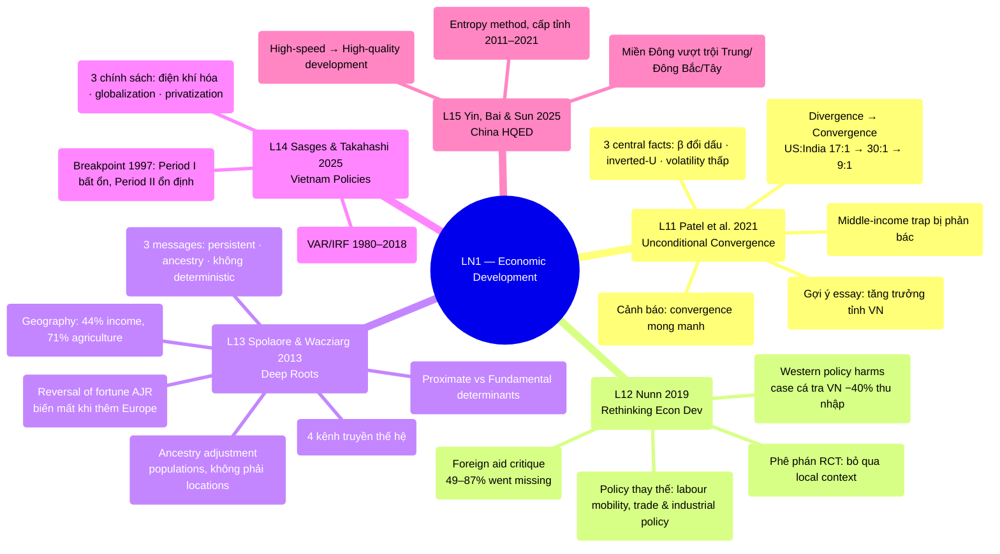

# LN1 — Economic Development

Lecture 1 (dự kiến Wed 22/7, 18:00–20:30, H104 — xem [[ln0-course-intro]]). Slide deck 53
trang, ngày 17/07/2026, cover 5 required readings. Vị trí trong course: chủ đề mở màn của
[[overview]].

## Cấu trúc bài giảng

Bài giảng đi qua 5 papers theo thứ tự: Spolaore & Wacziarg (16 phần) → Nunn (9 phần) →
Patel et al. (14 phần) → Sasges & Takahashi (2 phần) → Yin et al. (6 phần), kết bằng
2 slide "Take away".

## Mindmap

## Luận điểm chính theo paper

### 1. Spolaore & Wacziarg 2013 — [[l13-spolaore-2013-deep-roots]]

Literature tăng trưởng chuyển từ **proximate determinants** (tích lũy vốn, công nghệ ngoại
sinh) → **fundamental factors** bắt rễ trong lịch sử dài hạn ([[deep-roots-of-development]]).
Điểm nhấn của slides:

- Geography giải thích 44% biến thiên log income/capita (Table 1, latitude quan trọng nhất);
  điều kiện địa lý giải thích 71% biến thiên adoption of agriculture — Neolithic transmission
  (Table 2).
- **Reversal of fortune** (Acemoglu-Johnson-Robinson 2002 — slides ghi chú AJR đạt Nobel 2025):
  thể chế do settlers mang tới tùy settler mortality; nhưng khi thêm Europe vào mẫu, bằng
  chứng reversal biến mất (hệ số population density AD 1500 = 0, Table 3).
- **Ancestry adjustment** (Putterman & Weil 2010): persistence là đặc tính của **populations,
  không phải locations** (migration matrix); genetic distance FST (Spolaore & Wacziarg 2009).
- 4 kênh truyền thế hệ (Jablonka & Lamb 2005): genetic, epigenetic, behavioural, symbolic →
  gộp thành biological / cultural / dual transmission.
- 3 messages: (1) technology & productivity rất persistent; (2) phải control ancestry;
  (3) genealogical links giải thích diffusion của development. Lịch sử quan trọng nhưng
  **không deterministic** — barriers có thể vượt qua (Japan → East Asia; Hong Kong demo
  effect cho China, Romer 2009).

### 2. Nunn 2019 — [[l12-nunn-2019-rethinking-econ-dev]]

Phản tư về development policy (foreign aid, interventions) và academic research (RCT):

- Foreign aid: 49–87% aid cho trường học ở Africa "went missing"; aid nuôi rent-seeking,
  corruption, crowd out saving, có thể fuel conflict (Biafra, DRC); tied aid đội giá 15–40%.
- Chính sách phương Tây **chủ động gây hại**: tariffs, antidumping duties, hạn chế labour
  mobility. Case Việt Nam: antidumping duty với catfish (cá tra/basa) 2003 từ Mississippi →
  thu nhập thực farmers Việt giảm 40% (Brambilla et al. 2012); Figure 3: nước giàu là bên
  khởi xướng duties, nước nghèo là bên bị nhắm.
- Policy options thay thế: labour mobility/migration, trade & industrial policy (Korea,
  Finland...), consumer purchasing power (certified products).
- Phê phán RCT-style research: fixed costs cao, bỏ qua **local context**, ít hợp tác với
  local scholars — ví dụ health (Ebola refusal do ký ức thuộc địa), agriculture (Bali),
  education (bride price).

### 3. Patel, Sandefur & Subramanian 2021 — [[l11-patel-2021-unconditional-convergence]]

Trung tâm của [[unconditional-convergence]]:

- Sau WWII là unconditional **divergence** (US:India từ 17:1 năm 1950 lên 30:1 năm 1990),
  nhưng đến 2017 tỷ lệ còn 9:1 — divergence đã đảo chiều.
- 3 central facts: (1) hệ số β-convergence đổi dấu và significant giữa 1990–2000 (gap đóng
  trong ~170 năm); (2) inverted U-shape — middle-income tăng trưởng nhanh nhất; (3) kỷ nguyên
  convergence đi kèm volatility thấp hơn, persistence cao hơn ở developing countries.
- Slides nhấn: **[[middle-income-trap]]** (Gill & Kharas 2015) bị thực nghiệm phản bác —
  sau 1985 middle-income countries tăng trưởng cao hơn 0.50–0.75 điểm %.
- Cảnh báo: convergence 25 năm qua (nhờ China, cheap finance) không được bảo đảm trước
  deglobalization, climate change, labour-saving technology.
- **Gợi ý của giáo sư**: mô hình convergence áp dụng được cho tăng trưởng không đồng nhất
  giữa các tỉnh/vùng Việt Nam (slide 37) → gợi ý đề tài essay.

### 4. Sasges & Takahashi 2025 — [[l14-sasges-2025-vietnam-policies]]

VAR/IRF, Việt Nam 1980–2019, 3 chính sách: điện khí hóa, globalization, privatization.
Hai giai đoạn: Period I (1980–1997) tăng trưởng cao nhưng bất ổn — globalization + hạ tầng
điện giải thích 97% biến động GDP growth; Period II (1998–2019) cao và ổn định — 3 yếu tố chỉ
còn giải thích 25–40% biến động (60–75% do chính GDPG tự giải thích). Breakpoint 1997; tăng
trưởng bình quân >6.4%. Cơ chế ổn định: household consumption ổn định (khác Trung Quốc dựa
gross capital formation). Kết luận: con đường VN khớp **optimal growth theory** hơn mô hình
economic-takeoff kinh điển (tích lũy vốn).

### 5. Yin, Bai & Sun 2025 — [[l15-yin-2025-china-hqed]]

China chuyển từ high-speed → **high-quality development** ([[high-quality-development]]);
entropy method + cluster + kernel density, cấp tỉnh 2011–2021; miền Đông vượt trội miền
Trung/Đông Bắc/Tây; phát triển "uneven, uncoordinated, insufficient".

## Câu hỏi ôn thi tiềm năng

1. Phân biệt proximate vs fundamental determinants of development.
2. β-convergence vs σ-convergence; vì sao β cần nhưng chưa đủ cho σ; tốc độ ~2% (developed)
   vs 4.5% (developing), half-life τ ≈ 35 năm.
3. Reversal of fortune: cơ chế thể chế của AJR và phê phán khi thêm Europe/điều chỉnh ancestry.
4. Vì sao nói bằng chứng của Patel et al. mâu thuẫn với middle-income trap?
5. Các tác hại chính sách chủ động của phương Tây theo Nunn; case catfish Việt Nam.

## Liên kết

- [[overview]] · [[ln0-course-intro]] · [[almas-heshmati]]
- Concepts: [[unconditional-convergence]], [[deep-roots-of-development]],
  [[middle-income-trap]], [[high-quality-development]]
