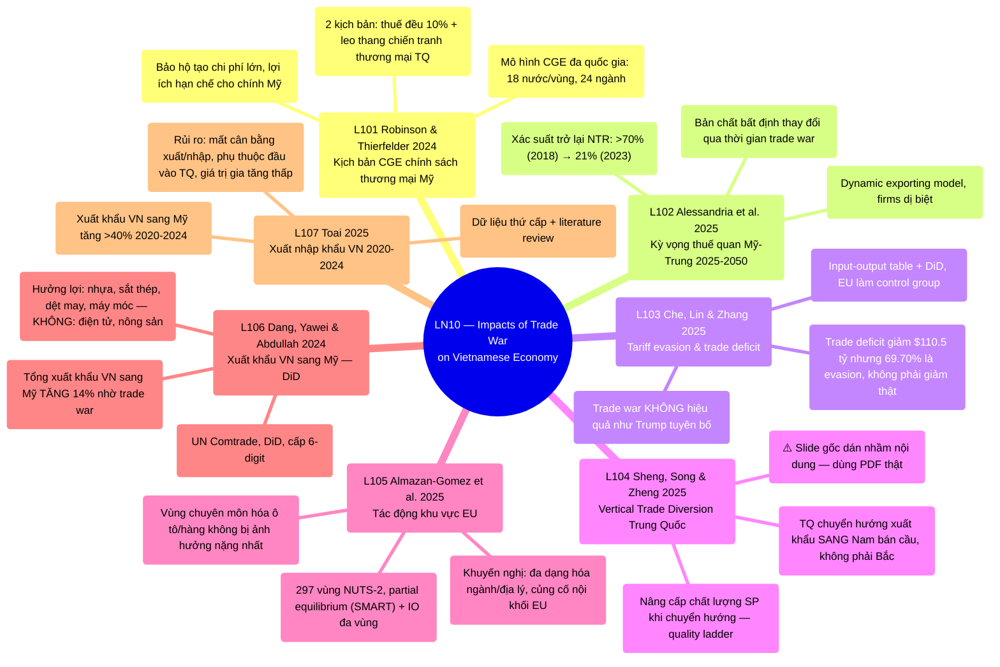

# LN10 — Impacts of Trade War on Vietnamese Economy

Lecture 10 (buổi cuối) trong [[overview]] (lịch chi tiết: [[ln0-course-intro]]). Slide deck 32
trang — bản giáo sư cập nhật ngày 9/8/2026 (thay bản gốc 6/8/2026, xem chi tiết thay đổi ở ghi
chú bên dưới) — cover 7 required readings (L101–L107) — 5 bài đầu phân tích chiến tranh thương
mại Mỹ–Trung ở tầm toàn cầu/lý thuyết (mô hình CGE, kỳ vọng thuế quan, tariff evasion, trade
diversion, tác động khu vực EU), 2 bài cuối là bằng chứng thực nghiệm trực tiếp về Việt
Nam. Lecture 10 (the final session) in [[overview]] (detailed schedule:
[[ln0-course-intro]]). A 32-page slide deck — the professor's revised version dated 9/8/2026
(replacing the original 6/8/2026 version, see the change note below) — covering 7 required
readings (L101–L107) — the first 5 papers analyze the US–China trade war at the global/theoretical
level (CGE modeling, tariff expectations, tariff evasion, trade diversion, EU regional impacts),
the final 2 provide direct Vietnam-specific empirical evidence.

## Cấu trúc bài giảng - Lecture structure

Cấu trúc đơn giản như LN9: **danh sách 7 reading** (slide 3, kèm trích dẫn đầy đủ) → **7 bài đọc
tóm tắt riêng theo thứ tự** (slide 4–24, mỗi bài 1–3 slide) → **Planning Schedule** (slide 25,
trùng nội dung đã có ở [[ln0-course-intro]] — không lặp lại chi tiết ở đây) → **"Recent useful
research and reading — NOT for exam"** (nhãn "NOT for exam" do chính giáo sư ghi thẳng trên slide
trong bản cập nhật 9/8/2026, xác nhận tường minh điều wiki vốn chỉ suy luận gián tiếp từ việc 2
bài này không có PDF riêng trong `raw/`) — slide 26–31 (dịch từ 26-29 do slide L104 dài thêm), 2
bài bổ sung KHÔNG có PDF trong `raw/` — Lartey-Law 2025 về AI trong quản trị đô thị, Ngo-Lee 2025
về bất bình đẳng thu nhập/hiệp định thương mại Việt–Mỹ BTA — chỉ có tóm tắt slide, không
deep-ingest thành trang riêng, và giờ giáo sư xác nhận rõ KHÔNG nằm trong phạm vi thi) → **Kết**
(slide 32). A simple structure like LN9: **the list of 7 readings** (slide 3,
with full citations) → **7 individually summarized readings in order** (slides 4–24, each paper
1–3 slides) → **Planning Schedule** (slide 25, duplicating content already in [[ln0-course-intro]]
— not repeated here in detail) → **"Recent useful research and reading — NOT for exam"** (the "NOT
for exam" label was added directly by the professor in the 8/9/2026 revision, explicitly
confirming what the wiki had only inferred from these 2 papers lacking a standalone PDF in
`raw/`) — slides 26–31 (shifted from 26-29 since the L104 slide grew longer), 2 supplementary
papers with NO PDF in `raw/` — Lartey-Law 2025 on AI in urban governance, Ngo-Lee 2025 on income
inequality/the Vietnam–US BTA — only a slide summary exists, not deep-ingested separately, and now
explicitly confirmed by the professor to be OUT of exam scope) → **Closing** (slide 32).

✅ **Lỗi slide gốc — L104 — ĐÃ ĐƯỢC GIÁO SƯ SỬA (9/8/2026)**: bản slide gốc 6/8/2026 ghi header
"Sheng, Song and Zheng (2025). How did Chinese Exporters Manage the trade War?" nhưng nội dung
bullet bên dưới lại mô tả SAI một bài khác về "climate change exposure và green innovation ở
doanh nghiệp Trung Quốc" — lỗi dán nhầm nội dung khi giáo sư soạn slide. Trang
[[l104-sheng-2025-chinese-exporters-trade-diversion]] khi đó đã được viết dựa TRỰC TIẾP trên PDF
gốc (xác nhận đúng tên bài/tác giả/journal, nội dung thật về Vertical Trade Diversion), KHÔNG dựa
vào nội dung sai trong slide — nên không cần sửa lại trang đó. Bản slide cập nhật 9/8/2026 giáo
sư gửi đã thay đúng nội dung slide (Hypothesis 1/2 HTD/VTD, mô hình kinh tế lượng, dự đoán VTD,
kết luận) khớp hoàn toàn với trang wiki đã viết trước đó — xác nhận việc bám PDF gốc thay vì slide
lỗi là đúng. ✅ **Source-slide error — L104 — FIXED BY THE PROFESSOR
(8/9/2026)**: the original 6/8/2026 slide deck had a header reading "Sheng, Song and Zheng (2025).
How did Chinese Exporters Manage the trade War?" but the bullet content underneath incorrectly
described a different paper about "climate change exposure and green innovation at Chinese firms"
— a copy-paste error when the professor prepared the slide. At the time, the page
[[l104-sheng-2025-chinese-exporters-trade-diversion]] had already been written DIRECTLY from the
original PDF (confirmed correct paper title/authors/journal, real content about Vertical Trade
Diversion), NOT from the incorrect slide content — so that page needed no correction. The revised
slide deck the professor sent on 8/9/2026 now has the correct slide content (Hypothesis 1/2
HTD/VTD, the econometric model, VTD predictions, conclusion), which fully matches the wiki page
written earlier — confirming that relying on the original PDF instead of the flawed slide was the
right call.

## Mindmap

## Luận điểm chính theo paper - Main arguments by paper

### 1. Robinson & Thierfelder 2024 — [[l101-robinson-thierfelder-2024-us-trade-policy-cge]]

- Mô hình CGE đa quốc gia (18 nước/vùng, 24 ngành) mô phỏng 2 kịch bản chính sách thương mại Mỹ:
  tăng thuế đều 10% và leo thang chiến tranh thương mại với Trung Quốc. A
  multi-country CGE model (18 countries/regions, 24 sectors) simulating 2 US trade-policy
  scenarios: a uniform 10% tariff increase and an escalated trade war with China.
- Cả 2 kịch bản đều cho thấy thuế quan KHÔNG bảo vệ được việc làm sản xuất Mỹ; chi phí đầu vào
  trung gian tăng làm phản tác dụng; thế giới thích ứng bằng cách chuyển hướng thương mại quanh
  Mỹ. Both scenarios show tariffs do NOT protect US manufacturing jobs;
  rising intermediate-input costs are counterproductive; the world adapts by diverting trade
  around the US.

### 2. Alessandria, Yor Khan, Khederlarian, Ruhl & Steinberg 2025 — [[l102-alessandria-2025-trade-war-tariff-risk]]

- Mô hình dynamic exporting với firm dị biệt ước lượng kỳ vọng thay đổi về thuế quan Mỹ-Trung,
  dùng dữ liệu nhập khẩu Mỹ + EU 2014–2024. A dynamic exporting model with
  heterogeneous firms estimating how expectations about US–China tariffs evolved, using US + EU
  import data 2014–2024.
- Xác suất trở lại mức thuế NTR ban đầu >70% nhưng giảm còn 21% vào 2023 — bản chất bất định của
  chính sách thương mại đã thay đổi khi trade war kéo dài qua nhiều đời tổng thống. The probability of tariffs reverting to NTR levels was initially >70% but fell to
  21% by 2023 — the nature of trade-policy uncertainty changed as the trade war persisted across
  multiple presidencies.

### 3. Che, Lin & Zhang 2025 — [[l103-che-2025-tariff-evasion-trade-war]]

- Dùng bảng input-output + DiD (EU làm nhóm đối chứng) đo hành vi né thuế của nhà nhập khẩu Mỹ đối
  với hàng Trung Quốc. Uses an input-output table + DiD (with the EU as a
  control group) to measure US importers' tariff-evasion behavior on Chinese goods.
- Thâm hụt thương mại Mỹ–Trung giảm 110.5 tỷ USD sau trade war, nhưng đến 69.70% khoảng chênh lệch
  này là do tariff evasion (khai gian giá trị/số lượng, phân loại sai sản phẩm), không phải giảm
  thương mại thật. The US–China trade deficit fell by USD 110.5 billion after
  the trade war, but up to 69.70% of that gap is due to tariff evasion (underreporting
  values/quantities, product misclassification), not a genuine trade reduction.

### 4. Sheng, Song & Zheng 2025 — [[l104-sheng-2025-chinese-exporters-trade-diversion]]

- ⚠️ Nội dung slide gốc bị dán nhầm — trang wiki dựa trên PDF thật: phân biệt Horizontal Trade
  Diversion (HTD, hàng hóa chuyển sang nước tương tự Mỹ) và Vertical Trade Diversion (VTD, chuyển
  xuống nước thu nhập thấp hơn theo bậc thang chất lượng). ⚠️ The original
  slide content was mispasted — the wiki page is based on the real PDF: distinguishing Horizontal
  Trade Diversion (HTD, diverting to countries similar to the US) from Vertical Trade Diversion
  (VTD, diverting down to lower-income countries along a quality ladder).
- Trái với kỳ vọng thông thường (HTD), Trung Quốc chủ yếu áp dụng chiến lược VTD — chuyển hàng
  chất lượng cao xuống Nam bán cầu, đồng thời nâng cấp chất lượng sản phẩm khi chuyển hướng. Contrary to conventional expectations (HTD), China primarily adopts the VTD strategy —
  diverting high-quality products to the Global South while upgrading product quality as it
  diverts.

### 5. Almazan-Gomez, El Khatabi, Llano & Perez 2025 — [[l105-almazan-gomez-2025-regional-exposure-trade-wars-eu]]

- Đo tác động khu vực của 2 biện pháp bảo hộ Mỹ chống EU (tranh chấp Boeing-Airbus, thuế 25% ô tô)
  trên 297 vùng NUTS-2 châu Âu, kết hợp partial equilibrium (SMART) + input-output đa vùng. Measures the regional impact of 2 US protectionist measures against the EU
  (Boeing-Airbus dispute, 25% automotive tariff) across 297 European NUTS-2 regions, combining a
  partial equilibrium model (SMART) + interregional input-output.
- Vùng chuyên môn hóa ô tô/hàng không vũ trụ và tích hợp sâu vào chuỗi giá trị châu Âu bị ảnh hưởng
  nặng nhất; khuyến nghị đa dạng hóa ngành/địa lý và củng cố thương mại nội khối EU. Regions specialized in automotive/aerospace and deeply embedded in European value
  chains are hit hardest; recommends sectoral/geographic diversification and strengthening
  intra-EU trade.

### 6. Dang, Yawei & Abdullah 2024 — [[l106-dang-2024-vietnam-exports-us-trade-war-did]]

- Dùng phương pháp Difference-in-Differences trên dữ liệu UN Comtrade cấp 6-digit để đo tác động
  trade war Mỹ-Trung lên xuất khẩu Việt Nam sang Mỹ. Uses a
  Difference-in-Differences approach on HS6-level UN Comtrade data to measure the US–China trade
  war's impact on Vietnamese exports to the US.
- Tổng xuất khẩu Việt Nam sang Mỹ tăng 14% nhờ trade war; ngành hưởng lợi rõ rệt là nhựa, sắt
  thép, dệt may, máy móc thiết bị — bằng chứng thực nghiệm trực tiếp cho lý thuyết trade diversion
  ở L101/L104. Vietnam's total exports to the US rose 14% due to the trade
  war; clear beneficiary sectors are plastics, iron/steel, textiles, and machinery — direct
  empirical evidence for the trade-diversion theory in L101/L104.

### 7. Toai 2025 — [[l107-toai-2025-vietnam-import-export-trade-war]]

- Phân tích mô tả + tổng quan tài liệu về tác động trade war lên cấu trúc xuất nhập khẩu Việt Nam
  2020–2024, dựa trên dữ liệu thứ cấp. A descriptive analysis + literature
  review of the trade war's impact on Vietnam's import/export structure 2020–2024, based on
  secondary data.
- Xuất khẩu Việt Nam sang Mỹ tăng >40% (2020–2024), Mỹ trở thành thị trường lớn nhất, nhưng cấu
  trúc mất cân bằng (xuất gần gấp 5 lần nhập) tạo rủi ro bị điều tra/trừng phạt thương mại và phụ
  thuộc đầu vào nhập khẩu từ Trung Quốc. Vietnamese exports to the US grew
  >40% (2020–2024), making the US the largest market, but the imbalanced structure (exports nearly
  5x imports) creates risk of trade investigation/retaliation and dependence on Chinese
  intermediate inputs.

## Câu hỏi ôn thi tiềm năng - Potential exam questions

1. So sánh 2 khung phương pháp mô phỏng trade war ở tầm toàn cầu —
   [[l101-robinson-thierfelder-2024-us-trade-policy-cge]] (CGE tĩnh, kịch bản "what if") và
   [[l102-alessandria-2025-trade-war-tariff-risk]] (mô hình động về kỳ vọng thuế quan) — điểm mạnh
   yếu của từng cách tiếp cận. Compare 2 global trade-war simulation
   frameworks — [[l101-robinson-thierfelder-2024-us-trade-policy-cge]] (static CGE, "what if"
   scenarios) and [[l102-alessandria-2025-trade-war-tariff-risk]] (dynamic model of tariff
   expectations) — strengths/weaknesses of each approach.
2. Theo [[l103-che-2025-tariff-evasion-trade-war]], vì sao con số "giảm thâm hụt thương mại Mỹ-Trung"
   mà chính quyền Trump công bố có thể gây hiểu lầm? Nêu cơ chế tariff evasion cụ thể và tỷ lệ đóng
   góp của nó vào khoảng chênh lệch. Per
   [[l103-che-2025-tariff-evasion-trade-war]], why can the "reduced US-China trade deficit" figure
   the Trump administration touted be misleading? Specify the concrete tariff-evasion mechanism and
   its contribution to the gap.
3. [[l104-sheng-2025-chinese-exporters-trade-diversion]] tìm thấy Trung Quốc dùng chiến lược
   Vertical Trade Diversion (chuyển xuống Nam bán cầu) thay vì Horizontal (chuyển sang nước tương
   tự Mỹ) như literature trước dự đoán — liên hệ phát hiện này với bằng chứng Việt Nam ở
   [[l106-dang-2024-vietnam-exports-us-trade-war-did]]/[[l107-toai-2025-vietnam-import-export-trade-war]]:
   Việt Nam đóng vai trò gì trong bức tranh VTD này (điểm đến hàng TQ né thuế, hay điểm thay thế
   trực tiếp cho hàng TQ tại thị trường Mỹ, hay cả hai)? 
   [[l104-sheng-2025-chinese-exporters-trade-diversion]] finds China uses a Vertical Trade
   Diversion strategy (diverting to the Global South) rather than Horizontal (diverting to
   US-similar countries) as prior literature predicted — connect this to Vietnam's evidence in
   [[l106-dang-2024-vietnam-exports-us-trade-war-did]]/[[l107-toai-2025-vietnam-import-export-trade-war]]:
   what role does Vietnam play in this VTD picture (a destination for Chinese tariff-evading goods,
   a direct substitute for Chinese goods in the US market, or both)?
4. So sánh cách tiếp cận đo tác động KHU VỰC/NGÀNH của trade war giữa
   [[l105-almazan-gomez-2025-regional-exposure-trade-wars-eu]] (297 vùng NUTS-2 châu Âu) và
   [[l106-dang-2024-vietnam-exports-us-trade-war-did]] (ngành xuất khẩu Việt Nam) — cả 2 đều tìm
   thấy tác động KHÔNG ĐỒNG ĐỀU, nêu rõ cơ chế gây ra sự không đồng đều ở mỗi bối cảnh. Compare the regional/sectoral impact-measurement approaches between
   [[l105-almazan-gomez-2025-regional-exposure-trade-wars-eu]] (297 European NUTS-2 regions) and
   [[l106-dang-2024-vietnam-exports-us-trade-war-did]] (Vietnamese export sectors) — both find
   UNEVEN impacts; specify the mechanism driving unevenness in each context.
5. [[l106-dang-2024-vietnam-exports-us-trade-war-did]] và
   [[l107-toai-2025-vietnam-import-export-trade-war]] đều kết luận Việt Nam hưởng lợi ngắn hạn từ
   trade war Mỹ-Trung — nhưng L107 nêu thêm các rủi ro cấu trúc dài hạn mà L106 không đề cập trực
   tiếp. Liệt kê các rủi ro đó và đánh giá mức độ nghiêm trọng dựa trên phương pháp DiD định lượng
   chặt chẽ hơn của L106. Both
   [[l106-dang-2024-vietnam-exports-us-trade-war-did]] and
   [[l107-toai-2025-vietnam-import-export-trade-war]] conclude Vietnam benefits short-term from
   the US–China trade war — but L107 raises additional long-term structural risks not directly
   addressed by L106. List those risks and assess their severity given L106's more rigorous
   quantitative DiD method.
6. Đây là buổi học cuối cùng của môn — tổng hợp: trong 10 lecture, chủ đề "trade war/protectionism"
   (LN10) liên hệ thế nào với chủ đề "institutions/governance" (LN2) và "FDI/informal economy"
   ([[l26-huynh-tran-2025-fdi-informal-economy]], LN2)? Cả 2 đều nói về cách nền kinh tế Việt Nam
   phản ứng với các cú sốc/áp lực bên ngoài. This is the course's final
   session — synthesize: across the 10 lectures, how does the "trade war/protectionism" theme
   (LN10) relate to the "institutions/governance" theme (LN2) and "FDI/informal economy"
   ([[l26-huynh-tran-2025-fdi-informal-economy]], LN2)? Both concern how the Vietnamese economy
   responds to external shocks/pressures.

## Liên kết

- [[overview]] · [[ln0-course-intro]] · [[almas-heshmati]]
- Bản dịch đầy đủ từng slide: [[ln10-slides]] Full slide-by-slide
  translation: [[ln10-slides]]
- Concept: [[trade-war-and-protectionism]]
