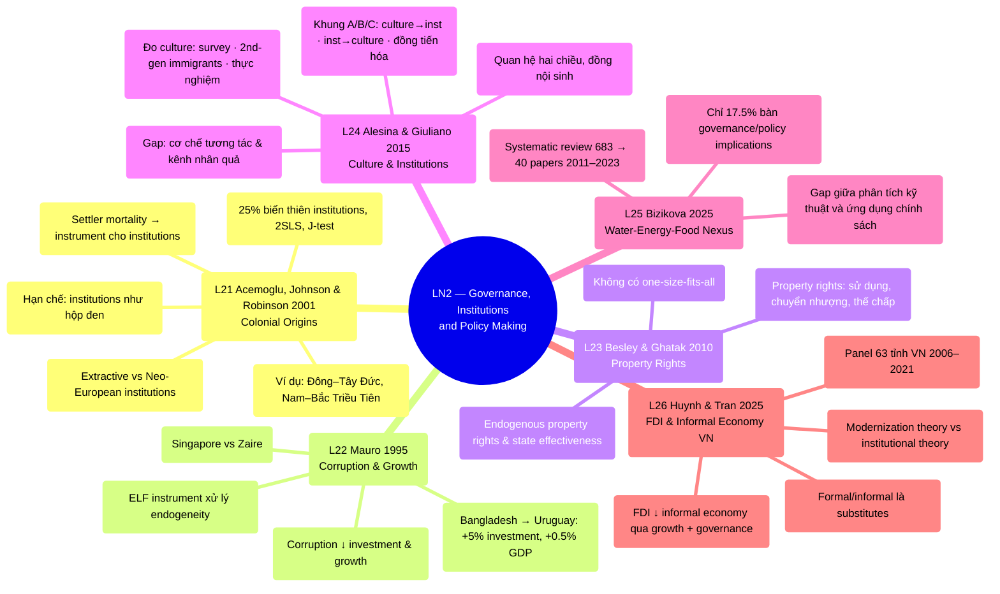

# LN2 — Governance, Institutions and Policy Making

Lecture 2 trong [[overview]] (lịch chi tiết: [[ln0-course-intro]]). Slide deck 49 trang, ngày
23/07/2026, cover 6 required readings.

## Cấu trúc bài giảng

Đi qua 6 papers theo thứ tự: Acemoglu, Johnson & Robinson 2001 (23 phần) → Mauro 1995
(9 phần) → Besley & Ghatak 2010 (3 phần) → Alesina & Giuliano 2015 (4 phần) → Bizikova 2025
(5 phần) → Huynh & Tran 2025 (2 phần), kết bằng 2 slide "Take away". Acemoglu là nền tảng lý
thuyết [[institutions]] mà 5 paper sau đều build trên.

## Mindmap

## Luận điểm chính theo paper

### 1. Acemoglu, Johnson & Robinson 2001 — [[l21-acemoglu-2001-colonial-origins]]

Câu hỏi: nguyên nhân căn bản của chênh lệch thu nhập giữa các nước là gì? Trung tâm của
[[institutions]]:

- Dùng tỷ lệ tử vong của lính thực dân châu Âu (malaria, sốt vàng da — chiếm 80% ca tử vong
  vùng nhiệt đới) làm **instrument** cho institutions hiện tại: settler mortality →
  settlements → early institutions → current institutions → income per capita.
- Nơi tỷ lệ tử vong cao, châu Âu không định cư được → dựng institutions kiểu **extractive**
  (khai thác tài nguyên chuyển về mẫu quốc); nơi tỷ lệ thấp → institutions kiểu
  **Neo-European** (bảo vệ property rights, khuyến khích đầu tư). Cả hai loại **persist** đến
  hiện tại.
- Mortality giải thích 25% biến thiên institutions hiện tại; OLS + 2SLS trên mẫu 64
  ex-colonies. Sau khi kiểm soát institutions, khoảng cách thu nhập theo vĩ độ/châu Phi biến
  mất.
- Overidentification test (J-test) không bác bỏ giả thuyết; robust khi thêm kiểm soát khí
  hậu, tài nguyên, đất đai, tuổi thọ.
- Ví dụ minh họa trong slide: Đông–Tây Đức, Nam–Bắc Triều Tiên (cùng điều kiện ban đầu,
  institutions khác nhau → kết quả khác nhau).
- Hạn chế slide nêu rõ: institutions bị coi như "hộp đen" — cơ chế cụ thể (property rights,
  expropriation risk) còn để ngỏ cho nghiên cứu sau.

### 2. Mauro 1995 — [[l22-mauro-1995-corruption-growth]]

- Dùng dữ liệu Business International/EIU (56 chỉ số rủi ro, 68 nước 1980–83) đo corruption,
  red tape, hiệu quả tư pháp, bất ổn chính trị.
- **Corruption làm giảm investment rate và growth**, kể cả sau khi kiểm soát bureaucratic
  regulation; robust khi dùng **ELF** (ethnolinguistic fractionalization index) làm
  instrument xử lý endogeneity.
- Minh họa: Singapore (10/10 mọi chỉ số, đầu tư cao nhất 1960–85) vs Zaire (institutions tệ
  nhất, đầu tư cực thấp).
- Ước lượng cụ thể: nếu Bangladesh nâng bureaucratic integrity lên mức Uruguay → investment
  rate +5%, GDP growth +0.5 điểm %.

### 3. Besley & Ghatak 2010 — [[l23-besley-ghatak-2010-property-rights]]

Chương Handbook of Development Economics, tiếp nối new institutional approach (North 1990):

- Property rights = quyền sử dụng, chuyển nhượng, thế chấp tài sản; trung tâm của resource
  allocation, hạn chế expropriation, giảm rào cản thương mại.
- Bàn cả endogenous property rights (khi nào rights tự phát sinh, state effectiveness).
- Kết luận nhấn mạnh: **không có công thức "one size fits all"** cho mở rộng private
  property rights — tác động hetero theo bối cảnh.

### 4. Alesina & Giuliano 2015 — [[l24-alesina-giuliano-2015-culture-institutions]]

- Câu hỏi: culture và [[institutions]] quan hệ **hai chiều** (feedback loop), không cái nào
  causally superior — cả hai đồng nội sinh theo demography, technology, dịch bệnh, chiến
  tranh, shocks.
- Đo culture 3 cách: survey data, second-generation immigrants (tách culture khỏi môi trường
  kinh tế/thể chế), thực nghiệm. Formal institutions đo qua WB Worldwide Governance Indicator
  (voice & accountability, rule of law, control of corruption...).
- Khung phân tích: (A) culture → formal institutions, (B) institutions → culture (shocks
  ngoại sinh, thị trường, regulation), (C) đồng tiến hóa hai chiều.
- Kết luận: 2 hướng nghiên cứu còn thiếu — (i) hiểu cơ chế tương tác (thường bị nghiên cứu
  tách rời, thực tế phi tuyến phức tạp), (ii) hiểu kênh nhân quả (complementarity gây khó
  identification bằng IV).

### 5. Bizikova 2025 — [[l25-bizikova-2025-water-energy-food-nexus]]

- Systematic review 683 → chọn 40 papers (2011–2023) về water-energy-food (WEF) nexus và
  governance.
- Chỉ **17.5%** nghiên cứu thực sự bàn governance/policy implications dù 63% có định lượng
  WEF nexus — gap giữa phân tích kỹ thuật và ứng dụng chính sách.
- Framing chính: cải thiện engagement với policymakers/academia/communities (32.5%), phối
  hợp (27.5%), giải pháp công nghệ (35%).

### 6. Huynh & Tran 2025 — [[l26-huynh-tran-2025-fdi-informal-economy]]

Panel 63 tỉnh Việt Nam 2006–2021 — **paper có dữ liệu Việt Nam trực tiếp**, đáng chú ý cho
essay:

- FDI inflows giảm informal economy qua 2 kênh đồng thời (hệ số tương tác FDI×GROW và FDI×GOV
  đều âm có ý nghĩa): thúc đẩy growth + cải thiện local governance quality (đo bằng chỉ số
  PAPI, 6 chiều).
- Formal và informal economy là **substitutes**; local governance quality là biến có hệ số âm
  LỚN NHẤT trong mô hình — giảm hoạt động phi chính thức mạnh nhất.
- Nghèo đói, thất nghiệp, tăng dân số nhanh là động lực chính của informal economy ở Việt Nam;
  fiscal policy chiến lược + đô thị hóa + vốn con người có thể thu hẹp khu vực này.
  informal employment trung bình 75.6% tổng lao động (dao động 31–91% theo tỉnh) — chênh lệch
  vùng miền rất lớn.
- Ước lượng chính bằng **System GMM** (Blundell & Bond, forward-orthogonal deviations cho
  unbalanced panel) để xử lý nội sinh — kiểm chứng lại bằng pooled OLS/RE/FE và 2 robustness
  check (arcsinh(FDI), và proxy thay thế TAX revenue/GDP) — đối chiếu modernization theory
  (FDI → giảm informal) và institutional theory (FDI → cải thiện governance) đồng thời thay vì
  chọn 1.

## Câu hỏi ôn thi tiềm năng

1. Trình bày chiến lược identification của Acemoglu et al. (2001): chuỗi settler mortality →
   settlements → early institutions → current institutions, và 3 điều kiện IV hợp lệ.
2. Vì sao Mauro dùng ELF làm instrument? Cơ chế corruption → investment → growth.
3. So sánh property rights approach của Besley & Ghatak với institutional approach của
   Acemoglu — điểm chung và khác biệt.
4. Vì sao Alesina & Giuliano cho rằng không thể tách causal effect của culture khỏi
   institutions? Nêu ví dụ đồng nội sinh.
5. Từ Huynh & Tran (2025), FDI ảnh hưởng informal economy ở Việt Nam qua những kênh nào? Liên
   hệ với governance quality cấp tỉnh.

## Liên kết

- [[overview]] · [[ln0-course-intro]] · [[almas-heshmati]]
- Concepts: [[institutions]]
