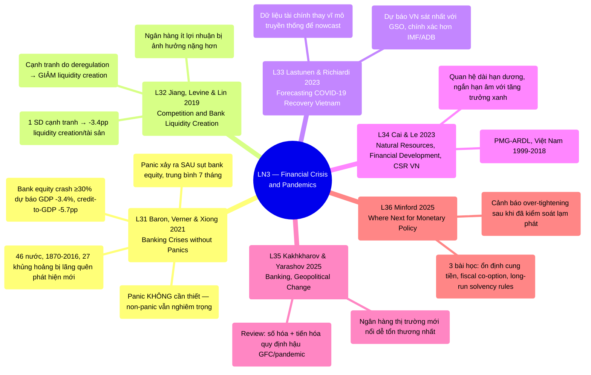

# LN3 — Financial Crisis and Pandemics

Lecture 3 trong [[overview]] (lịch chi tiết: [[ln0-course-intro]]). Slide deck 56 trang, ngày
25/07/2026, cover 6 required readings.

## Cấu trúc bài giảng

Đi qua 6 papers theo thứ tự: Baron, Verner & Xiong 2021 (21 phần) → Jiang, Levine & Lin 2019
(11 phần) → Lastunen & Richiardi 2023 (7 phần, kèm 1 slide bonus tóm tắt Heshmati 2021 review
hậu quả COVID-19) → Cai & Le 2023 (4 phần) → Kakhkharov & Yarashov 2025 (1 phần) → Minford 2025
(4 phần), kết bằng 2 slide "Take away". Sau đó có 2 slide giới thiệu 2 bài nghiên cứu riêng của
giáo sư (UEH PhD Seminars, không phải required reading có mã số): "Global Bank Balance Sheet
Constraints and Local Corporate Distress: Evidence from Sweden" và "Capital Structure Dynamics
and Adjustment Behavior of Listed Firms in Vietnam".

## Mindmap

## Luận điểm chính theo paper

### 1. Baron, Verner & Xiong 2021 — [[l31-baron-2021-banking-crises-without-panics]]

Trung tâm của [[banking-crisis]]:

- Bank equity crash (giảm ≥30%/năm) dự báo GDP thực giảm 3.4%, bank credit-to-GDP giảm 5.7
  điểm % sau 3 năm — kể cả không có panic (không panic: GDP -2.7%, credit-to-GDP -3.5%).
- Panic là cơ chế khuếch đại, không phải nguyên nhân: trung bình xảy ra 7 tháng sau khi bank
  equity đã giảm 30%, khi đã mất 55% tổng mức giảm.
- Bộ dữ liệu mới 46 nước 1870–2016, phát hiện 27 khủng hoảng "bị lãng quên".
- Hàm ý chính sách: ưu tiên tái cấp vốn ngân hàng sớm, không chỉ backstop thanh khoản.

### 2. Jiang, Levine & Lin 2019 — [[l32-jiang-2019-competition-bank-liquidity-creation]]

- Cạnh tranh ngân hàng tăng do bãi bỏ quy định liên bang Mỹ → liquidity creation GIẢM (phản
  trực giác).
- 1 SD tăng cạnh tranh → giảm 3.4 điểm % liquidity creation/tài sản; ngân hàng trung vị mất
  $3.5 triệu, ngân hàng trung bình mất $21.3 triệu.
- Cơ chế: ngân hàng ít lợi nhuận (ít khả năng hấp thụ rủi ro) bị ảnh hưởng nặng hơn.

### 3. Lastunen & Richiardi 2023 — [[l33-lastunen-2023-forecasting-covid-recovery-vietnam]]

- Nowcast phục hồi COVID-19 bằng dữ liệu tài chính (chỉ số ngành) thay vì vĩ mô truyền thống.
- Dự báo Việt Nam (dựa Q2/2020, công bố 09/2020): −4.1% trend GDP — sát nhất với số liệu GSO
  chính thức (−4.0%), chính xác hơn IMF (−4.9%), ADB (−4.7%).

### 4. Cai & Le 2023 — [[l34-cai-2023-natural-resources-financial-development-vietnam]]

- Tài nguyên thiên nhiên, phát triển tài chính, CSR có quan hệ dài hạn dương nhưng ngắn hạn âm
  với tăng trưởng xanh Việt Nam (PMG-ARDL, 1999–2018).
- Lưu ý: văn phong bài có một số đoạn thuật ngữ không nhất quán, cần đối chiếu thận trọng.

### 5. Kakhkharov & Yarashov 2025 — [[l35-kakhkharov-2025-banking-geopolitical-change]]

Review ngân hàng hậu GFC/pandemic trong bối cảnh phân mảnh địa chính trị; ngân hàng thị trường
mới nổi (như Việt Nam) đặc biệt dễ tổn thương.

### 6. Minford 2025 — [[l36-minford-2025-monetary-policy-lessons]]

3 bài học chính sách tiền tệ: ổn định tăng trưởng cung tiền, chính sách tài khóa hỗ trợ ổn
định, kỷ luật ngân sách bằng quy tắc khả năng thanh toán dài hạn — cảnh báo rủi ro
over-tightening.

## Câu hỏi ôn thi tiềm năng

1. Phân biệt "banking crisis" và "panic" theo Baron et al. (2021); vì sao panic không phải
   điều kiện cần?
2. Cơ chế nào giải thích vì sao cạnh tranh ngân hàng (do deregulation) làm GIẢM liquidity
   creation theo Jiang et al.?
3. Vì sao dự báo của Lastunen & Richiardi chính xác hơn IMF/ADB cho Việt Nam 2020? Nêu số
   liệu so sánh cụ thể.
4. 3 bài học ổn định chính sách tiền tệ theo Minford (2025) là gì?
5. So sánh vai trò của "dữ liệu thị trường tài chính" trong L31 (bank equity) và L33 (chỉ số
   ngành) — điểm chung về mặt phương pháp luận.

## Liên kết

- [[overview]] · [[ln0-course-intro]] · [[almas-heshmati]]
- Concepts: [[banking-crisis]]
