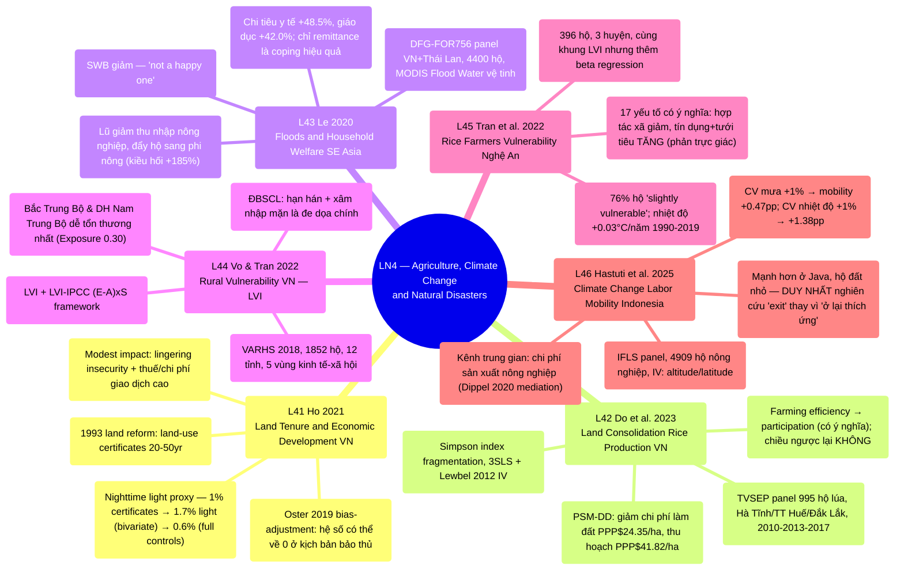

# LN4 — Agriculture, Climate Change and Natural Disasters

Lecture 4 trong [[overview]] (lịch chi tiết: [[ln0-course-intro]]). Slide deck 57 trang, ngày
29/07/2026, cover 6 required readings — 5 nguồn về Việt Nam, 1 nguồn về Indonesia.

## Cấu trúc bài giảng

Đi qua 6 papers theo thứ tự cố định: Ho 2021 (7 phần) → Do et al. 2023 (14 phần) → Le 2020 (14
phần) → Vo & Tran 2022 (6 phần) → Tran et al. 2022 (6 phần) → Hastuti et al. 2025 (4 phần), kết
bằng 2 slide "Take away" tóm tắt lại từng paper theo thứ tự. Trình tự logic của lecture đi từ
**thể chế đất đai** (Ho, Do et al. — land tenure và land fragmentation, không nhất thiết liên quan
khí hậu) sang **thiên tai/biến đổi khí hậu** (Le, Vo & Tran, Tran et al., Hastuti et al. — lũ lụt,
livelihood vulnerability, labor mobility). Đây là điểm cần lưu ý: 2 reading đầu (L41, L42) thực
chất là chủ đề "Agriculture" thuần túy (thể chế/năng suất nông nghiệp), trong khi 4 reading sau
(L43–L46) mới đúng nghĩa "Climate Change and Natural Disasters" — tên lecture ghép 2 mạch chủ đề
riêng biệt nhưng có liên hệ qua bối cảnh chung "hộ nông thôn Việt Nam/Đông Nam Á".

## Mindmap

## Luận điểm chính theo paper

### 1. Ho 2021 — [[l41-ho-2021-land-tenure-vietnam]]

- Cải cách ruộng đất 1993 Việt Nam cấp land-use certificates (20–50 năm) — kiểm định thực nghiệm
  lập luận private-property-rights của Acemoglu et al. trong bối cảnh within-country.
  Nighttime light intensity làm proxy phát triển kinh tế cấp xã vì không có GDP cấp xã.
- Hệ số bivariate 1,7% (1% certificates → 1,7% ánh sáng đêm) giảm còn 0,6% khi thêm đầy đủ kiểm
  soát + province FE (Table 3, cột 7); Oster (2019) bias-adjustment cho thấy hệ số có thể về 0 ở
  kịch bản bảo thủ nhất.
- Tác động khiêm tốn (modest) do lingering insecurity (nhà nước vẫn có thể thu hồi) và thuế/chi
  phí thời gian giao dịch đất cao — không phải do private tenure không quan trọng, mà vì đây là
  private tenure KHÔNG HOÀN CHỈNH.
- Liên kết trực tiếp lý thuyết LN2: [[institutions]], [[l21-acemoglu-2001-colonial-origins]],
  [[l23-besley-ghatak-2010-property-rights]].

### 2. Do, Nguyen & Grote 2023 — [[l42-do-2023-land-consolidation-vietnam]]

- Land fragmentation (đất phân mảnh, trung bình 3,9 thửa/hộ) là di sản từ phân phối đất bình quân
  thời Đổi Mới. Land consolidation (dồn điền đổi thửa, hợp pháp hóa 2014) được kỳ vọng cải thiện
  kinh tế quy mô.
- Simultaneous-equation system (3SLS + Lewbel 2012 IV): farming efficiency → tham gia
  consolidation (có ý nghĩa dương), nhưng consolidation → farming efficiency KHÔNG có ý nghĩa.
- PSM-DD: consolidation giảm chi phí làm đất PPP$24,35/ha, thu hoạch PPP$41,82/ha; tăng thu nhập
  nông nghiệp, giảm nghèo (FGT index).
- Cùng dữ liệu TVSEP với L43 (3 tỉnh: Hà Tĩnh, Thừa Thiên Huế, Đắk Lắk); khác kênh thể chế đất đai
  với L41 (fragmentation/consolidation, không phải property rights/tenure security).

### 3. Le 2020 — [[l43-le-2020-floods-household-welfare]]

- Dùng dữ liệu vệ tinh MODIS Flood Water khách quan (giảm nội sinh so với self-report) kết hợp
  panel DFG-FOR756 (VN + Thái Lan, 4.400 hộ) để đo tác động lũ đa chiều theo khung Dell et al.
  (2014): thu nhập, chi tiêu, coping strategies, subjective wellbeing (khung OECD 2013).
- Lũ giảm thu nhập nông nghiệp (~97% với thủy sản, ~37% với cây trồng) nhưng đẩy hộ tìm thu nhập
  phi nông (kiều hối +185%); tăng chi tiêu y tế +48,5%, giáo dục +42,0%.
- Trong các cơ chế ứng phó, CHỈ kiều hối (remittances) có hiệu quả có ý nghĩa thống kê; SWB giảm
  đáng kể trong ngắn hạn.
- Kết luận u ám: "living in villages that are subject to flooding is not a happy one."

### 4. Vo & Tran 2022 — [[l44-vo-tran-2022-rural-vulnerability-vietnam]]

- Dùng LVI (Hahn et al. 2009) + LVI-IPCC (E−A)×S trên dữ liệu VARHS 2018 (1.852 hộ, 12 tỉnh, 5
  vùng kinh tế-xã hội) để so sánh vulnerability liên vùng — thuần thống kê mô tả, không hồi quy.
- Bắc Trung Bộ & Duyên hải Nam Trung Bộ dễ tổn thương nhất (LVI-IPCC = 0,012, dương duy nhất) do
  Exposure cao (0,30 — bão/lũ/áp thấp) áp đảo adaptive capacity/sensitivity khá tốt.
- Đồng bằng sông Hồng và Đồng bằng sông Cửu Long dễ tổn thương đặc biệt về food/water; ĐBSCL —
  hạn hán + xâm nhập mặn là mối đe dọa chính.
- Xem [[livelihood-vulnerability-index]] — trunk concept cho L44+L45.

### 5. Tran et al. 2022 — [[l45-tran-2022-rice-farmers-vulnerability-nghean]]

- Áp dụng cùng công thức LVI như L44 nhưng ở độ phân giải hộ/huyện (396 hộ, 3 huyện Nghệ An —
  đúng vùng "nóng nhất" theo L44), bổ sung ma trận tương quan + **beta regression** để tìm driver.
- 76% hộ "slightly vulnerable"; nhiệt độ tăng 0,03°C/năm (1990–2019, p<0,10).
- 17 yếu tố có ý nghĩa: hợp tác xã nông nghiệp, học vấn, đa dạng thu nhập, rét đậm GIẢM
  vulnerability; lũ, hạn hán, giới tính nam, lao động gia đình, **tín dụng chính thức, tưới tiêu**
  (2 kết quả phản trực giác — do chất lượng thực thi kém, không phải do bản chất công cụ có hại)
  TĂNG vulnerability.
- Cặp phương pháp luận trực tiếp với L44: cùng công cụ đo (LVI), khác mục đích (mô tả vs giải
  thích nguyên nhân) và độ phân giải (vùng/tỉnh vs huyện/hộ).

### 6. Hastuti et al. 2025 — [[l46-hastuti-2025-climate-labor-mobility-indonesia]]

- Duy nhất nghiên cứu ngoài Việt Nam (Indonesia, IFLS panel 2000/2007/2014, 4.909 hộ nông nghiệp).
  Labor mobility = dịch chuyển KHU VỰC nghề nghiệp (không nhất thiết di cư địa lý).
  IV: altitude (cho nhiệt độ), latitude (cho mưa) — kiểm định mạnh (Kleibergen-Paap F ~58-61).
- CV mưa +1% → xác suất labor mobility +0,47 điểm%; CV nhiệt độ +1% → +1,38 điểm% (cả hai p<0,01).
- Mediation analysis (Dippel et al. 2020): kênh trung gian farm production cost có ý nghĩa với
  mưa, KHÔNG có ý nghĩa với nhiệt độ (nhiệt độ có thể tác động qua kênh khác).
- Tác động mạnh hơn ở Java, hộ đất nhỏ; DUY NHẤT trong LN4 coi mobility LÀ chiến lược thích ứng
  (exit), không phải hậu quả cần khắc phục — đối lập với L43–L45 (ở lại và thích ứng tại chỗ).

## Câu hỏi ôn thi tiềm năng

1. So sánh phương pháp xử lý endogeneity của L41 (Oster 2019 bias-adjustment), L42 (Lewbel 2012
   heteroscedasticity-based IV nội tại), và L46 (IV ngoại sinh altitude/latitude) — vì sao mỗi
   paper phải chọn chiến lược khác nhau khi biến can thiệp (land tenure, land consolidation,
   climate) đều khó tìm instrument sạch?
2. So sánh khung đo lường "vulnerability to climate/disaster" giữa L43 (outcome-based: OECD
   wellbeing + reduced-form regression trên thu nhập/chi tiêu/SWB thực) và L44/L45 (index-based:
   LVI/LVI-IPCC composite index kiểu HDI). Ưu nhược điểm của mỗi cách tiếp cận?
3. L44 và L45 dùng cùng công thức LVI của Hahn et al. (2009) nhưng khác độ phân giải địa lý và
   mục đích phân tích. Nêu rõ khác biệt và giải thích vì sao 2 kết luận chính sách khác nhau về
   bản chất (regional targeting vs household-level intervention) dù cùng phương pháp gốc.
4. Vì sao private land tenure ở Việt Nam (Ho 2021) có tác động "khiêm tốn" lên phát triển kinh
   tế, trái ngược với tác động lớn mà nghiên cứu xuyên quốc gia của Acemoglu et al. (AJR) tìm
   thấy? Liên hệ khái niệm [[institutions]] và property rights KHÔNG hoàn chỉnh.
5. Tran et al. (2022) tìm thấy tín dụng chính thức và tưới tiêu làm TĂNG (không giảm) household
   vulnerability — đây là kết quả phản trực giác. Đề xuất cách diễn giải hợp lý và một chiến lược
   thực nghiệm khác (nếu có) để phân biệt nhân quả thật với reverse causality tiềm ẩn.
6. So sánh 2 cách hộ gia đình phản ứng trước cú sốc khí hậu/thiên tai xuất hiện trong LN4: "ở lại
   và thích ứng tại chỗ" (coping strategies trong L43; vulnerability reduction trong L44/L45) vs
   "rời khỏi nông nghiệp" (labor mobility trong L46). Những yếu tố nào (đất đai, giáo dục, vùng
   miền) quyết định hộ chọn chiến lược nào?

## Liên kết

- [[overview]] · [[ln0-course-intro]] · [[almas-heshmati]]
- Concepts: [[livelihood-vulnerability-index]] · [[institutions]] (cross-lecture LN2)
