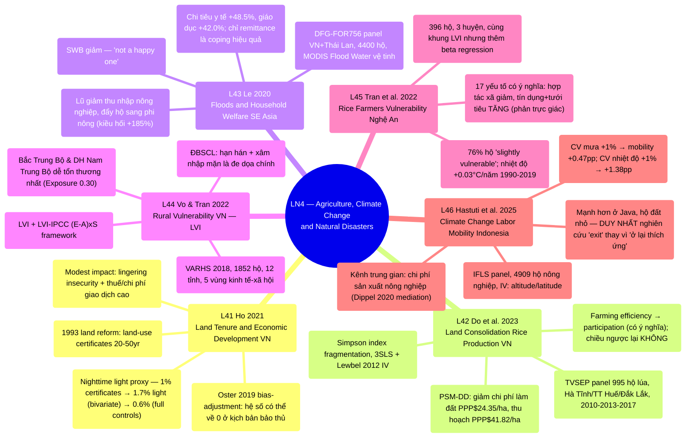

# LN4 — Agriculture, Climate Change and Natural Disasters

Lecture 4 trong [[overview]] (lịch chi tiết: [[ln0-course-intro]]). Slide deck 57 trang, ngày
29/07/2026, cover 6 required readings — 5 nguồn về Việt Nam, 1 nguồn về Indonesia. Lecture 4 in [[overview]] (detailed schedule: [[ln0-course-intro]]). A 57-page slide
deck, dated 29/07/2026, covering 6 required readings — 5 Vietnam-focused sources, 1 on
Indonesia.

## Cấu trúc bài giảng - Lecture structure

Đi qua 6 papers theo thứ tự cố định: Ho 2021 (7 phần) → Do et al. 2023 (14 phần) → Le 2020 (14
phần) → Vo & Tran 2022 (6 phần) → Tran et al. 2022 (6 phần) → Hastuti et al. 2025 (4 phần), kết
bằng 2 slide "Take away" tóm tắt lại từng paper theo thứ tự. Trình tự logic của lecture đi từ
**thể chế đất đai** (Ho, Do et al. — land tenure và land fragmentation, không nhất thiết liên quan
khí hậu) sang **thiên tai/biến đổi khí hậu** (Le, Vo & Tran, Tran et al., Hastuti et al. — lũ lụt,
livelihood vulnerability, labor mobility). Đây là điểm cần lưu ý: 2 reading đầu (L41, L42) thực
chất là chủ đề "Agriculture" thuần túy (thể chế/năng suất nông nghiệp), trong khi 4 reading sau
(L43–L46) mới đúng nghĩa "Climate Change and Natural Disasters" — tên lecture ghép 2 mạch chủ đề
riêng biệt nhưng có liên hệ qua bối cảnh chung "hộ nông thôn Việt Nam/Đông Nam Á". Works through 6 papers in a fixed order: Ho 2021 (7 sections) → Do et al. 2023 (14
sections) → Le 2020 (14 sections) → Vo & Tran 2022 (6 sections) → Tran et al. 2022 (6 sections)
→ Hastuti et al. 2025 (4 sections), closing with 2 "Take away" slides summarizing each paper in
order. The lecture's logical sequence moves from **land institutions** (Ho, Do et al. — land
tenure and land fragmentation, not necessarily climate-related) to **natural disasters/climate
change** (Le, Vo & Tran, Tran et al., Hastuti et al. — floods, livelihood vulnerability, labor
mobility). Worth noting: the first 2 readings (L41, L42) are actually pure "Agriculture" topics
(institutions/agricultural productivity), while the latter 4 (L43–L46) genuinely fit "Climate
Change and Natural Disasters" — the lecture title merges 2 distinct topic threads connected
through the shared context of "rural Vietnamese/Southeast Asian households."

## Mindmap

## Luận điểm chính theo paper - Main arguments by paper

### 1. Ho 2021 — [[l41-ho-2021-land-tenure-vietnam]]

- Cải cách ruộng đất 1993 Việt Nam cấp land-use certificates (20–50 năm) — kiểm định thực nghiệm
  lập luận private-property-rights của Acemoglu et al. trong bối cảnh within-country.
  Nighttime light intensity làm proxy phát triển kinh tế cấp xã vì không có GDP cấp xã. Vietnam's 1993 land reform granting land-use certificates (20–50 years) —
  empirically tests Acemoglu et al.'s private-property-rights argument in a within-country
  setting. Nighttime light intensity used as a commune-level economic development proxy since
  no commune-level GDP exists.
- Hệ số bivariate 1,7% (1% certificates → 1,7% ánh sáng đêm) giảm còn 0,6% khi thêm đầy đủ kiểm
  soát + province FE (Table 3, cột 7); Oster (2019) bias-adjustment cho thấy hệ số có thể về 0 ở
  kịch bản bảo thủ nhất. The bivariate coefficient of 1.7% (1% certificates
  → 1.7% nighttime light) falls to 0.6% with full controls + province FE (Table 3, column 7);
  Oster (2019) bias-adjustment shows the coefficient could fall to zero under the most
  conservative scenario.
- Tác động khiêm tốn (modest) do lingering insecurity (nhà nước vẫn có thể thu hồi) và thuế/chi
  phí thời gian giao dịch đất cao — không phải do private tenure không quan trọng, mà vì đây là
  private tenure KHÔNG HOÀN CHỈNH. A modest impact due to lingering
  insecurity (the state can still reclaim it) and high land-transaction taxes/time costs — not
  because private tenure doesn't matter, but because this is INCOMPLETE private tenure.
- Liên kết trực tiếp lý thuyết LN2: [[institutions]], [[l21-acemoglu-2001-colonial-origins]],
  [[l23-besley-ghatak-2010-property-rights]]. Directly links to LN2 theory:
  [[institutions]], [[l21-acemoglu-2001-colonial-origins]],
  [[l23-besley-ghatak-2010-property-rights]].

### 2. Do, Nguyen & Grote 2023 — [[l42-do-2023-land-consolidation-vietnam]]

- Land fragmentation (đất phân mảnh, trung bình 3,9 thửa/hộ) là di sản từ phân phối đất bình quân
  thời Đổi Mới. Land consolidation (dồn điền đổi thửa, hợp pháp hóa 2014) được kỳ vọng cải thiện
  kinh tế quy mô. Land fragmentation (averaging 3.9 plots/household) is a
  legacy of the egalitarian land distribution of the Doi Moi era. Land consolidation (legalized
  in 2014) is expected to improve economies of scale.
- Simultaneous-equation system (3SLS + Lewbel 2012 IV): farming efficiency → tham gia
  consolidation (có ý nghĩa dương), nhưng consolidation → farming efficiency KHÔNG có ý nghĩa. Simultaneous-equation system (3SLS + Lewbel 2012 IV): farming efficiency →
  participation in consolidation (significantly positive), but consolidation → farming
  efficiency is NOT significant.
- PSM-DD: consolidation giảm chi phí làm đất PPP$24,35/ha, thu hoạch PPP$41,82/ha; tăng thu nhập
  nông nghiệp, giảm nghèo (FGT index). PSM-DD: consolidation lowers
  land-preparation costs by PPP$24.35/ha, harvest costs by PPP$41.82/ha; raises farm income,
  reduces poverty (FGT index).
- Cùng dữ liệu TVSEP với L43 (3 tỉnh: Hà Tĩnh, Thừa Thiên Huế, Đắk Lắk); khác kênh thể chế đất đai
  với L41 (fragmentation/consolidation, không phải property rights/tenure security). Same TVSEP data as L43 (3 provinces: Ha Tinh, Thua Thien Hue, Dak Lak); a different
  land-institutions channel than L41 (fragmentation/consolidation, not property
  rights/tenure security).

### 3. Le 2020 — [[l43-le-2020-floods-household-welfare]]

- Dùng dữ liệu vệ tinh MODIS Flood Water khách quan (giảm nội sinh so với self-report) kết hợp
  panel DFG-FOR756 (VN + Thái Lan, 4.400 hộ) để đo tác động lũ đa chiều theo khung Dell et al.
  (2014): thu nhập, chi tiêu, coping strategies, subjective wellbeing (khung OECD 2013). Uses objective MODIS Flood Water satellite data (reducing endogeneity vs.
  self-reports) combined with the DFG-FOR756 panel (VN + Thailand, 4,400 households) to measure
  multidimensional flood impact per the Dell et al. (2014) framework: income, expenditure,
  coping strategies, subjective wellbeing (OECD 2013 framework).
- Lũ giảm thu nhập nông nghiệp (~97% với thủy sản, ~37% với cây trồng) nhưng đẩy hộ tìm thu nhập
  phi nông (kiều hối +185%); tăng chi tiêu y tế +48,5%, giáo dục +42,0%. 
  Floods reduce agricultural income (~97% for fishing, ~37% for crops) but push households
  toward non-farm income (remittances +185%); raise health spending +48.5%, education spending
  +42.0%.
- Trong các cơ chế ứng phó, CHỈ kiều hối (remittances) có hiệu quả có ý nghĩa thống kê; SWB giảm
  đáng kể trong ngắn hạn. Among coping mechanisms, ONLY remittances are
  statistically significantly effective; SWB drops significantly in the short run.
- Kết luận u ám: "living in villages that are subject to flooding is not a happy one." A somber conclusion: "living in villages that are subject to flooding is not a
  happy one."

### 4. Vo & Tran 2022 — [[l44-vo-tran-2022-rural-vulnerability-vietnam]]

- Dùng LVI (Hahn et al. 2009) + LVI-IPCC (E−A)×S trên dữ liệu VARHS 2018 (1.852 hộ, 12 tỉnh, 5
  vùng kinh tế-xã hội) để so sánh vulnerability liên vùng — thuần thống kê mô tả, không hồi quy. Uses LVI (Hahn et al. 2009) + LVI-IPCC (E−A)×S on VARHS 2018 data (1,852
  households, 12 provinces, 5 socio-economic regions) to compare vulnerability across regions —
  purely descriptive statistics, no regression.
- Bắc Trung Bộ & Duyên hải Nam Trung Bộ dễ tổn thương nhất (LVI-IPCC = 0,012, dương duy nhất) do
  Exposure cao (0,30 — bão/lũ/áp thấp) áp đảo adaptive capacity/sensitivity khá tốt. The North Central and South Central Coast is most vulnerable (LVI-IPCC = 0.012,
  the only positive value) due to high Exposure (0.30 — storms/floods/depressions) outweighing
  fairly good adaptive capacity/sensitivity.
- Đồng bằng sông Hồng và Đồng bằng sông Cửu Long dễ tổn thương đặc biệt về food/water; ĐBSCL —
  hạn hán + xâm nhập mặn là mối đe dọa chính. The Red River Delta and Mekong
  River Delta are especially vulnerable in food/water; the Mekong Delta's main threats are
  drought + salinity intrusion.
- Xem [[livelihood-vulnerability-index]] — trunk concept cho L44+L45. See
  [[livelihood-vulnerability-index]] — the trunk concept for L44+L45.

### 5. Tran et al. 2022 — [[l45-tran-2022-rice-farmers-vulnerability-nghean]]

- Áp dụng cùng công thức LVI như L44 nhưng ở độ phân giải hộ/huyện (396 hộ, 3 huyện Nghệ An —
  đúng vùng "nóng nhất" theo L44), bổ sung ma trận tương quan + **beta regression** để tìm driver. Applies the same LVI formula as L44 but at the household/district resolution (396
  rice households, 3 districts in Nghe An — the very "hottest" region per L44), adding a
  correlation matrix + **beta regression** to find drivers.
- 76% hộ "slightly vulnerable"; nhiệt độ tăng 0,03°C/năm (1990–2019, p<0,10). 76% of households are "slightly vulnerable"; temperature rises 0.03°C/year
  (1990–2019, p<0.10).
- 17 yếu tố có ý nghĩa: hợp tác xã nông nghiệp, học vấn, đa dạng thu nhập, rét đậm GIẢM
  vulnerability; lũ, hạn hán, giới tính nam, lao động gia đình, **tín dụng chính thức, tưới tiêu**
  (2 kết quả phản trực giác — do chất lượng thực thi kém, không phải do bản chất công cụ có hại)
  TĂNG vulnerability. 17 significant factors: agricultural cooperatives,
  education, income diversity, severe cold DECREASE vulnerability; floods, drought, male gender,
  family labor, **formal credit, irrigation** (2 counterintuitive results — due to poor
  implementation quality, not the instruments' inherent harm) INCREASE vulnerability.
- Cặp phương pháp luận trực tiếp với L44: cùng công cụ đo (LVI), khác mục đích (mô tả vs giải
  thích nguyên nhân) và độ phân giải (vùng/tỉnh vs huyện/hộ). A direct
  methodological pairing with L44: same measurement tool (LVI), different purpose (descriptive
  vs. explanatory) and resolution (region/province vs. district/household).

### 6. Hastuti et al. 2025 — [[l46-hastuti-2025-climate-labor-mobility-indonesia]]

- Duy nhất nghiên cứu ngoài Việt Nam (Indonesia, IFLS panel 2000/2007/2014, 4.909 hộ nông nghiệp).
  Labor mobility = dịch chuyển KHU VỰC nghề nghiệp (không nhất thiết di cư địa lý).
  IV: altitude (cho nhiệt độ), latitude (cho mưa) — kiểm định mạnh (Kleibergen-Paap F ~58-61). The only study outside Vietnam (Indonesia, IFLS panel 2000/2007/2014, 4,909
  agricultural households). Labor mobility = shifting occupational SECTOR (not necessarily
  geographic migration). IV: altitude (for temperature), latitude (for rainfall) — strong
  tests (Kleibergen-Paap F ~58-61).
- CV mưa +1% → xác suất labor mobility +0,47 điểm%; CV nhiệt độ +1% → +1,38 điểm% (cả hai p<0,01). Rainfall CV +1% → labor mobility probability +0.47 percentage points; temperature
  CV +1% → +1.38 percentage points (both p<0.01).
- Mediation analysis (Dippel et al. 2020): kênh trung gian farm production cost có ý nghĩa với
  mưa, KHÔNG có ý nghĩa với nhiệt độ (nhiệt độ có thể tác động qua kênh khác). Mediation analysis (Dippel et al. 2020): the farm production cost channel is
  significant for rainfall, NOT significant for temperature (temperature may operate through a
  different channel).
- Tác động mạnh hơn ở Java, hộ đất nhỏ; DUY NHẤT trong LN4 coi mobility LÀ chiến lược thích ứng
  (exit), không phải hậu quả cần khắc phục — đối lập với L43–L45 (ở lại và thích ứng tại chỗ). Stronger effects in Java, smallholder households; the ONLY paper in LN4 to treat
  mobility AS an adaptation strategy (exit), not an outcome to remediate — contrasting with
  L43–L45 (staying and adapting in place).

## Câu hỏi ôn thi tiềm năng - Potential exam questions

1. So sánh phương pháp xử lý endogeneity của L41 (Oster 2019 bias-adjustment), L42 (Lewbel 2012
   heteroscedasticity-based IV nội tại), và L46 (IV ngoại sinh altitude/latitude) — vì sao mỗi
   paper phải chọn chiến lược khác nhau khi biến can thiệp (land tenure, land consolidation,
   climate) đều khó tìm instrument sạch? Compare the endogeneity-handling
   methods of L41 (Oster 2019 bias-adjustment), L42 (Lewbel 2012 heteroscedasticity-based
   internal IV), and L46 (exogenous IV altitude/latitude) — why must each paper choose a
   different strategy when the intervention variable (land tenure, land consolidation, climate)
   is difficult to instrument cleanly?
2. So sánh khung đo lường "vulnerability to climate/disaster" giữa L43 (outcome-based: OECD
   wellbeing + reduced-form regression trên thu nhập/chi tiêu/SWB thực) và L44/L45 (index-based:
   LVI/LVI-IPCC composite index kiểu HDI). Ưu nhược điểm của mỗi cách tiếp cận? Compare the "vulnerability to climate/disaster" measurement frameworks between L43
   (outcome-based: OECD wellbeing + reduced-form regression on actual income/expenditure/SWB)
   and L44/L45 (index-based: LVI/LVI-IPCC, an HDI-style composite index). Pros/cons of each
   approach?
3. L44 và L45 dùng cùng công thức LVI của Hahn et al. (2009) nhưng khác độ phân giải địa lý và
   mục đích phân tích. Nêu rõ khác biệt và giải thích vì sao 2 kết luận chính sách khác nhau về
   bản chất (regional targeting vs household-level intervention) dù cùng phương pháp gốc. L44 and L45 use the same LVI formula from Hahn et al. (2009) but different
   geographic resolutions and analytical purposes. Spell out the differences and explain why
   the 2 policy conclusions differ in kind (regional targeting vs. household-level intervention)
   despite the same base method.
4. Vì sao private land tenure ở Việt Nam (Ho 2021) có tác động "khiêm tốn" lên phát triển kinh
   tế, trái ngược với tác động lớn mà nghiên cứu xuyên quốc gia của Acemoglu et al. (AJR) tìm
   thấy? Liên hệ khái niệm [[institutions]] và property rights KHÔNG hoàn chỉnh. Why does private land tenure in Vietnam (Ho 2021) have a "modest" effect on
   economic development, contrasting with the large effect found by Acemoglu et al.'s (AJR)
   cross-country research? Relate to the [[institutions]] concept and INCOMPLETE property
   rights.
5. Tran et al. (2022) tìm thấy tín dụng chính thức và tưới tiêu làm TĂNG (không giảm) household
   vulnerability — đây là kết quả phản trực giác. Đề xuất cách diễn giải hợp lý và một chiến lược
   thực nghiệm khác (nếu có) để phân biệt nhân quả thật với reverse causality tiềm ẩn. Tran et al. (2022) find that formal credit and irrigation INCREASE (not decrease)
   household vulnerability — a counterintuitive result. Propose a reasonable interpretation and
   an alternative empirical strategy (if any) to distinguish genuine causality from potential
   reverse causality.
6. So sánh 2 cách hộ gia đình phản ứng trước cú sốc khí hậu/thiên tai xuất hiện trong LN4: "ở lại
   và thích ứng tại chỗ" (coping strategies trong L43; vulnerability reduction trong L44/L45) vs
   "rời khỏi nông nghiệp" (labor mobility trong L46). Những yếu tố nào (đất đai, giáo dục, vùng
   miền) quyết định hộ chọn chiến lược nào? Compare the 2 household
   responses to climate/disaster shocks appearing in LN4: "stay and adapt in place" (coping
   strategies in L43; vulnerability reduction in L44/L45) vs. "leave agriculture" (labor
   mobility in L46). What factors (land, education, region) determine which strategy a
   household chooses?

## Liên kết

- [[overview]] · [[ln0-course-intro]] · [[almas-heshmati]]
- Bản dịch đầy đủ từng slide: [[ln4-slides]] Full slide-by-slide
  translation: [[ln4-slides]]
- Concepts: [[livelihood-vulnerability-index]] · [[institutions]] (cross-lecture LN2)
