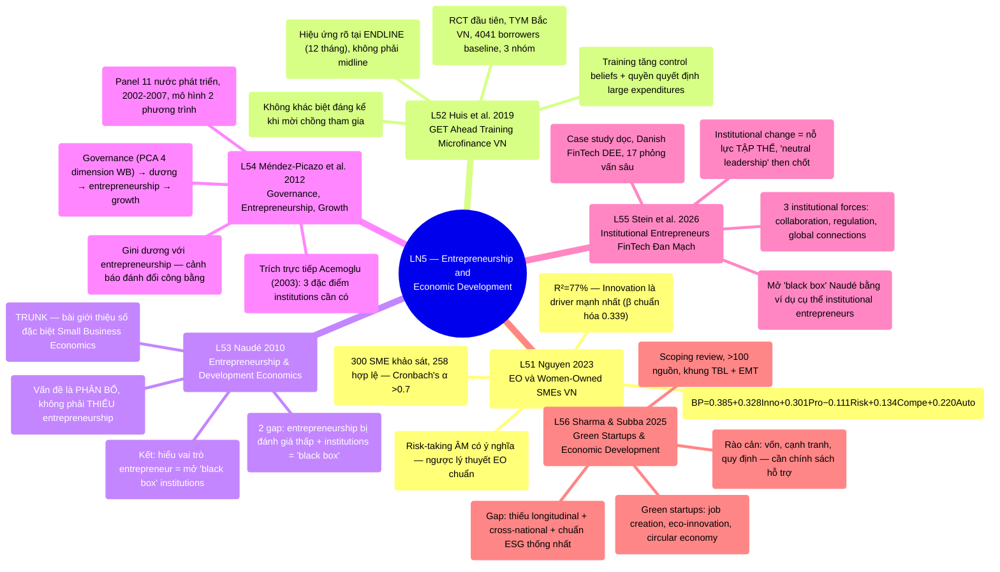

# LN5 — Entrepreneurship and Economic Development

Lecture 5 trong [[overview]] (lịch chi tiết: [[ln0-course-intro]]). Slide deck 50 trang, ngày
25/07/2026, cover 6 required readings.

## Cấu trúc bài giảng

Đi qua 6 papers theo thứ tự: Nguyen 2023 (6 phần) → Huis, Lensink, Vu & Hansen 2019 (13 phần) → Naudé
2010 (5 phần) → Méndez-Picazo, Galindo-Martín & Ribeiro-Soriano 2012 (8 phần) → Stein, Evers &
O'Gorman 2026 (6 phần) → Sharma & Subba 2025 (6 phần), kết bằng 2 slide "Take away" tóm tắt lại cả 6
bài.

## Mindmap

## Luận điểm chính theo paper

### 1. Nguyen 2023 — [[l51-nguyen-2023-entrepreneurial-orientation-women-smes-vietnam]]

- Khảo sát 300 SME nữ làm chủ ở Việt Nam (258 phản hồi hợp lệ); 5 khía cạnh EO (innovation,
  proactiveness, risk-taking, competitive aggressiveness, autonomy) → business performance.
- Mô hình giải thích 76.7% phương sai BP; 4/5 khía cạnh dương có ý nghĩa, **risk-taking âm và có ý
  nghĩa** — trái ngược lý thuyết EO chuẩn.
- Bối cảnh: SME = 98% doanh nghiệp Việt Nam, women-owned = 26.5% doanh nghiệp đang hoạt động.

### 2. Huis, Lensink, Vu & Hansen 2019 — [[l52-huis-2019-get-training-microfinance-vietnam]]

- RCT đầu tiên đánh giá GET Ahead training (ILO) trên khách hàng vay vốn nữ của TYM, MFI lớn nhất Bắc
  Việt Nam — 3 nhóm (training + mời chồng, training cá nhân, control).
- Training tăng control beliefs, tăng quyền quyết định tài chính (khoản chi lớn), giảm relational
  friction/oppression — nhưng hiệu ứng chỉ rõ rệt tại endline (12 tháng), gợi ý empowerment tích lũy
  dần theo thời gian.
- Không phát hiện khác biệt đáng kể khi mời chồng tham gia cùng.

### 3. Naudé 2010 — [[l53-naude-2010-entrepreneurship-development-economics]]

Trung tâm của [[entrepreneurship-and-development]] — bài TRUNK/programmatic của cả lecture:

- Bài giới thiệu số đặc biệt Small Business Economics 34(1), 2010, tích hợp entrepreneurship vào
  development economics — không phải nghiên cứu thực nghiệm.
- 2 gap: (i) entrepreneurship bị đánh giá thấp trong development economics; (ii) institutions vẫn là
  "black box" dù cả 2 ngành đều công nhận tầm quan trọng.
- Vấn đề không phải THIẾU entrepreneurship ở nước đang phát triển (tỷ lệ đo được còn cao hơn nước phát
  triển) mà là **PHÂN BỔ sai lệch** (productive vs unproductive/destructive, Baumol 1990).
- Kết luận: hiểu vai trò entrepreneur trong phát triển = "unpacking the black box" của institutional
  explanations.

### 4. Méndez-Picazo, Galindo-Martín & Ribeiro-Soriano 2012 — [[l54-mendez-picazo-2012-governance-entrepreneurship-growth]]

- Mô hình panel 2 phương trình, 11 nước phát triển, 2002–2007: GDP = f(innovation, entrepreneurship,
  investment); entrepreneurship = f(Gini, governance, public expenditure, money supply).
- **Trích trực tiếp Acemoglu (2003)** — 3 đặc điểm institutions cần có để thúc đẩy growth (cùng khung
  với [[l21-acemoglu-2001-colonial-origins]], LN2).
- Governance (đo qua principal components 4 dimension World Bank) → dương → entrepreneurship → dương
  gián tiếp → growth; nhưng Gini và lạm phát là "negative effects" cần quản lý.

### 5. Stein, Evers & O'Gorman 2026 — [[l55-stein-2026-digital-entrepreneurship-fintech-denmark]]

- Case study định tính dọc thời gian, Danish FinTech Digital Entrepreneurial Ecosystem (DEE), 17
  phỏng vấn sâu, dữ liệu 2009–2024.
- 3 institutional forces định hình DEE: collaboration dynamics (incumbent-start-up), regulatory
  framework adaptation, global connections.
- Institutional change là nỗ lực **tập thể** của nhiều institutional entrepreneurs qua thời gian;
  **neutral leadership** then chốt; cả system-level và organisation-level agency đều cần đồng thời.
- Mở "black box" của Naudé (L53) bằng bằng chứng cụ thể: institutional entrepreneurs chủ động thay
  đổi institutions, không chỉ phản ứng thụ động.

### 6. Sharma & Subba 2025 — [[l56-sharma-subba-2025-green-startups-sustainability]]

- Scoping review (>100 nguồn học thuật + grey literature), khung Triple Bottom Line + Ecological
  Modernization Theory.
- Green startups đóng góp job creation, eco-innovation, circular economy; nhưng đối mặt rào cản vốn,
  cạnh tranh, quy định, hạ tầng, thiếu chuẩn ESG thống nhất.
- Research gap: thiếu longitudinal studies, thiếu so sánh cross-national, thiếu chuẩn ESG hài hòa.

## Câu hỏi ôn thi tiềm năng

1. Theo Nguyen (2023), vì sao risk-taking có tác động ÂM lên business performance của women-owned SME
   Việt Nam, ngược với kỳ vọng lý thuyết EO chuẩn (Lumpkin & Dess 1996)? Nêu số liệu hồi quy cụ thể
   (hệ số, mức ý nghĩa).
2. So sánh phương pháp và câu hỏi nghiên cứu giữa Nguyen (2023, L51) và Huis et al. (2019, L52) — cả
   hai đều về women's economic empowerment ở Việt Nam nhưng khác biệt gì về thiết kế nghiên cứu
   (cross-sectional survey/regression vs RCT) và khả năng suy luận nhân quả?
3. Naudé (2010) mô tả institutions như một "black box" trong development economics. Stein et al.
   (2026) "mở" hộp đen này như thế nào qua case study Danish FinTech? Nêu 3 institutional forces cụ
   thể và giải thích vai trò "collective movement" + "neutral leadership".
4. Méndez-Picazo et al. (2012) trích dẫn trực tiếp 3 đặc điểm institutions của Acemoglu (2003). Đối
   chiếu với [[l21-acemoglu-2001-colonial-origins]] (LN2) — 2 bài dùng khung Acemoglu ở cấp độ/đơn vị
   phân tích nào khác nhau (persistence lịch sử dài hạn vs panel entrepreneurship hiện đại)?
5. Theo Sharma & Subba (2025), những rào cản chính nào cản trở green startups mở rộng quy mô, và
   chính sách nào được đề xuất để khắc phục? Nêu ít nhất 3 khoảng trống nghiên cứu (research gaps) bài
   xác định.
6. Naudé (2010) lập luận vấn đề không phải là THIẾU entrepreneurship ở nước đang phát triển mà là vấn
   đề PHÂN BỔ (allocation). Đối chiếu luận điểm này với phát hiện của Méndez-Picazo et al. (2012) rằng
   bất bình đẳng (Gini) có tương quan DƯƠNG với entrepreneurship activity — hai phát hiện này có tạo ra
   căng thẳng với mục tiêu giảm nghèo/bất bình đẳng mà Naudé đặt làm trọng tâm không?

## Liên kết

- [[overview]] · [[ln0-course-intro]] · [[almas-heshmati]]
- Concepts: [[entrepreneurship-and-development]], [[institutions]]
