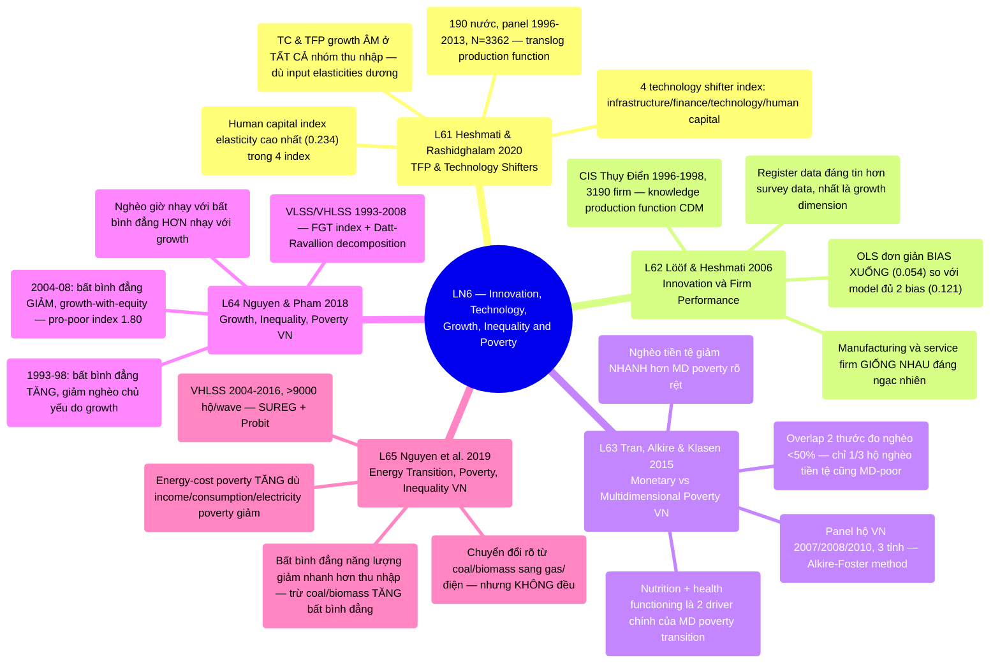

# LN6 — Innovation, Technology, Growth, Inequality and Poverty

Lecture 6 trong [[overview]] (lịch chi tiết: [[ln0-course-intro]]). Slide deck 61 trang, ngày
01/08/2026, cover 5 required readings — 2 bài phương pháp về công nghệ/năng suất (của chính GS
Heshmati) rồi 3 bài thực nghiệm về tăng trưởng-bất bình đẳng-nghèo ở Việt Nam. Lecture 6 in [[overview]] (detailed schedule: [[ln0-course-intro]]). A 61-page slide
deck, dated 01/08/2026, covering 5 required readings — 2 methodological papers on technology/
productivity (by Prof. Heshmati himself), then 3 empirical papers on growth-inequality-poverty
in Vietnam.

## Cấu trúc bài giảng - Lecture structure

Đi qua 5 papers theo thứ tự: Heshmati & Rashidghalam 2020 (9 phần) → Lööf & Heshmati 2006 (11
phần) → Tran, Alkire & Klasen 2015 (10 phần) → Nguyen & Pham 2018 (12 phần) → Nguyen et al. 2019
(10 phần), kết bằng 2 slide "Take away" tóm tắt lại cả 5 bài, cộng 1 slide giới thiệu **UNU-WIDER
World Income Inequality Database (WIID) 2026 update** (không phải required reading, chỉ là tài
nguyên tham khảo GS giới thiệu thêm). Works through 5 papers in order:
Heshmati & Rashidghalam 2020 (9 sections) → Lööf & Heshmati 2006 (11 sections) → Tran, Alkire &
Klasen 2015 (10 sections) → Nguyen & Pham 2018 (12 sections) → Nguyen et al. 2019 (10 sections),
closing with 2 "Take away" slides summarizing all 5 papers, plus 1 slide introducing the
**UNU-WIDER World Income Inequality Database (WIID) 2026 update** (not a required reading, just
a reference resource the professor adds).

Hai bài đầu (L61, L62) là cặp phương pháp về đo lường công nghệ/năng suất — do chính giáo sư là
tác giả — đặt nền cho khái niệm TFP/technical change/innovation trước khi chuyển sang 3 bài thực
nghiệm Việt Nam về nghèo đói/bất bình đẳng ở nửa sau lecture. The first two
papers (L61, L62) form a methodological pair on measuring technology/productivity — authored by
the professor himself — laying the TFP/technical-change/innovation groundwork before the lecture
shifts to 3 empirical Vietnam papers on poverty/inequality in its second half.

## Mindmap

## Luận điểm chính theo paper - Main arguments by paper

### 1. Heshmati & Rashidghalam 2020 — [[l61-heshmati-rashidghalam-2020-tfp-technology-shifters]]

- Mô hình hóa TFP growth bằng translog production function, phân rã thành 3 cấu phần: unobserved
  time-trend technical change (TC), scale economies, và technology shifter index quan sát được —
  dữ liệu panel 190 nước 1996–2013 (N=3362). Models TFP growth via a translog
  production function, decomposed into 3 components: unobserved time-trend technical change
  (TC), scale economies, and observable technology shifter index — panel data of 190 countries
  1996–2013 (N=3362).
- Kết quả gây bất ngờ: TC và TFP growth **ÂM ở TẤT CẢ nhóm thu nhập quốc gia và mọi năm** trong mô
  hình technology index được dữ liệu ủng hộ tốt nhất (Model 3/TI, trọng số ước lượng từ dữ liệu —
  khác Model 4/RTI dùng trọng số định sẵn; TFP trung bình −3.6%), dù input elasticities
  (labor/capital/energy) dương và returns to scale > 1. A surprising result:
  TC and TFP growth are **NEGATIVE across ALL country income groups and years** in the
  data-best-supported technology index model (Model 3/TI, weights estimated from the data —
  unlike Model 4/RTI's pre-specified weights; mean TFP −3.6%), despite positive input elasticities
  (labor/capital/energy) and increasing returns to scale.
- Human capital index (health + education expenditure + tertiary enrollment) có elasticity cao
  nhất lên TFP (0.234) trong 4 technology shifter index; ngược lại technology index (R&D/hi-tech
  export/patent) có elasticity ÂM nhẹ (−0.043) — phản trực giác. The human
  capital index (health + education expenditure + tertiary enrollment) has the highest TFP
  elasticity (0.234) among the 4 technology shifter indices; conversely the technology index
  (R&D/hi-tech exports/patents) has a slightly NEGATIVE elasticity (−0.043) — counterintuitive.

### 2. Lööf & Heshmati 2006 — [[l62-loof-heshmati-2006-innovation-performance]]

- Phân tích độ nhạy (sensitivity analysis) của quan hệ innovation–firm performance, dùng khung
  knowledge production function 4 phương trình kiểu CDM (Crépon, Duguet & Mairesse 1998) để xử lý
  selectivity + simultaneity bias — dữ liệu CIS Thụy Điển 1996–1998, 3190 firm (1309 innovative). Sensitivity analysis of the innovation–firm performance relationship, using a
  4-equation CDM-style (Crépon, Duguet & Mairesse 1998) knowledge production function to correct
  selectivity + simultaneity bias — Swedish CIS data 1996–1998, 3190 firms (1309 innovative).
- OLS đơn giản cho elasticity **bị bias XUỐNG** (0.054, level) so với model đủ 2 bias (0.121);
  simultaneity bias được xác nhận quan trọng hơn selectivity bias. Simple OLS
  gives a **downward-biased** elasticity (0.054, level) versus the full-bias-corrected model
  (0.121); simultaneity bias is confirmed to matter more than selectivity bias.
- Phát hiện đáng chú ý: manufacturing và service firm có quan hệ innovation→productivity **giống
  nhau đến ngạc nhiên** — điều chưa được tài liệu hóa tốt trước đó; employment chỉ tăng theo
  innovation output ở service firm. A notable finding: manufacturing and
  service firms show a **strikingly similar** innovation→productivity relationship — not
  previously well documented; employment increases with innovation output only for service
  firms.

### 3. Tran, Alkire & Klasen 2015 — [[l63-tran-alkire-klasen-2015-monetary-multidimensional-poverty-vietnam]]

- So sánh tĩnh và động giữa nghèo tiền tệ (monetary) và nghèo đa chiều (multidimensional, phương
  pháp Alkire-Foster) — panel hộ gia đình Việt Nam 2007/2008/2010, 3 tỉnh (Hà Tĩnh, Thừa Thiên
  Huế, Đắk Lắk). Compares monetary poverty and multidimensional poverty
  (Alkire-Foster method) both statically and dynamically — Vietnamese household panel data
  2007/2008/2010, 3 provinces (Ha Tinh, Thua Thien Hue, Dak Lak).
- Overlap giữa 2 thước đo **dưới 50%** — trong số hộ nghèo tiền tệ, chỉ 1/3 cũng nghèo đa chiều;
  nghèo tiền tệ giảm nhanh hơn RÕ RỆT so với nghèo đa chiều theo thời gian. 
  Overlap between the two measures is **under 50%** — of monetary-poor households, only 1/3 are
  also multidimensionally poor; monetary poverty falls CLEARLY faster than multidimensional
  poverty over time.
- Nutrition và health functioning là 2 driver chính của biến động MD poverty — dinh dưỡng thực tế
  XẤU ĐI nhẹ theo thời gian dù các chỉ báo khác (nước sạch, vệ sinh, điện) tiến bộ liên tục. Nutrition and health functioning are the two main drivers of MD poverty transitions
  — nutrition actually WORSENED slightly over time even as other indicators (clean water,
  sanitation, electricity) continuously improved.

### 4. Nguyen & Pham 2018 — [[l64-nguyen-pham-2018-growth-inequality-poverty-vietnam]]

- Phân rã growth–redistribution (Datt-Ravallion 1991; Kolenikov-Shorrocks 2005) + pro-poor growth
  index (Kakwani-Pernia 2000) cho Việt Nam 1993–2008, dùng 4 khảo sát hộ (VLSS 1993/1998, VHLSS
  2004/2008). Growth-redistribution decomposition (Datt-Ravallion 1991;
  Kolenikov-Shorrocks 2005) + pro-poor growth index (Kakwani-Pernia 2000) for Vietnam
  1993–2008, using 4 household surveys (VLSS 1993/1998, VHLSS 2004/2008).
- Giai đoạn 1993–98: bất bình đẳng TĂNG (Gini 0.33→0.35), giảm nghèo chủ yếu do growth (pro-poor
  index 0.90, dưới ngưỡng "pro-poor"); giai đoạn 2004–08: bất bình đẳng GIẢM (Gini 0.37→0.356),
  growth-with-equity, pro-poor index 1.80 (highly pro-poor). 1993–98 period:
  inequality ROSE (Gini 0.33→0.35), poverty reduction driven mainly by growth (pro-poor index
  0.90, below the "pro-poor" threshold); 2004–08 period: inequality FELL (Gini 0.37→0.356),
  growth-with-equity, pro-poor index 1.80 (highly pro-poor).
- Nghèo hiện nhạy cảm với bất bình đẳng HƠN nhạy cảm với growth (elasticity to inequality tăng từ
  0.15 năm 1993 lên 1.78 năm 2008) — hàm ý chính sách giảm bất bình đẳng có đòn bẩy cao hơn. Poverty is now more sensitive to inequality than to growth (elasticity to inequality
  rose from 0.15 in 1993 to 1.78 in 2008) — implying inequality-reduction policy now has higher
  leverage.

### 5. Nguyen, Nguyen, Hoang, Wilson & Managi 2019 — [[l65-nguyen-2019-energy-transition-poverty-inequality-vietnam]]

- Khảo sát VHLSS 2004–2016 (>9000 hộ/wave), phân loại năng lượng thành 4 nhóm (coal & biomass,
  oil, gas, electricity), dùng SUREG (2 phương trình liên quan) + Probit để xác định nhân tố ảnh
  hưởng. VHLSS survey 2004–2016 (>9000 households/wave), classifying energy
  into 4 categories (coal & biomass, oil, gas, electricity), using SUREG (2 related equations) +
  Probit to identify influencing factors.
- Chuyển đổi năng lượng rõ ràng nhưng KHÔNG đều: hộ nghèo + dân tộc thiểu số vùng Bắc còn tăng chi
  tiêu coal/biomass; energy-cost poverty **TĂNG 5 điểm %** dù income/consumption/electricity
  poverty đều giảm. Energy transition is clear but UNEVEN: poor + ethnic
  minority households in the Northern region actually increased coal/biomass expenditure;
  energy-cost poverty **ROSE 5 percentage points** even as income/consumption/electricity poverty
  all fell.
- Bất bình đẳng năng lượng nhìn chung giảm nhanh hơn bất bình đẳng thu nhập/tiêu dùng, nhưng bất
  bình đẳng riêng về coal & biomass lại TĂNG mạnh (Gini 0.52→0.79) — nghịch lý phân phối. Overall energy inequality falls faster than income/consumption inequality, but
  coal-and-biomass-specific inequality ROSE sharply (Gini 0.52→0.79) — a distributional paradox.

## Câu hỏi ôn thi tiềm năng - Potential exam questions

1. Heshmati & Rashidghalam (2020) tìm thấy TC và TFP growth ÂM ở TẤT CẢ nhóm thu nhập quốc gia
   trong technology index model, dù input elasticities dương và RTS > 1. Giải thích nghịch lý này
   và nêu ý nghĩa chính sách — technology shifter nào có elasticity cao nhất lên TFP? Heshmati & Rashidghalam (2020) find NEGATIVE TC and TFP growth across ALL country
   income groups in the technology index model, despite positive input elasticities and RTS > 1.
   Explain this paradox and its policy implication — which technology shifter has the highest TFP
   elasticity?
2. Lööf & Heshmati (2006) so sánh 4 quy trình ước lượng khác nhau cho quan hệ innovation–
   performance. Giải thích tại sao OLS đơn giản cho hệ số bị bias XUỐNG, và simultaneity bias
   khác selectivity bias thế nào trong bối cảnh knowledge production function. Lööf & Heshmati (2006) compare 4 different estimation procedures for the
   innovation–performance relationship. Explain why simple OLS gives a downward-biased
   coefficient, and how simultaneity bias differs from selectivity bias in the knowledge
   production function context.
3. Tran, Alkire & Klasen (2015) tìm thấy overlap giữa monetary poor và multidimensionally poor ở
   Việt Nam dưới 50%. Nêu 2 chỉ báo (indicator) là driver chính của biến động nghèo đa chiều, và
   giải thích tại sao nghèo tiền tệ giảm nhanh hơn nghèo đa chiều. Tran,
   Alkire & Klasen (2015) find the overlap between monetary poor and multidimensionally poor in
   Vietnam under 50%. Name 2 indicators that are the main drivers of multidimensional poverty
   transitions, and explain why monetary poverty falls faster than multidimensional poverty.
4. So sánh 2 giai đoạn 1993–98 và 2004–08 trong Nguyen & Pham (2018) theo khung phân rã growth
   component vs inequality component của Datt-Ravallion. Giai đoạn nào là "pro-poor growth" theo
   chỉ số Kakwani-Pernia, và tại sao? Compare the two periods 1993–98 and
   2004–08 in Nguyen & Pham (2018) using the Datt-Ravallion growth-component vs.
   inequality-component decomposition. Which period is "pro-poor growth" per the Kakwani-Pernia
   index, and why?
5. Nguyen et al. (2019) phát hiện energy-cost poverty TĂNG dù income poverty, consumption poverty
   và electricity poverty đều GIẢM ở Việt Nam 2004–2016. Đối chiếu phát hiện này với luận điểm của
   Tran, Alkire & Klasen (2015, L63) về sự phân kỳ giữa các thước đo nghèo khác nhau — 2 bài có
   ủng hộ lẫn nhau không? Nguyen et al. (2019) find energy-cost poverty ROSE
   even as income poverty, consumption poverty, and electricity poverty all FELL in Vietnam
   2004–2016. Contrast this finding with Tran, Alkire & Klasen's (2015, L63) argument about
   divergence between different poverty measures — do the two papers support each other?
6. Cả L61 và L62 đều là bài phương pháp của chính GS Heshmati về đo lường công nghệ/đổi mới. So
   sánh đơn vị phân tích (quốc gia vs firm) và cách mỗi bài xử lý vấn đề nội sinh (endogeneity) —
   phương pháp nào gần với SGMM của Huynh & Tran (2025, L26, LN2) hơn? Both
   L61 and L62 are Prof. Heshmati's own methodological papers on measuring technology/innovation.
   Compare their unit of analysis (country vs. firm) and how each handles endogeneity — which
   approach is closer to the SGMM used by Huynh & Tran (2025, L26, LN2)?

## Liên kết

- [[overview]] · [[ln0-course-intro]] · [[almas-heshmati]] (tác giả L61 và L62 — xem ghi chú
  ở cuối trang người này cần bổ sung liên kết) [[overview]] ·
  [[ln0-course-intro]] · [[almas-heshmati]] (author of L61 and L62 — note this person page needs
  a link added)
- Concepts: [[technology-change-and-tfp-growth]], [[growth-inequality-poverty-nexus]],
  [[technology-upgrading]], [[middle-innovation-trap]], [[creative-accumulation]]
