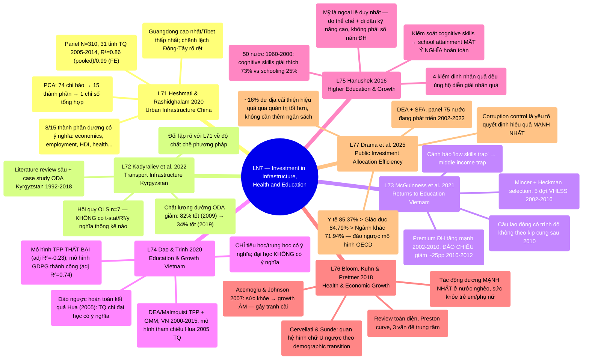

# LN7 — Investment in Development Infrastructure, Health and Education

Lecture 7 trong [[overview]] (lịch chi tiết: [[ln0-course-intro]]). Slide deck 57 trang, ngày
01/08/2026, cover 7 required readings — lecture đầu tiên gộp CẢ 3 trụ đầu tư phát triển (hạ tầng,
giáo dục, y tế) trong cùng một buổi, khác với các LN trước chỉ tập trung 1 chủ đề. Lecture 7 in [[overview]] (detailed schedule: [[ln0-course-intro]]). A 57-page slide
deck, dated 01/08/2026, covering 7 required readings — the first lecture to combine ALL 3
development-investment pillars (infrastructure, education, health) in a single session, unlike
prior LNs which each focus on one topic.

## Cấu trúc bài giảng - Lecture structure

Đi qua 7 papers theo thứ tự: Heshmati & Rashidghalam 2020 (11 phần) → Kadyraliev et al. 2022 (5
phần) → McGuinness et al. 2021 (10 phần) → Dao & Trinh 2020 (7 phần) → Hanushek 2016 (11 phần) →
Bloom, Kuhn & Prettner 2018 (5 phần) → Drama et al. 2025 (2 phần), kết bằng 2 slide "Take away"
tóm tắt lại cả 7 bài. Cấu trúc slide phản ánh trình tự logic của lecture: mở đầu bằng HẠ TẦNG (2
bài, đô thị hóa Trung Quốc + giao thông), chuyển sang GIÁO DỤC (3 bài, VN×2 + xuyên quốc gia), rồi
Y TẾ (1 bài, review toàn diện), và khép lại bằng một bài TỔNG HỢP cả giáo dục+y tế dưới góc độ hiệu
quả phân bổ đầu tư công. Works through 7 papers in order: Heshmati &
Rashidghalam 2020 (11 sections) → Kadyraliev et al. 2022 (5 sections) → McGuinness et al. 2021 (10
sections) → Dao & Trinh 2020 (7 sections) → Hanushek 2016 (11 sections) → Bloom, Kuhn & Prettner
2018 (5 sections) → Drama et al. 2025 (2 sections), closing with 2 "Take away" slides summarizing
all 7 papers. The slide structure mirrors the lecture's logical sequence: opening with
INFRASTRUCTURE (2 papers, Chinese urbanization + transport), moving to EDUCATION (3 papers, VN×2 +
cross-country), then HEALTH (1 paper, a comprehensive review), and closing with a SYNTHESIS paper
covering both education+health through the lens of public-investment allocative
efficiency.

## Mindmap

## Luận điểm chính theo paper - Main arguments by paper

### 1. Heshmati & Rashidghalam 2020 — [[l71-heshmati-rashidghalam-2020-urban-infrastructure-china]]

- Xây dựng chỉ số hạ tầng đô thị tổng hợp bằng PCA (74 chỉ báo → 15 thành phần → 1 chỉ số) cho 31
  tỉnh Trung Quốc 2005–2014, sau đó hồi quy tác động lên tỷ lệ đô thị hóa (panel N=310, pooled OLS
  và fixed-effects). Builds a composite urban-infrastructure index via PCA
  (74 indicators → 15 components → 1 index) for 31 Chinese provinces 2005–2014, then regresses
  its effect on the urbanization rate (a N=310 panel, pooled OLS and fixed-effects).
- 8/15 thành phần hạ tầng (economics, employment, human development, health, housing, security,
  utilities, technology) có tác động DƯƠNG có ý nghĩa lên đô thị hóa; education/environment không
  có ý nghĩa — "pull factor kinh tế" quan trọng hơn "pull factor phúc lợi gián tiếp". 8/15 infrastructure components (economics, employment, human development, health,
  housing, security, utilities, technology) have a significant POSITIVE effect on urbanization;
  education/environment are not significant — the "economic pull factor" matters more than the
  "indirect welfare pull factor".
- Chênh lệch tỉnh/vùng rõ rệt (Guangdong cao nhất, Tibet thấp nhất; Eastern region vượt trội) —
  khuyến nghị mỗi tỉnh cần kế hoạch đô thị hóa riêng, chính phủ trung ương cải thiện phân bổ nguồn
  lực giữa tỉnh giàu/nghèo. Marked provincial/regional gaps (Guangdong
  highest, Tibet lowest; the Eastern region dominant) — recommending each province needs its own
  urbanization plan, with the central government improving resource allocation between rich/poor
  provinces.

### 2. Kadyraliev et al. 2022 — [[l72-kadyraliev-2022-transport-infrastructure-investment]]

- Literature review rộng về hạ tầng giao thông–tăng trưởng (Aschauer 1989, Calderon & Servén 2004)
  kết hợp case study Kyrgyzstan: viện trợ nước ngoài (ODA) 1992–2018 cho hạ tầng giao thông
  (11.2% GDP/năm trung bình). A broad literature review on transport
  infrastructure–growth (Aschauer 1989, Calderon & Servén 2004) combined with a Kyrgyzstan case
  study: foreign aid (ODA) 1992–2018 for transport infrastructure (averaging 11.2% of GDP/year).
- Hồi quy thực nghiệm chỉ n=7 quan sát (2013–2019), KHÔNG báo cáo t-stat/R²/kiểm định ý nghĩa nào —
  điểm yếu phương pháp luận rõ rệt, đối lập trực tiếp với độ chặt chẽ của L71. The empirical regression has only n=7 observations (2013–2019), reporting NO
  t-statistic/R²/significance test whatsoever — a clear methodological weakness, directly
  contrasting with L71's rigor.
- Phát hiện định tính đáng chú ý hơn: chất lượng đường ODA giảm từ 82% "tốt" (2009) xuống 34% "tốt"
  (2019), nợ hạ tầng giao thông (1.463 tỷ USD) có kỳ hạn ngắn hơn tuổi thọ đường — rủi ro trả nợ
  trước khi hạ tầng hết hạn. The more noteworthy findings are qualitative:
  ODA-funded road quality fell from 82% "good" (2009) to 34% "good" (2019), transport
  infrastructure debt (USD 1.463 billion) has a shorter term than road lifespan — a repayment
  risk arising before the infrastructure's useful life ends.

### 3. McGuinness et al. 2021 — [[l73-mcguinness-2021-returns-to-education-vietnam]]

- Ước lượng suất sinh lời giáo dục (Mincer + Heckman selection) ở Việt Nam qua 5 đợt VHLSS (2002,
  2008, 2010, 2012, 2016), kèm phân tích cầu lao động tương đối (Katz & Autor 1999). Estimates returns to education (Mincer + Heckman selection) in Vietnam across 5
  VHLSS waves (2002, 2008, 2010, 2012, 2016), with a relative labor-demand analysis (Katz & Autor
  1999).
- Phát hiện khúc ngoặt lớn: premium giáo dục ĐH tăng mạnh 2002–2010 (dư cầu lao động có trình độ),
  rồi ĐẢO CHIỀU giảm mạnh (~25 điểm %) 2010–2012 dù kinh tế VẪN tăng trưởng, ổn định thấp hơn
  2012–2016. Finds a major turning point: university-education premiums rose
  sharply 2002–2010 (excess demand for skilled labor), then SHARPLY REVERSED (~25 percentage
  points) 2010–2012 despite the economy STILL growing, stabilizing lower 2012–2016.
- Cảnh báo nguy cơ "low skills trap": premium thấp → giảm động lực đầu tư vốn con người → hút thêm
  FDI kỹ năng thấp → càng giảm premium — có thể góp phần vào middle income trap. Warns of a "low skills trap" risk: low premiums → reduced human-capital investment
  incentive → attracting more low-skill FDI → further eroding premiums — potentially
  contributing to a middle income trap.

### 4. Dao & Trinh 2020 — [[l74-dao-2020-education-economic-growth-vietnam]]

- Kiểm định tác động giáo dục (3 bậc) lên tăng trưởng VN 2000–2015, dùng mô hình tham chiếu Hua
  (2005, Trung Quốc): TFP (DEA/Malmquist) + GDP growth, ước lượng GMM. Tests
  the effect of education (3 levels) on VN growth 2000–2015, using Hua's (2005, China) reference
  model: TFP (DEA/Malmquist) + GDP growth, GMM estimation.
- Mô hình TFP THẤT BẠI công khai (adjusted R²=−0.23, tác giả tự thừa nhận "questionable"); mô hình
  GDPG thành công (adjusted R²=0.74) — CHỈ tiểu học/trung học có ý nghĩa thống kê, đại học KHÔNG có
  ý nghĩa (t=1.079). The TFP model FAILS openly (adjusted R²=−0.23, the
  author admits it's "questionable"); the GDPG model succeeds (adjusted R²=0.74) — ONLY primary/
  secondary education are statistically significant, higher education is NOT (t=1.079).
- Đảo ngược hoàn toàn kết quả Hua (2005) cho Trung Quốc (chỉ đại học có ý nghĩa) — bằng chứng
  "returns to education by level" phụ thuộc giai đoạn phát triển, không phải hằng số phổ quát. Completely reverses Hua's (2005) result for China (only higher education
  significant) — evidence that "returns to education by level" depend on development stage, not
  a universal constant.

### 5. Hanushek 2016 — [[l75-hanushek-2016-higher-education-economic-growth]]

- Phản biện luận điểm chính sách phổ biến "mở rộng ĐH → tăng trưởng nhanh hơn", dùng dữ liệu tăng
  trưởng xuyên quốc gia 50 nước 1960–2000 với thước đo mới: **knowledge capital** (điểm kiểm tra
  toán/khoa học quốc tế) thay vì số năm đi học. Rebuts the popular policy
  argument "expanding higher education → faster growth", using cross-country growth data for 50
  countries 1960–2000 with a new measure: **knowledge capital** (international math/science test
  scores) instead of years of schooling.
- Cognitive skills giải thích 73.3% biến thiên tăng trưởng (vs 25.2% của school attainment); MỘT
  KHI kiểm soát cognitive skills, cả tertiary lẫn non-tertiary schooling đều MẤT Ý NGHĨA hoàn
  toàn. Cognitive skills explain 73.3% of growth variation (vs. 25.2% for
  school attainment); ONCE cognitive skills are controlled for, both tertiary and non-tertiary
  schooling LOSE ALL SIGNIFICANCE.
- Mỹ là ngoại lệ duy nhất với tertiary schooling có ý nghĩa (10%) nhưng hoàn toàn do thể chế mạnh +
  thu hút nhân tài nhập cư kỹ năng cao (55% tiến sĩ STEM Mỹ là người nước ngoài), không phải do số
  năm học ĐH tự thân. The US is the sole exception with significant tertiary
  schooling (10%) but entirely due to strong institutions + attracting highly skilled immigrant
  talent (55% of US STEM PhDs are foreign-born), not years of tertiary schooling itself.

### 6. Bloom, Kuhn & Prettner 2018 — [[l76-bloom-2018-health-economic-growth]]

- Khảo cứu toàn diện literature lý thuyết + thực nghiệm về quan hệ sức khỏe–tăng trưởng, tổ chức
  quanh Preston curve và 3 vấn đề trung tâm: nhân quả 2 chiều, thay đổi theo giai đoạn phát triển,
  khác biệt theo chiều sức khỏe. A comprehensive review of theoretical +
  empirical literature on the health–growth relationship, organized around the Preston curve and
  3 central issues: bidirectional causality, variation by development stage, differences by
  health dimension.
- Tranh cãi nổi bật: Acemoglu & Johnson (2007) tìm thấy sức khỏe → growth ÂM (dùng epidemiological
  transition làm IV); Aghion et al. (2011)/Bloom et al. (2014) chỉ ra hiệu ứng âm biến mất khi kiểm
  soát sức khỏe ban đầu; Cervellati & Sunde giải quyết bằng khung demographic transition (quan hệ
  hình chữ U ngược). A notable dispute: Acemoglu & Johnson (2007) find health
  → growth is NEGATIVE (using the epidemiological transition as an IV); Aghion et al. (2011)/
  Bloom et al. (2014) show the negative effect disappears when controlling for initial health;
  Cervellati & Sunde resolve it via a demographic-transition framework (an inverted-U-like
  relationship).
- Tác động dương MẠNH NHẤT ở nước kém phát triển giai đoạn post-transition, qua sức khỏe trẻ em/
  phụ nữ (demographic dividend); nước phát triển đối mặt "flat-of-the-curve medicine" và cần thiết
  kế an sinh xã hội phù hợp với tuổi thọ tăng. The positive effect is
  STRONGEST for less-developed, post-transition countries, via children's/women's health (a
  demographic dividend); developed countries face "flat-of-the-curve medicine" and need
  social-security designs matching rising longevity.

### 7. Drama et al. 2025 — [[l77-drama-2025-public-investment-allocation-efficiency]]

- Đo hiệu quả phân bổ đầu tư công xuyên ngành (giáo dục vs y tế vs khác) trên panel 75 nước đang
  phát triển 2002–2022, dùng đồng thời DEA (phi tham số) + SFA (tham số) + Tobit 2 giai đoạn. Measures cross-sectoral public-investment allocative efficiency (education vs.
  health vs. other) on a panel of 75 developing countries 2002–2022, using DEA (non-parametric) +
  SFA (parametric) + a two-stage Tobit simultaneously.
- Y tế (85.37%) và giáo dục (84.79%) hiệu quả HƠN ngành khác/hạ tầng (71.94%) — ĐẢO NGƯỢC mô hình
  OECD (Afonso & Aubyn 2006: giáo dục 85% > y tế 72% ở nước giàu). Health
  (85.37%) and education (84.79%) are MORE efficient than other sectors/infrastructure (71.94%) —
  REVERSING the OECD pattern (Afonso & Aubyn 2006: education 85% > health 72% in rich
  countries).
- **Corruption control là yếu tố quyết định hiệu quả MẠNH NHẤT** (mạnh nhất ở hạ tầng, hệ số 0.085)
  — còn ~16% dư địa cải thiện hiệu quả qua quản trị tốt hơn mà KHÔNG cần thêm ngân sách. **Corruption control is the STRONGEST efficiency determinant** (strongest for
  infrastructure, coefficient 0.085) — with ~16% efficiency-improvement headroom via better
  governance WITHOUT more budget.

## Câu hỏi ôn thi tiềm năng - Potential exam questions

1. Theo Heshmati & Rashidghalam (2020), 8/15 thành phần hạ tầng đô thị có tác động dương có ý
   nghĩa lên đô thị hóa Trung Quốc là những thành phần nào, và tại sao education/environment
   KHÔNG có ý nghĩa? Nêu R² của mô hình pooled OLS vs fixed-effects và giải thích chênh lệch. Per Heshmati & Rashidghalam (2020), which 8/15 urban-infrastructure components have
   a significant positive effect on China's urbanization, and why are education/environment NOT
   significant? State the R² of the pooled OLS vs. fixed-effects models and explain the
   gap.
2. So sánh độ chặt chẽ phương pháp luận giữa Heshmati & Rashidghalam (2020, L71, N=310 panel + PCA)
   và Kadyraliev et al. (2022, L72, n=7 OLS không kiểm định ý nghĩa) — vì sao cùng khung lý thuyết
   production function nhưng độ tin cậy thực nghiệm khác biệt hoàn toàn? 
   Compare the methodological rigor between Heshmati & Rashidghalam (2020, L71, a N=310 panel +
   PCA) and Kadyraliev et al. (2022, L72, an n=7 OLS with no significance testing) — why does the
   same production-function theoretical framework yield completely different empirical
   credibility?
3. McGuinness et al. (2021) phát hiện suất sinh lời giáo dục đại học ở Việt Nam đảo chiều giảm
   mạnh giai đoạn 2010–2012 dù kinh tế VẪN tăng trưởng. Nêu cơ chế giải thích của bài (cầu-cung lao
   động có trình độ) và liên hệ với khái niệm "low skills trap"/[[middle-income-trap]]. McGuinness et al. (2021) find Vietnam's higher-education wage return sharply
   reversed 2010–2012 despite the economy STILL growing. State the paper's explanatory mechanism
   (skilled labor supply-demand) and relate it to the "low skills trap"/[[middle-income-trap]]
   concept.
4. Dao & Trinh (2020) dùng mô hình tham chiếu của Hua (2005, Trung Quốc) nhưng thu được kết quả
   TRÁI NGƯỢC HOÀN TOÀN cho Việt Nam (tiểu học/trung học có ý nghĩa vs chỉ đại học có ý nghĩa ở
   TQ). Đối chiếu với luận điểm của Hanushek (2016, L75) — hai bài có mâu thuẫn nhau không, hay bổ
   sung cho nhau ở cấp độ nào? Dao & Trinh (2020) use Hua's (2005, China)
   reference model but obtain a COMPLETELY OPPOSITE result for Vietnam (primary/secondary
   significant vs. only higher education significant in China). Cross-reference with Hanushek's
   (2016, L75) argument — do the two papers contradict each other, or complement each other at
   what level?
5. Hanushek (2016) lập luận "school attainment" là thước đo vốn con người có sai lệch, và đề xuất
   thay bằng "knowledge capital". Nêu 2 vấn đề phương pháp luận của school attainment mà bài chỉ
   ra, và tóm tắt ít nhất 2/4 chiến lược kiểm định nhân quả cognitive skills → growth mà bài dùng. Hanushek (2016) argues "school attainment" is a biased measure of human capital,
   proposing "knowledge capital" instead. State the 2 methodological problems with school
   attainment the paper identifies, and summarize at least 2/4 causality-testing strategies for
   cognitive skills → growth the paper uses.
6. Acemoglu & Johnson (2007), được tổng hợp trong Bloom, Kuhn & Prettner (2018, L76), tìm thấy sức
   khỏe cải thiện có tác động ÂM lên tăng trưởng — trái ngược đa số literature. Giải thích cơ chế
   (capital dilution kiểu Solow) và cách Cervellati & Sunde (2011) hòa giải mâu thuẫn này bằng khung
   demographic transition. Acemoglu & Johnson (2007), synthesized in Bloom,
   Kuhn & Prettner (2018, L76), find health improvements have a NEGATIVE effect on growth —
   contrary to most of the literature. Explain the mechanism (Solow-style capital dilution) and
   how Cervellati & Sunde (2011) reconcile this contradiction via a demographic-transition
   framework.
7. Drama et al. (2025) tìm thấy y tế/giáo dục hiệu quả HƠN hạ tầng/ngành khác ở nước đang phát
   triển — ĐẢO NGƯỢC mô hình quan sát được ở OECD. Nêu 2 yếu tố quyết định hiệu quả mạnh nhất theo
   mô hình Tobit của bài, và giải thích vì sao "ngành khác" (hạ tầng) nhạy cảm với tham nhũng hơn y
   tế/giáo dục. Drama et al. (2025) find health/education MORE efficient than
   infrastructure/other sectors in developing countries — REVERSING the pattern observed in the
   OECD. State the 2 strongest efficiency determinants per the paper's Tobit model, and explain
   why "other sectors" (infrastructure) is more corruption-sensitive than health/education.

## Liên kết

- [[overview]] · [[ln0-course-intro]] · [[almas-heshmati]] (tác giả [[l71-heshmati-rashidghalam-2020-urban-infrastructure-china]]) [[overview]] · [[ln0-course-intro]] · [[almas-heshmati]] (author of
  [[l71-heshmati-rashidghalam-2020-urban-infrastructure-china]])
- Concepts: [[infrastructure-investment-and-growth]], [[human-capital-returns-to-education]],
  [[health-and-growth]], [[public-investment-allocation-efficiency]]
