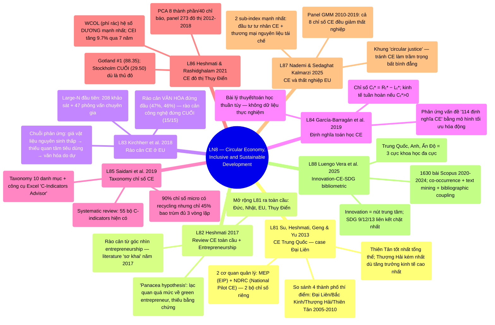

# LN8 — Circular Economy, Inclusive and Sustainable Development

Lecture 8 trong [[overview]] (lịch chi tiết: [[ln0-course-intro]]). Slide deck 55 trang, ngày
1/8/2026, cover 8 required readings (6 bài trong outline gốc syllabus + 2 bài L87/L88 giáo sư bổ
sung sau). Lecture 8 in [[overview]] (detailed schedule: [[ln0-course-intro]]).
A 55-page slide deck, dated 1/8/2026, covering 8 required readings (6 papers from the original
syllabus outline + 2 papers L87/L88 the professor added later).

## Cấu trúc bài giảng
## Lecture structure

9 phần theo "Outline of Presentation" (slide 4): **Khái niệm CE** (slide 5-6, định nghĩa Pearce &
Turner 1990 + 3R + 10 R-strategies) → **Mô hình Pearce & Turner** (slide 7-11, sơ đồ kinh tế tuyến
tính vs tuần hoàn, tài nguyên có thể/không thể tái tạo) → **Vì sao cần CE (case Trung Quốc)** (slide
12-24, 5 lý do A-E: sức khỏe môi trường, khan hiếm tài nguyên, tiêu chuẩn xanh/cạnh tranh, an ninh
quốc gia, giải quyết vấn đề khác — dẫn thẳng vào [[l81-su-2013-circular-economy-china]] + hệ thống
chỉ số đánh giá NDRC/MEP + rào cản Trung Quốc) → **Review CE toàn cầu** (slide 25-33, dựa trên
[[l82-heshmati-2017-review-circular-economy-implementation]]: mục tiêu, kỳ vọng, CE như chiến lược
bền vững, thực hành, case Thụy Điển, chuẩn đánh giá OECD Green Growth) → **OECD Green Growth
Indicators** (slide 34-36) → **8 bài đọc tóm tắt riêng** (slide 37-54, mỗi bài 1-3 slide theo cấu
trúc bullet điểm chính) → **Kết** (slide 55). 9 parts per the "Outline of
Presentation" (slide 4): **The concept of CE** (slides 5-6, Pearce & Turner's 1990 definition + 3R
+ 10 R-strategies) → **The Pearce & Turner model** (slides 7-11, linear vs. circular economy
diagrams, renewable/non-renewable resources) → **Why CE (the China case)** (slides 12-24, 5
reasons A-E: environmental/human health, resource scarcity, green standards/competitiveness,
national security, solving other problems — leading directly into
[[l81-su-2013-circular-economy-china]] + the NDRC/MEP evaluation indicator systems + China's
barriers) → **A global CE review** (slides 25-33, based on
[[l82-heshmati-2017-review-circular-economy-implementation]]: aim, expected outcomes, CE as a
sustainable-development strategy, practices, the Sweden case, the OECD Green Growth evaluation
standard) → **OECD Green Growth Indicators** (slides 34-36) → **8 individually summarized
readings** (slides 37-54, each paper 1-3 slides in bullet-point form) → **Closing** (slide
55).

Điểm đặc biệt: slide 12-24 (case Trung Quốc) và slide 25-33 (review toàn cầu) không chỉ giới thiệu
bài đọc mà DIỄN GIẢI SÂU nội dung [[l81-su-2013-circular-economy-china]] và
[[l82-heshmati-2017-review-circular-economy-implementation]] ngay trong phần thân bài giảng — 2 bài
đó đóng vai trò khung sườn cho toàn bộ 3/4 đầu slide deck, trước khi chuyển sang tóm tắt riêng lẻ 8
bài (kể cả 2 bài đó) ở phần cuối. A notable feature: slides 12-24 (the China
case) and 25-33 (the global review) do not just introduce the readings but DEEPLY DISCUSS the
content of [[l81-su-2013-circular-economy-china]] and
[[l82-heshmati-2017-review-circular-economy-implementation]] directly within the lecture body —
those 2 papers serve as the framework for 3/4 of the slide deck's opening, before switching to
individually summarizing all 8 papers (including those 2) at the end.

## Mindmap

## Luận điểm chính theo paper
## Main arguments by paper

### 1. Su, Heshmati, Geng & Yu 2013 — [[l81-su-2013-circular-economy-china]]

- Review toàn diện CE ở Trung Quốc + case study định lượng: so sánh hiệu suất CE của Đại Liên với
  Bắc Kinh, Thượng Hải, Thiên Tân qua 10 chỉ số 2005–2010. A comprehensive
  review of CE in China + a quantitative case study: comparing Dalian's CE performance against
  Beijing, Shanghai, Tianjin via 10 indicators, 2005–2010.
- Trung Quốc quản lý CE qua 2 cơ quan trung ương (MEP, NDRC) công bố 2 bộ chỉ số đánh giá EIP khác
  nhau; **Thiên Tân hiệu suất tốt nhất tổng thể, Thượng Hải kém nhất** dù tăng trưởng kinh tế cao
  nhất — tăng trưởng nhanh không tự động đi kèm quản lý CE tốt. China manages
  CE through 2 central agencies (MEP, NDRC) publishing 2 different EIP evaluation indicator
  systems; **Tianjin performs best overall, Shanghai worst** despite the highest economic growth
  — rapid growth does not automatically come with good CE management.

### 2. Heshmati 2017 — [[l82-heshmati-2017-review-circular-economy-implementation]]

- Mở rộng review CE ra toàn cầu (Đức, Nhật, EU, Thụy Điển), bổ sung góc nhìn hoàn toàn mới:
  entrepreneurship và CE như chiến lược phát triển quốc gia đổi mới. Expands
  the CE review globally (Germany, Japan, EU, Sweden), adding an entirely new perspective:
  entrepreneurship and CE as an innovative national development strategy.
- "Panacea hypothesis" — niềm tin thiếu bằng chứng rằng entrepreneur xanh sẽ tự động dẫn dắt chuyển
  đổi bền vững; literature entrepreneurship-CE khi đó "còn ở giai đoạn sơ khai". The "panacea hypothesis" — an unevidenced belief that green entrepreneurs will
  automatically drive sustainable transformation; the entrepreneurship-CE literature was then
  "still in its infant stage."

### 3. Kirchherr et al. 2018 — [[l83-kirchherr-2018-barriers-circular-economy-eu]]

- Nghiên cứu large-N đầu tiên về rào cản CE ở EU (208 khảo sát + 47 phỏng vấn) — **phản bác** quan
  điểm phổ biến rằng rào cản công nghệ là chính. The first large-N study on CE
  barriers in the EU (208 surveys + 47 interviews) — **rebutting** the common view that
  technological barriers are primary.
- Rào cản văn hóa (thiếu quan tâm tiêu dùng, văn hóa doanh nghiệp do dự) đứng đầu; rào cản công
  nghệ đứng CUỐI bảng (15/15) — trái ngược hoàn toàn literature cũ. Cultural
  barriers (lacking consumer interest, hesitant company culture) rank top; technological barriers
  rank LAST (15/15) — a complete reversal of prior literature.

### 4. García-Barragán, Eyckmans & Rousseau 2019 — [[l84-garcia-barragan-2019-defining-measuring-circular-economy]]

- Bài lý thuyết/toán học thuần túy: xây dựng mô hình tối ưu hóa động dòng vật liệu để định nghĩa
  KHÔNG MƠ HỒ kinh tế tuyến tính/tuần hoàn/tăng trưởng tuần hoàn. A purely
  theoretical/mathematical paper: building a dynamic material-flow optimization model to give
  UNAMBIGUOUS definitions of linear/circular/circular-growth economies.
- Chỉ số Cₜ* = hoạt động tái chế tối ưu trừ hoạt động tuyến tính tối ưu; kinh tế tuần hoàn nếu
  Cₜ*>0 — bao trùm cả tái chế lẫn kéo dài vòng đời sản phẩm/mô hình kinh doanh mới. The metric Cₜ* = optimal recycling activity minus optimal linear activity; the
  economy is circular if Cₜ*>0 — encompassing both recycling and product-lifetime extension/new
  business models.

### 5. Saidani, Yannou, Leroy, Cluzel & Kendall 2019 — [[l85-saidani-2019-taxonomy-circular-economy-indicators]]

- Systematic review xác định 55 bộ chỉ số đo circularity (C-indicators) hiện có, xây dựng taxonomy
  10 danh mục + công cụ chọn lọc Excel. A systematic review identifying 55
  existing circularity-indicator (C-indicator) sets, building a 10-category taxonomy + an Excel
  selection tool.
- 90% chỉ số cấp micro bao gồm recycling nhưng chỉ 45% bao trùm đủ cả 3 vòng lặp CE chính; 60% chỉ
  dùng 1 con số duy nhất để tổng hợp. 90% of micro-level indicators include
  recycling but only 45% cover all 3 main CE loops; 60% use only a single number to
  aggregate.

### 6. Heshmati & Rashidghalam 2021 — [[l86-heshmati-rashidghalam-2021-urban-circular-economy-sweden]]

- Xây dựng chỉ số CE tổng hợp (CEI, PCA, 8 thành phần/40 chỉ báo) cho 273 đô thị Thụy Điển
  2012–2018, hồi quy panel xác định yếu tố quyết định. Building a composite
  CE index (CEI, PCA, 8 components/40 indicators) for 273 Swedish municipalities 2012–2018,
  regressing panel data to identify determinants.
- Gotland xếp #1, Stockholm xếp CUỐI dù là thủ đô phát triển nhất — mật độ dân số cao và thất
  nghiệp làm GIẢM CEI; phí thu gom rác là đòn bẩy chính sách MẠNH NHẤT. 
  Gotland ranks #1, Stockholm ranks LAST despite being the most developed capital — high
  population density and unemployment REDUCE CEI; the waste collection charge is the STRONGEST
  policy lever.

### 7. Nademi & Sedaghat Kalmarzi 2025 — [[l87-nademi-kalmarzi-2025-circular-economy-unemployment]]

- Panel GMM 8 mô hình, các nước châu Âu 2010–2019: **tất cả 8 chỉ số CE đều giảm thất nghiệp** có ý
  nghĩa; chỉ số CE tổng hợp (PCA) của nhóm tác giả tác động mạnh nhất. Panel
  GMM across 8 models, European countries 2010–2019: **all 8 CE indexes significantly reduce
  unemployment**; the authors' own composite (PCA) CE index has the strongest effect.
- Khung "circular justice" — cảnh báo cần chú ý tác động xã hội tới nhóm yếu thế để tránh CE làm
  trầm trọng bất bình đẳng hiện có. A "circular justice" framework — warning
  that social impacts on marginalized groups must be addressed to avoid CE worsening existing
  inequality.

### 8. Luengo Vera, Gómez Gandía, de Lucas Ancillo & del Val Núñez 2025 — [[l88-vera-2025-innovation-circular-economy-sdgs]]

- Bibliometric + conceptual analysis 1630 bài báo Scopus 2020–2024 về giao điểm innovation × CE ×
  SDGs — 3 câu hỏi nghiên cứu tường minh về cách innovation kết nối CE với SDG. A bibliometric + conceptual analysis of 1630 Scopus articles 2020–2024 at the
  innovation × CE × SDGs intersection — 3 explicit research questions on how innovation connects
  CE to the SDGs.
- Innovation là nút trung tâm/"systemic enabler"; Trung Quốc, Anh, Ấn Độ là 3 cực khoa học chính —
  bối cảnh đa cực nhưng không đồng đều. Innovation is the central node/
  "systemic enabler"; China, the UK, India are the 3 main scientific poles — a multipolar yet
  uneven landscape.

## Câu hỏi ôn thi tiềm năng
## Potential exam questions

1. Kirchherr et al. (2017) tìm thấy 114 định nghĩa CE khác nhau trong literature. Ba bài L83, L84,
   L85 phản ứng khác nhau thế nào trước vấn đề này — nêu rõ hướng đi cụ thể của từng bài (chấp
   nhận/loại bỏ/tổ chức hóa sự mơ hồ) và đánh giá ưu-nhược điểm mỗi hướng. 
   Kirchherr et al. (2017) find 114 different CE definitions in the literature. How do L83, L84,
   and L85 respond differently to this problem — specify each paper's concrete approach
   (accepting/eliminating/organizing the ambiguity) and evaluate the pros/cons of each.
2. So sánh phát hiện về rào cản CE giữa [[l81-su-2013-circular-economy-china]]/
   [[l82-heshmati-2017-review-circular-economy-implementation]] (bối cảnh Trung Quốc) và
   [[l83-kirchherr-2018-barriers-circular-economy-eu]] (bối cảnh EU) — vì sao rào cản công nghệ
   được coi là hàng đầu ở nguồn này nhưng đứng cuối ở nguồn kia? Đề xuất giải thích dựa trên trình
   độ phát triển kinh tế. Compare the CE-barrier findings between
   [[l81-su-2013-circular-economy-china]]/[[l82-heshmati-2017-review-circular-economy-implementation]]
   (China context) and [[l83-kirchherr-2018-barriers-circular-economy-eu]] (EU context) — why are
   technological barriers seen as primary in one source but last in the other? Propose an
   explanation based on economic development level.
3. Đối chiếu mô hình quản trị CE của Trung Quốc ([[l81-su-2013-circular-economy-china]], top-down,
   2 cơ quan trung ương) và Thụy Điển ([[l86-heshmati-rashidghalam-2021-urban-circular-economy-sweden]],
   phân quyền, đòn bẩy giá cả) — nêu cụ thể cơ chế của từng mô hình và đánh giá mô hình nào phù hợp
   hơn với bối cảnh thể chế Việt Nam. Contrast China's CE governance model
   ([[l81-su-2013-circular-economy-china]], top-down, 2 central agencies) with Sweden's
   ([[l86-heshmati-rashidghalam-2021-urban-circular-economy-sweden]], decentralized, price
   levers) — specify each model's mechanism and assess which fits Vietnam's institutional context
   better.
4. Theo [[l86-heshmati-rashidghalam-2021-urban-circular-economy-sweden]], vì sao Stockholm (thủ đô
   phát triển nhất Thụy Điển) lại có CEI thấp nhất trong khi các đô thị ngoại vi (Gotland,
   Härjedalen) đứng đầu? Nêu cụ thể các biến hồi quy có ý nghĩa giải thích hiện tượng này. Per [[l86-heshmati-rashidghalam-2021-urban-circular-economy-sweden]], why does
   Stockholm (Sweden's most developed capital) have the lowest CEI while peripheral municipalities
   (Gotland, Härjedalen) rank top? Specify the significant regression variables explaining this
   pattern.
5. So sánh phương pháp đo lường/chỉ số tổng hợp PCA dùng bởi
   [[l86-heshmati-rashidghalam-2021-urban-circular-economy-sweden]] (LN8),
   [[l71-heshmati-rashidghalam-2020-urban-infrastructure-china]] (LN7), và
   [[l61-heshmati-rashidghalam-2020-tfp-technology-shifters]] (LN6) — nêu rõ đặc điểm chung
   ("chữ ký phương pháp luận" của tác giả) và khác biệt biến phụ thuộc/bối cảnh mỗi bài. Compare the PCA composite-index methodology used by
   [[l86-heshmati-rashidghalam-2021-urban-circular-economy-sweden]] (LN8),
   [[l71-heshmati-rashidghalam-2020-urban-infrastructure-china]] (LN7), and
   [[l61-heshmati-rashidghalam-2020-tfp-technology-shifters]] (LN6) — specify the common features
   (the author's "methodological signature") and each paper's differing dependent
   variable/context.
6. Theo [[l87-nademi-kalmarzi-2025-circular-economy-unemployment]], CE giảm thất nghiệp châu Âu qua
   những kênh nào? Đối chiếu phát hiện "CE giảm thất nghiệp rõ ràng" ở cấp vĩ mô này với bức tranh
   phức tạp hơn về việc làm xanh ở [[l56-sharma-subba-2025-green-startups-sustainability]] (LN5,
   cấp vi mô) — hai phát hiện này có mâu thuẫn không, hay phản ánh khác biệt cấp độ phân tích? Per [[l87-nademi-kalmarzi-2025-circular-economy-unemployment]], through which
   channels does CE reduce unemployment in Europe? Contrast this "CE clearly reduces
   unemployment" macro-level finding with the more complex green-jobs picture in
   [[l56-sharma-subba-2025-green-startups-sustainability]] (LN5, micro-level) — do these two
   findings conflict, or reflect a difference in level of analysis?
7. Theo [[l85-saidani-2019-taxonomy-circular-economy-indicators]], vì sao dùng trực tiếp tỷ lệ tái
   chế (recycling rate) làm proxy cho CE là "không thỏa đáng về mặt phương pháp luận"? Liên hệ với
   định nghĩa toán học của [[l84-garcia-barragan-2019-defining-measuring-circular-economy]] để giải
   thích khác biệt giữa "đo hoạt động" và "đo giá trị tối đa hóa". Per
   [[l85-saidani-2019-taxonomy-circular-economy-indicators]], why is using the recycling rate
   directly as a CE proxy "methodologically unsatisfactory"? Connect this to
   [[l84-garcia-barragan-2019-defining-measuring-circular-economy]]'s mathematical definition to
   explain the difference between "measuring activity" and "measuring maximized value."
8. [[l88-vera-2025-innovation-circular-economy-sdgs]] tìm thấy Trung Quốc, Anh, Ấn Độ là 3 cực khoa
   học chính về CE-innovation-SDG. Đối chiếu phát hiện này với vai trò trung tâm của Trung Quốc
   xuyên suốt các case study định tính khác trong LN8 ([[l81-su-2013-circular-economy-china]],
   [[l82-heshmati-2017-review-circular-economy-implementation]]) — bằng chứng bibliometric này củng
   cố luận điểm gì về vai trò dẫn dắt CE toàn cầu của Trung Quốc? 
   [[l88-vera-2025-innovation-circular-economy-sdgs]] finds China, the UK, and India are the 3
   main scientific poles on CE-innovation-SDG. Contrast this with China's central role across
   LN8's other qualitative case studies ([[l81-su-2013-circular-economy-china]],
   [[l82-heshmati-2017-review-circular-economy-implementation]]) — what claim about China's
   global CE leadership does this bibliometric evidence reinforce?

## Liên kết

- [[overview]] · [[ln0-course-intro]] · [[almas-heshmati]]
- Concept: [[circular-economy]]
