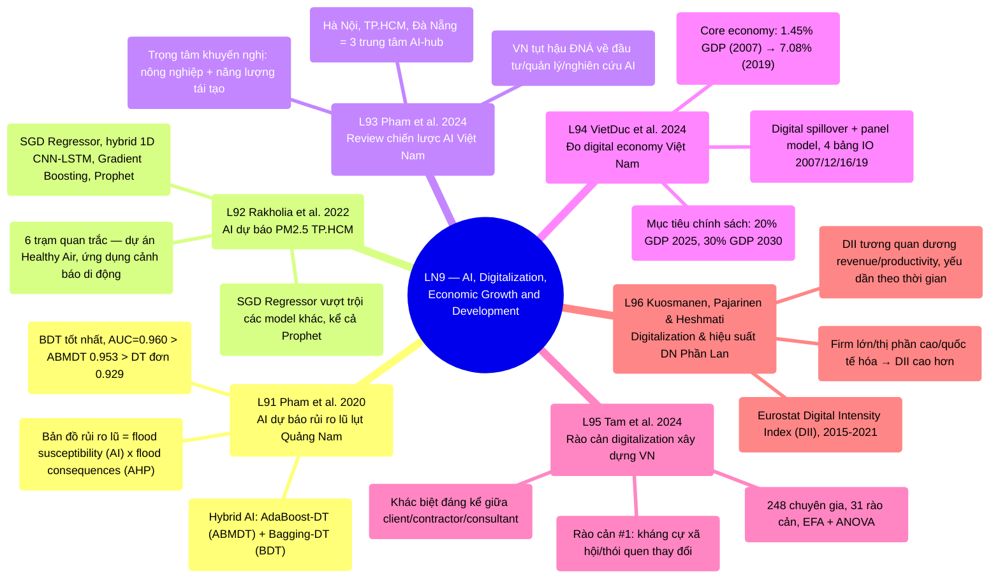

# LN9 — Artificial Intelligence, Digitalization and Economic Growth and Development

Lecture 9 trong [[overview]] (lịch chi tiết: [[ln0-course-intro]]). Slide deck 38 trang, ngày
6/8/2026, cover 6 required readings (L91–L96) — 2 bài đầu là ứng dụng AI cho quản lý rủi ro môi
trường/thiên tai ở Việt Nam, 4 bài sau chuyển sang đo lường/tác động của digitalization lên nền
kinh tế và hiệu suất doanh nghiệp. Lecture 9 in [[overview]] (detailed
schedule: [[ln0-course-intro]]). A 38-page slide deck, dated 6/8/2026, covering 6 required
readings (L91–L96) — the first 2 papers apply AI to environmental/disaster risk management in
Vietnam, the remaining 4 shift to measuring digitalization's impact on the economy and firm
performance.

## Cấu trúc bài giảng - Lecture structure

Deck không có mục "Outline of Presentation" tường minh như LN7/LN8 — cấu trúc đơn giản: **danh
sách 6 reading** (slide 3, kèm trích dẫn đầy đủ) → **6 bài đọc tóm tắt riêng theo thứ tự**
(slide 4–30, mỗi bài 1–6 slide dạng bullet điểm chính) → **"Recent useful research and reading"**
(slide 31–37, 3 bài bổ sung KHÔNG có PDF trong `raw/` — Tu et al. 2026 về AI industrial policy
Trung Quốc, Lin-Xu 2025 về digital transformation & high-quality growth Trung Quốc, Rashidghalam
et al. 2026 IZA DP về AI ở nền kinh tế Việt Nam — chỉ có tóm tắt trên slide, không deep-ingest
thành trang `source` riêng vì thiếu bài báo gốc) → **Kết** (slide 38). The
deck has no explicit "Outline of Presentation" section like LN7/LN8 — a simpler structure: **the
list of 6 readings** (slide 3, with full citations) → **6 individually summarized readings in
order** (slides 4–30, each paper 1–6 bullet-point slides) → **"Recent useful research and
reading"** (slides 31–37, 3 supplementary papers with NO PDF in `raw/` — Tu et al. 2026 on AI
industrial policy in China, Lin-Xu 2025 on digital transformation & China's high-quality growth,
Rashidghalam et al. 2026 IZA DP on AI in the Vietnamese economy — only a slide summary exists, not
deep-ingested as separate `source` pages since the underlying papers are unavailable) → **Closing**
(slide 38).

Điểm đặc biệt: lecture này có 2 CỤM chủ đề tách biệt rõ rệt bên trong cùng 1 buổi học — (1) AI cho
quản lý rủi ro thiên tai/môi trường ở Việt Nam (L91 lũ lụt, L92 chất lượng không khí), và (2) đo
lường/tác động digitalization lên kinh tế và doanh nghiệp (L93 chiến lược AI quốc gia, L94 quy mô
digital economy, L95 rào cản digitalization xây dựng, L96 digitalization & hiệu suất doanh
nghiệp) — khác với các lecture trước, 2 cụm này không có bài "trunk" nối chúng lại, chỉ cùng chung
chủ đề rộng "AI & Digitalization". A notable feature: this lecture has 2
CLEARLY SEPARATE thematic clusters within a single session — (1) AI for disaster/environmental
risk management in Vietnam (L91 flooding, L92 air quality), and (2) measuring/assessing
digitalization's impact on the economy and firms (L93 national AI strategy, L94 digital economy
scale, L95 construction digitalization barriers, L96 digitalization & firm performance) — unlike
prior lectures, these 2 clusters have no "trunk" paper linking them, sharing only the broad
"AI & Digitalization" theme.

## Mindmap

## Luận điểm chính theo paper - Main arguments by paper

### 1. Pham et al. 2020 — [[l91-pham-2020-flood-risk-ai-vietnam]]

- Kết hợp 2 mô hình AI hybrid (ABMDT, BDT) với Decision Table làm base classifier để lập bản đồ
  khả năng xảy ra lũ (flood susceptibility) tại Quảng Nam, dùng 847 điểm lũ lịch sử + 14 yếu tố ảnh
  hưởng. Combines 2 hybrid AI models (ABMDT, BDT) with Decision Table as the
  base classifier to map flood susceptibility in Quang Nam, using 847 historical flood locations +
  14 influencing factors.
- Mô hình BDT tốt nhất (AUC=0.960); bản đồ rủi ro lũ cuối cùng kết hợp bản đồ khả năng xảy ra (AI)
  với bản đồ hậu quả (phương pháp AHP) — một khung 2 lớp có thể tái sử dụng cho vùng dễ lũ
  khác. The BDT model performs best (AUC=0.960); the final flood-risk map
  combines the susceptibility map (AI) with a consequences map (AHP method) — a reusable 2-layer
  framework applicable to other flood-prone areas.

### 2. Rakholia et al. 2022 — [[l92-rakholia-2022-air-quality-ai-hcmc]]

- So sánh 4 thuật toán ML (SGD Regressor, hybrid 1D CNN-LSTM, Gradient Boosting, Prophet) dự báo
  PM2.5 theo giờ tại 6 trạm quan trắc TP.HCM, đề xuất quy trình huấn luyện riêng để xử lý tính
  không dừng của chuỗi thời gian PM2.5. Compares 4 ML algorithms (SGD
  Regressor, hybrid 1D CNN-LSTM, Gradient Boosting, Prophet) forecasting hourly PM2.5 across 6
  HCMC monitoring stations, proposing a dedicated training protocol to address the
  non-stationarity of the PM2.5 time series.
- SGD Regressor vượt trội các model khác kể cả Prophet phổ biến; kết quả dùng trực tiếp cho ứng
  dụng cảnh báo sớm ô nhiễm không khí "Healthy Air". The SGD Regressor
  outperforms all other models including the popular Prophet; results feed directly into the
  "Healthy Air" early-warning mobile app.

### 3. Pham et al. 2024 — [[l93-pham-2024-ai-development-vietnam-review]]

- Critical review so sánh khung đầu tư/quy định/nghiên cứu AI của Việt Nam với các nước Đông Nam Á
  khác — Việt Nam bị đánh giá tụt hậu ở cả 3 trụ. A critical review comparing
  Vietnam's AI investment/regulatory/research framework against other Southeast Asian countries —
  Vietnam is assessed as lagging on all 3 pillars.
- Khuyến nghị tập trung nguồn lực vào nông nghiệp + năng lượng tái tạo, xây cơ chế liên kết
  nghiên cứu cấp Bộ; Hà Nội, TP.HCM, Đà Nẵng là 3 trung tâm AI-hub tiềm năng. 
  Recommends concentrating resources on agriculture + renewable energy, building Ministerial-level
  research linkage mechanisms; Hanoi, HCMC, and Danang are the 3 potential AI-hub centers.

### 4. VietDuc et al. 2024 — [[l94-vietduc-2024-digital-economy-vietnam]]

- Đo quy mô digital economy Việt Nam bằng digital spillover + panel model trên 4 bảng
  Input-Output quốc gia (2007/2012/2016/2019). Measures the scale of Vietnam's
  digital economy using digital spillover + a panel model on 4 national Input-Output tables
  (2007/2012/2016/2019).
- Core digital economy tăng từ 1.45% GDP (2007) lên 7.08% (2019); digitalized economy đạt
  11.56% GDP giai đoạn 2016–2019 — hàm ý cần chính sách đạt mục tiêu 20% GDP (2025)/30% GDP
  (2030). The core digital economy grew from 1.45% of GDP (2007) to 7.08%
  (2019); the digitalized economy reached 11.56% of GDP in 2016–2019 — implying the need for
  policy to hit the 20%-of-GDP (2025)/30%-of-GDP (2030) targets.

### 5. Tam et al. 2024 — [[l95-tam-2024-construction-digitalization-barriers-vietnam]]

- Khảo sát 248 chuyên gia xây dựng Việt Nam (client/contractor/consultant) về 31 rào cản
  digitalization, dùng reliability test + EFA + ANOVA. Surveys 248 Vietnamese
  construction professionals (client/contractor/consultant) on 31 digitalization barriers, using
  reliability tests + EFA + ANOVA.
- Rào cản lớn nhất là kháng cự xã hội/thói quen thay đổi, tiếp theo là chi phí phần mềm/phần cứng
  cao, thiếu dữ liệu thị trường, lo ngại an ninh, thiếu tiêu chuẩn hóa. The
  biggest barrier is social/habitual resistance to change, followed by high software/hardware
  costs, lack of market data, security concerns, and lack of standardization.

### 6. Kuosmanen, Pajarinen & Heshmati — [[l96-kuosmanen-2026-digital-adoption-firm-performance-finland]]

- Dùng Eurostat Digital Intensity Index (DII) trên dữ liệu doanh nghiệp dịch vụ Phần Lan 2015–2021,
  ghép với financial statement panel để đo quan hệ digitalization–hiệu suất. 
  Uses the Eurostat Digital Intensity Index (DII) on Finnish service-firm data 2015–2021, merged
  with a financial-statement panel to measure the digitalization–performance relationship.
- Tương quan dương DII–doanh thu bền vững qua cả giai đoạn COVID-19; tương quan DII–năng suất yếu
  dần theo thời gian; firm lớn/thị phần cao/hoạt động quốc tế có DII cao hơn. 
  The DII–revenue correlation stays positive persisting through COVID-19; the DII–productivity
  correlation weakens over time; larger firms/higher market share/international activity have
  higher DII.

## Câu hỏi ôn thi tiềm năng - Potential exam questions

1. So sánh 2 ứng dụng AI cho quản lý rủi ro ở Việt Nam — [[l91-pham-2020-flood-risk-ai-vietnam]]
   (lũ lụt) và [[l92-rakholia-2022-air-quality-ai-hcmc]] (chất lượng không khí) — về mục tiêu, mô
   hình AI dùng, và cách kết quả được đưa vào ứng dụng thực tế. Compare the 2
   AI-for-risk-management applications in Vietnam — [[l91-pham-2020-flood-risk-ai-vietnam]]
   (flooding) and [[l92-rakholia-2022-air-quality-ai-hcmc]] (air quality) — on their goals, the AI
   models used, and how results feed into real-world applications.
2. Theo [[l93-pham-2024-ai-development-vietnam-review]] và [[l94-vietduc-2024-digital-economy-vietnam]],
   Việt Nam đang ở đâu trong quá trình chuyển đổi số so với khu vực, và 2 bài đề xuất những chính
   sách gì để đạt mục tiêu digitalized economy 20–30% GDP? Per
   [[l93-pham-2024-ai-development-vietnam-review]] and
   [[l94-vietduc-2024-digital-economy-vietnam]], where does Vietnam stand in digital transformation
   relative to the region, and what policies do the 2 papers propose to hit the 20–30%-of-GDP
   digitalized-economy targets?
3. [[l95-tam-2024-construction-digitalization-barriers-vietnam]] tìm thấy rào cản văn hóa/thói quen
   là lớn nhất, KHÔNG phải rào cản công nghệ — so sánh với phát hiện tương tự về rào cản văn hóa ở
   [[l83-kirchherr-2018-barriers-circular-economy-eu]] (LN8, rào cản CE ở EU). Hai phát hiện này
   có điểm chung gì về bản chất của "rào cản chuyển đổi" trong các nước/ngành khác nhau? [[l95-tam-2024-construction-digitalization-barriers-vietnam]] finds cultural/habitual
   resistance is the largest barrier, NOT technological barriers — compare with the similar
   cultural-barrier finding in [[l83-kirchherr-2018-barriers-circular-economy-eu]] (LN8, CE
   barriers in the EU). What do these 2 findings share about the nature of "transition barriers"
   across different countries/sectors?
4. Theo [[l96-kuosmanen-2026-digital-adoption-firm-performance-finland]], vì sao tương quan
   digitalization–productivity yếu dần theo thời gian dù tương quan digitalization–doanh thu vẫn
   bền vững? Liên hệ khả năng này với luận điểm "TC/TFP âm" ở
   [[l61-heshmati-rashidghalam-2020-tfp-technology-shifters]] (LN6) — cả 2 bài có gợi ý gì chung về
   giới hạn của công nghệ trong việc nâng năng suất? Per
   [[l96-kuosmanen-2026-digital-adoption-firm-performance-finland]], why does the
   digitalization–productivity correlation weaken over time even as the digitalization–revenue
   correlation stays robust? Connect this possibility to the "negative TC/TFP" finding in
   [[l61-heshmati-rashidghalam-2020-tfp-technology-shifters]] (LN6) — what do both papers jointly
   suggest about the limits of technology in raising productivity?
5. Việt Nam là bối cảnh chung của 4/6 bài đọc LN9 (L91, L92, L93, L95) — tổng hợp các phát hiện này
   thành một bức tranh về năng lực chuyển đổi số/AI của Việt Nam: điểm mạnh (ứng dụng kỹ thuật cụ
   thể như L91/L92), điểm yếu (chính sách/đầu tư như L93, rào cản hành vi như L95). Vietnam is the shared context of 4/6 LN9 readings (L91, L92, L93, L95) — synthesize
   these findings into a picture of Vietnam's digital/AI transformation capacity: strengths
   (specific technical applications like L91/L92), weaknesses (policy/investment like L93,
   behavioral barriers like L95).

## Liên kết

- [[overview]] · [[ln0-course-intro]] · [[almas-heshmati]]
- Concept: [[ai-for-environmental-risk-vietnam]], [[digital-transformation-and-productivity]]
