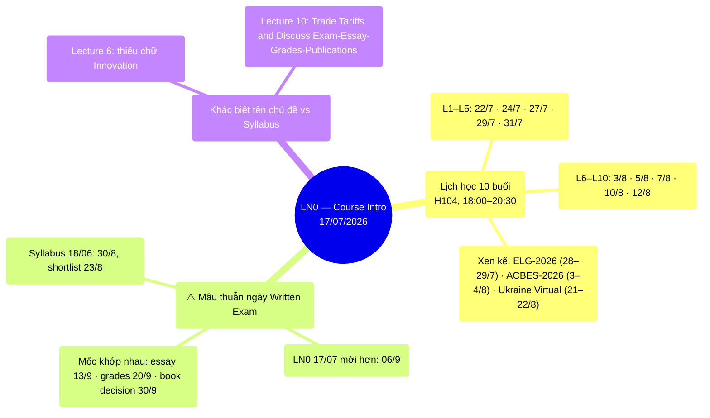

# LN0 — Course Intro (17/07/2026)

Deck 14 slide: lịch học chi tiết + reading list đầy đủ cho 10 lectures. Tiêu đề gốc
"Development Economics vs Economic Development" nhưng nội dung chủ yếu là administrative.

## Mindmap

## Lịch học (18:00–20:30, phòng H104)

| #   | Ngày     |     | #   | Ngày     |
| --- | -------- | --- | --- | -------- |
| L1  | Wed 22/7 |     | L6  | Mon 3/8  |
| L2  | Fri 24/7 |     | L7  | Wed 5/8  |
| L3  | Mon 27/7 |     | L8  | Fri 7/8  |
| L4  | Wed 29/7 |     | L9  | Mon 10/8 |
| L5  | Fri 31/7 |     | L10 | Wed 12/8 |

Xen kẽ: ELG-2026 Conference (28–29/7), ACBES-2026 (3–4/8), Ukraine Virtual Conf (21–22/8).

## ⚠️ MÂU THUẪN với Syllabus — ngày Written Exam

| Nguồn | Ngày exam |
|---|---|
| [[syllabus-2026]] (18/06/2026) | **30/8** (shortlist 20 bài: 23/8) |
| LN0 (17/07/2026 — **mới hơn**) | **Sept 06** |

LN0 mới hơn nên tạm coi **06/9** là ngày hiện hành, nhưng CẦN XÁC NHẬN với giáo sư/lớp.
Các mốc khác khớp nhau: essay 13/9, grades 20/9, book decision 30/9.

## Khác biệt nhỏ về tên chủ đề so với syllabus

- Lecture 6: "Technology, Growth, Inequality and Poverty" (syllabus có thêm "Innovation").
- Lecture 10: "Trade Tariffs and Discuss Exam-Essay-Grades-Publications".

## Liên kết

- [[overview]] · [[ln1-economic-development]] · [[almas-heshmati]]
