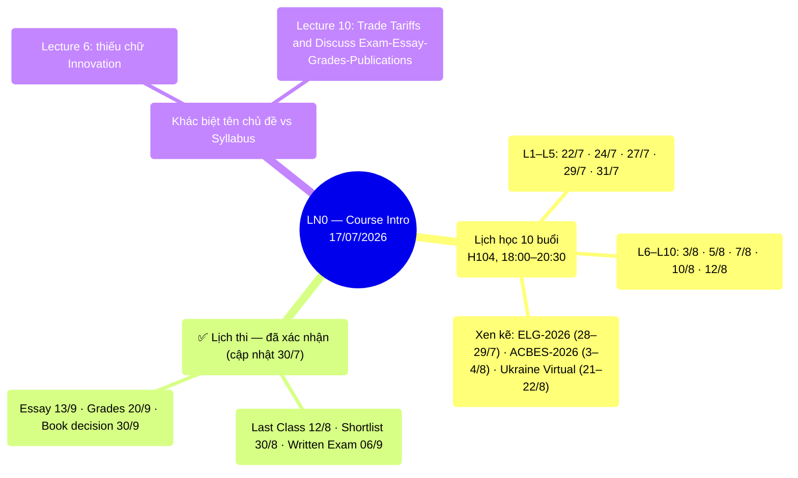

# LN0 — Course Intro (17/07/2026)

Deck 14 slide: lịch học chi tiết + reading list đầy đủ cho 10 lectures. Tiêu đề gốc
"Development Economics vs Economic Development" nhưng nội dung chủ yếu là administrative.

## Mindmap

## Lịch học (18:00–20:30, phòng H104)

| #   | Ngày     |     | #   | Ngày     |
| --- | -------- | --- | --- | -------- |
| L1  | Wed 22/7 |     | L6  | Mon 3/8  |
| L2  | Fri 24/7 |     | L7  | Wed 5/8  |
| L3  | Mon 27/7 |     | L8  | Fri 7/8  |
| L4  | Wed 29/7 |     | L9  | Mon 10/8 |
| L5  | Fri 31/7 |     | L10 | Wed 12/8 |

Xen kẽ: ELG-2026 Conference (28–29/7), ACBES-2026 (3–4/8), Ukraine Virtual Conf (21–22/8).

## ✅ Lịch thi — đã xác nhận (cập nhật 30/7)

Giáo sư trình chiếu slide "Planning Schedule" cập nhật ngay trong lớp (ảnh chụp màn hình,
xem `also_covers` ở frontmatter) — đây là nguồn **mới nhất**, thay thế cho cả syllabus
(18/06) lẫn bản LN0 gốc (17/07) ở những mục có khác biệt:

| Mốc | Syllabus (18/06) | LN0 gốc (17/07) | **Planning Schedule (mới nhất)** |
|---|---|---|---|
| Last Class | — | 12/8 (L10) | **12/8** — khớp |
| Shortlist 20 bài | 23/8 | — | **30/8** — ⚠️ đổi so với syllabus |
| Written Exam | 30/8 | 06/9 | **06/9** — xác nhận đúng bản LN0, KHÔNG phải syllabus |
| Deadline Essay | 13/9 | 13/9 | **13/9** — khớp |
| Submit Grades | 20/9 | 20/9 | **20/9** — khớp |
| Book publication decision | 30/9 | 30/9 | **30/9** — khớp |

**Mâu thuẫn ngày thi giữa syllabus và LN0 nay đã được giải quyết**: Written Exam chính thức
là **06/9** (không phải 30/8 như syllabus ghi ban đầu). Điểm cần lưu ý thêm: ngày gửi
shortlist 20 bài đã **dời từ 23/8 sang 30/8** — trễ hơn 1 tuần so với kế hoạch ban đầu trong
syllabus, đồng nghĩa thời gian giữa lúc có shortlist và ngày thi (06/9) chỉ còn ~1 tuần.

## Khác biệt nhỏ về tên chủ đề so với syllabus

- Lecture 6: "Technology, Growth, Inequality and Poverty" (syllabus có thêm "Innovation").
- Lecture 10: "Trade Tariffs and Discuss Exam-Essay-Grades-Publications".

## Liên kết

- [[overview]] · [[ln1-economic-development]] · [[almas-heshmati]]
