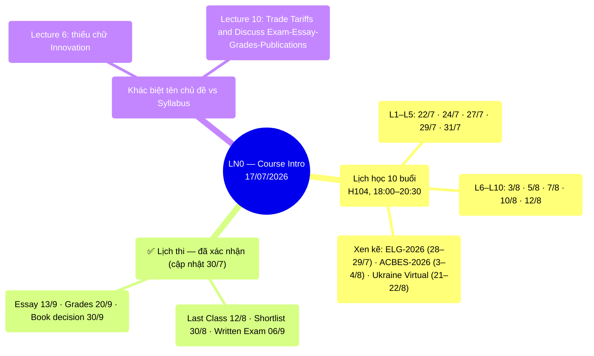

# LN0 — Course Intro (17/07/2026)

Deck 14 slide: lịch học chi tiết + reading list đầy đủ cho 10 lectures. Tiêu đề gốc
"Development Economics vs Economic Development" nhưng nội dung chủ yếu là administrative. A 14-slide deck: detailed class schedule plus the full reading list for all 10
lectures. Original title "Development Economics vs Economic Development," but the content is
mostly administrative.

## Mindmap

## Lịch học (18:00–20:30, phòng H104) - Class Schedule (18:00–20:30, Room H104)

| #   | Ngày     |     | #   | Ngày     |
| --- | -------- | --- | --- | -------- |
| L1  | Wed 22/7 |     | L6  | Mon 3/8  |
| L2  | Fri 24/7 |     | L7  | Wed 5/8  |
| L3  | Mon 27/7 |     | L8  | Fri 7/8  |
| L4  | Wed 29/7 |     | L9  | Mon 10/8 |
| L5  | Fri 31/7 |     | L10 | Wed 12/8 |

Xen kẽ: ELG-2026 Conference (28–29/7), ACBES-2026 (3–4/8), Ukraine Virtual Conf (21–22/8). Interspersed: the ELG-2026 Conference (28–29/7), ACBES-2026 (3–4/8), Ukraine
Virtual Conference (21–22/8).

## ✅ Lịch thi — đã xác nhận (cập nhật 30/7) - ✅ Exam Schedule — Confirmed (Updated 30/7)

Giáo sư trình chiếu slide "Planning Schedule" cập nhật ngay trong lớp (ảnh chụp màn hình,
xem `also_covers` ở frontmatter) — đây là nguồn **mới nhất**, thay thế mọi mốc cũ trong
syllabus (18/06) và bản LN0 gốc (17/07): The professor presented an
updated "Planning Schedule" slide directly in class (screenshot, see `also_covers` in the
frontmatter) — this is the **most recent** source, superseding all earlier dates in the
syllabus (18/06) and the original LN0 deck (17/07):

- **Written Exam: 06/9** — chính thức, khớp bản LN0 gốc, KHÔNG phải 30/8 như syllabus ghi
  ban đầu. **Written Exam: 06/9** — official, confirms the original LN0
  date, NOT 30/8 as the syllabus originally stated.
- **Shortlist 20 bài: 30/8** — dời từ 23/8 (syllabus) sang 30/8, trễ hơn 1 tuần so với kế
  hoạch ban đầu, chỉ còn ~1 tuần giữa lúc có shortlist và ngày thi. 
  **Shortlist of 20: 30/8** — moved from 23/8 (syllabus) to 30/8, a week later than the
  original plan, leaving only ~1 week between receiving the shortlist and the exam.
- Last Class **12/8** · Deadline Essay **13/9** · Submit Grades **20/9** · Book publication
  decision **30/9** — các mốc này khớp cả 3 nguồn (syllabus/LN0/Planning Schedule), không đổi. Last Class **12/8** · Essay deadline **13/9** · Grades submitted **20/9** · Book
  publication decision **30/9** — these dates match across all 3 sources (syllabus/LN0/Planning
  Schedule), unchanged.

## ✅ Cấu trúc đề thi viết — GS thông báo trong lớp (11/8/2026) - ✅ Written-Exam Structure — Announced in Class (8/11/2026)

⚠️ **Nguồn**: giáo sư thông báo bằng lời trong lớp, người dùng truyền đạt lại — KHÔNG có file/ảnh
chụp trong `raw/` làm bằng chứng giấy tờ (khác với mục lịch thi ở trên vốn có ảnh chụp slide).
Ghi nhận lại đây để có 1 điểm tham chiếu duy nhất, nhưng độ chắc chắn thấp hơn các mốc có bằng
chứng ảnh/PDF. ⚠️ **Source**: the professor announced this verbally in
class, relayed by the user — there is NO file/screenshot in `raw/` as documentary evidence
(unlike the exam-schedule section above, which has a slide screenshot). Recorded here as a
single reference point, but with lower certainty than the dates backed by photo/PDF
evidence.

- **2 phần**: Phần 1 **bắt buộc 2 câu**; Phần 2 **tự chọn, trả lời 4 câu** (trong một tập câu hỏi
  lớn hơn — số lượng câu tự chọn để lựa chọn chưa rõ, chỉ biết cần chọn trả lời 4). **2 parts**: Part 1 is **2 compulsory questions**; Part 2 is **elective, answer
  4 questions** (from a larger question set — the exact number of elective questions offered is
  not yet known, only that 4 must be answered).
- **Thời gian**: tạm tính (tentative) **2 giờ**. **Duration**: tentatively
  **2 hours**.
- **Hình thức**: đề đóng (closed-book) — khớp với [[k31-final-exam]] (đề K31 cũng đề
  đóng). **Format**: closed-book — consistent with [[k31-final-exam]] (K31's
  exam was also closed-book).
- **Chiến lược đọc paper GS khuyến nghị**: khi đọc từng paper trong shortlist, tập trung vào
  **Abstract, Methodology, Discussion, Conclusion** để tự suy ra hàm ý chính sách (policy
  implications) — đây chính là loại câu hỏi đề thi hay hỏi (xem mẫu ở [[k31-final-exam]]). Thay
  thế/bổ sung: đọc kỹ **lecture note** (slide GS tóm tắt sẵn) nếu không đủ thời gian đọc hết từng
  PDF gốc. **The professor's recommended paper-reading strategy**: when
  reading each shortlisted paper, focus on the **Abstract, Methodology, Discussion, and
  Conclusion** to derive the policy implications yourself — this is exactly the type of question
  the exam tends to ask (see the example in [[k31-final-exam]]). Alternative/supplement: read the
  **lecture note** carefully (the professor's own slide summaries) if there isn't enough time to
  read every original PDF in full.
- ⚠️ **Quan trọng cho dự đoán shortlist**: GS xác nhận **sẽ KHÔNG dùng lại đúng 20 bài đã chọn cho
  K31 (2025)** — năm nay sẽ có bài khác. Đây là thông tin làm ĐẢO NGƯỢC phương pháp dự đoán trước
  đó ở [[shortlist-prediction]] (bản 2026-08-08 từng giả định GS lặp lại nguyên shortlist K31) —
  xem trang đó để biết phương pháp dự đoán mới (loại trừ 20 bài K31, suy luận từ 42 bài còn
  lại). ⚠️ **Important for shortlist prediction**: the professor confirmed he
  will **NOT reuse the exact same 20 papers chosen for K31 (2025)** — this year's picks will
  differ. This reverses the previous prediction method in [[shortlist-prediction]] (the
  2026-08-08 version had assumed the professor would repeat the K31 shortlist exactly) — see that
  page for the new prediction method (excluding the 20 K31 papers, inferring from the remaining
  42).

## Khác biệt nhỏ về tên chủ đề so với syllabus - Minor Differences in Topic Names vs. the Syllabus

- Lecture 6: "Technology, Growth, Inequality and Poverty" (syllabus có thêm "Innovation"). Lecture 6: "Technology, Growth, Inequality and Poverty" (the syllabus adds
  "Innovation").
- Lecture 10: "Trade Tariffs and Discuss Exam-Essay-Grades-Publications". 
  Lecture 10: "Trade Tariffs and Discuss Exam-Essay-Grades-Publications."

## Liên kết

- [[overview]] · [[ln1-economic-development]] · [[almas-heshmati]]
