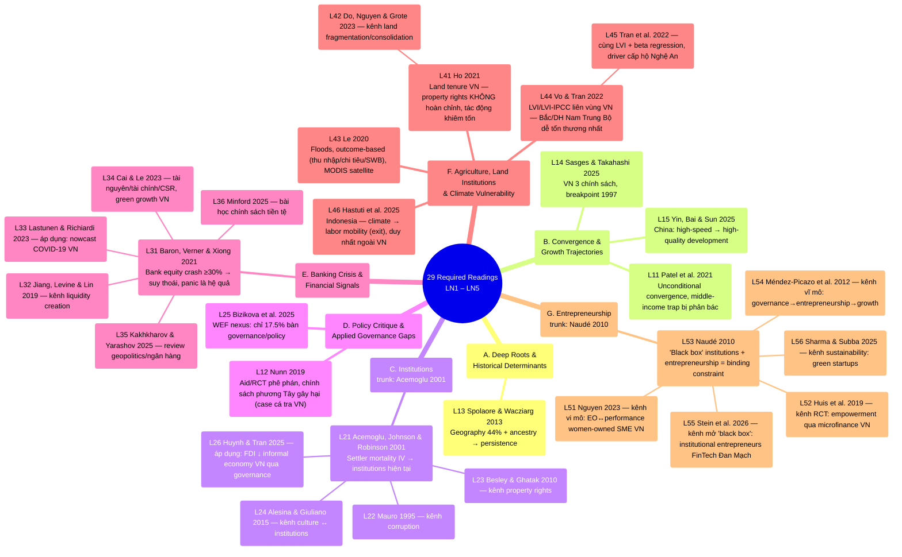

# Mindmap toàn bộ Required Readings — LN1–LN5

Tổng hợp từ [[ln1-economic-development]], [[ln2-governance-institutions-policy-making]],
[[ln3-financial-crisis-and-pandemics]], [[ln4-agriculture-climate-change-natural-disasters]] và
[[ln5-entrepreneurship-economic-development]] (29 papers, lectures 6–10 chưa có tài liệu trong
`raw/` — xem [[overview]]). Synthesized from
[[ln1-economic-development]], [[ln2-governance-institutions-policy-making]],
[[ln3-financial-crisis-and-pandemics]], [[ln4-agriculture-climate-change-natural-disasters]] and
[[ln5-entrepreneurship-economic-development]] (29 papers; lectures 6–10 have no materials yet in
`raw/` — see [[overview]]). Khác với mindmap riêng của từng lecture (vốn đi theo đúng thứ
tự slide), trang này nhóm 29 paper theo **7 cụm chủ đề xuyên lecture** để lộ ra các connection
không nằm gọn trong 1 buổi học — đặc biệt cụm Institutions, nơi Acemoglu et al. (2001) đóng vai
trò "trunk" lý thuyết mà nhiều paper khác (LN2, và nay cả LN4/LN5) build trên; cụm Banking
Crisis, nơi Baron, Verner & Xiong (2021) đóng vai trò tương tự cho 5 paper LN3 còn lại; và cụm
Entrepreneurship mới, nơi Naudé (2010) đóng vai trò trunk programmatic cho 5 paper LN5 còn
lại. Unlike the per-lecture mindmaps (which follow the professor's slide
order), this page groups the 29 papers into **7 cross-lecture thematic clusters** to surface
connections that don't fit neatly within a single lecture — especially the Institutions
cluster, where Acemoglu et al. (2001) acts as the theoretical "trunk" that many other papers
(LN2, and now LN4/LN5 too) build on; the Banking Crisis cluster, where Baron, Verner & Xiong
(2021) plays a similar role for the other 5 LN3 papers; and the new Entrepreneurship cluster,
where Naudé (2010) acts as the programmatic trunk for the other 5 LN5 papers.

## Mindmap theo cụm chủ đề
## Mindmap by Thematic Cluster

## Giải thích 5 cụm
## Explanation of the Clusters

### A. Deep Roots & Historical Determinants

Chỉ 1 paper thuần lý thuyết deep-roots ([[l13-spolaore-2013-deep-roots]]), nhưng **L21 Acemoglu
cũng là một deep-roots argument** — chỉ khác kênh truyền dẫn: Spolaore dùng ancestry/geography
trực tiếp, Acemoglu dùng institutions làm biến trung gian (settler mortality lịch sử →
institutions persist đến hiện tại). Xem [[deep-roots-of-development]]. Only
1 purely theoretical deep-roots paper ([[l13-spolaore-2013-deep-roots]]), but **L21 Acemoglu is
also a deep-roots argument** — differing only in transmission channel: Spolaore uses
ancestry/geography directly, while Acemoglu uses institutions as the mediating variable
(historical settler mortality → institutions persisting to the present). See
[[deep-roots-of-development]].

### B. Convergence & Growth Trajectories

3 paper cùng trả lời "nước nào đang bắt kịp, vì sao": Patel ở tầm toàn cầu
([[unconditional-convergence]]), Yin ở tầm nội bộ Trung Quốc (miền Đông vs Trung/Tây —
[[high-quality-development]]), Sasges ở tầm Việt Nam qua 3 chính sách cụ thể. 3 papers all answer "which countries are catching up, and why": Patel at the global
level ([[unconditional-convergence]]), Yin at the intra-China level (East vs. Central/West —
[[high-quality-development]]), Sasges at the Vietnamese level via 3 specific policies.
Cả ba đều gợi ý essay có thể soi vào bất bình đẳng tăng trưởng **nội bộ một nước** (tỉnh VN, vùng
Trung Quốc) thay vì chỉ so sánh quốc gia. All three suggest an essay could
examine growth inequality **within a single country** (Vietnamese provinces, Chinese regions)
rather than only cross-country comparisons.

### C. Institutions — 4 kênh cụ thể
### C. Institutions — 4 Specific Channels

Đây là cụm dày nhất trong LN1+LN2 (5/11 paper) và có cấu trúc phân cấp rõ nhất: [[institutions]]
(Acemoglu) là khung lý thuyết gốc, 3 paper sau mỗi paper khai thác **một kênh truyền dẫn** khác
nhau từ institutions tới outcome kinh tế — corruption (Mauro), property rights (Besley & Ghatak),
culture (Alesina & Giuliano) — còn Huynh & Tran là paper duy nhất trong cụm này **test trực tiếp
trên dữ liệu Việt Nam** (63 tỉnh, 2006–2021). This is the densest cluster in
LN1+LN2 (5/11 papers) and has the clearest hierarchical structure: [[institutions]] (Acemoglu)
is the original theoretical framework, and each of the 3 following papers explores a different
**transmission channel** from institutions to economic outcomes — corruption (Mauro), property
rights (Besley & Ghatak), culture (Alesina & Giuliano) — while Huynh & Tran is the only paper in
this cluster that **tests directly on Vietnamese data** (63 provinces, 2006–2021).

### D. Policy Critique & Applied Governance Gaps

2 paper không thuộc khung lý thuyết convergence/institutions mà phê phán khoảng cách giữa nghiên
cứu và chính sách: Nunn phê phán aid + RCT ở tầm vĩ mô, Bizikova chỉ ra gap governance trong
literature WEF nexus (chỉ 17.5% nghiên cứu thực sự bàn chính sách). 2 papers
outside the convergence/institutions theoretical framework that critique the gap between
research and policy: Nunn critiques aid + RCTs at the macro level, Bizikova identifies a
governance gap in the WEF-nexus literature (only 17.5% of studies actually discuss
policy). Cả hai là lời nhắc rằng "biết nguyên nhân" (cụm A–C) chưa chắc dẫn tới "chính
sách đúng". Both are reminders that "knowing the cause" (clusters A–C)
does not necessarily lead to "the right policy."

### E. Banking Crisis & Financial Signals

Cụm mới từ LN3 (6/17 paper), cấu trúc phân cấp giống cụm C: [[banking-crisis]] (Baron, Verner &
Xiong 2021) là trunk lý thuyết — chứng minh bank equity crash tự nó đã dự báo suy thoái, panic
chỉ là hệ quả khuếch đại — 5 paper còn lại mỗi paper khai thác một khía cạnh khác: Jiang et al.
đào sâu kênh liquidity creation (cạnh tranh ngân hàng), Lastunen & Richiardi áp cùng logic "dữ
liệu tài chính là tín hiệu sớm" sang dự báo phục hồi COVID-19 Việt Nam, Cai & Le nhìn góc tài
nguyên-tài chính-tăng trưởng xanh Việt Nam, còn Kakhkharov & Yarashov và Minford là 2 bài
review/chính sách vĩ mô đặt khung địa chính trị và lịch sử tiền tệ dài hạn cho toàn cụm. A new cluster from LN3 (6/17 papers), with a hierarchical structure like cluster C:
[[banking-crisis]] (Baron, Verner & Xiong 2021) is the theoretical trunk — showing bank equity
crashes alone already predict recessions, with panic only an amplifying consequence — the other
5 papers each explore a different facet: Jiang et al. dig into the liquidity-creation channel
(bank competition), Lastunen & Richiardi apply the same "financial data as an early signal"
logic to forecasting Vietnam's COVID-19 recovery, Cai & Le take a resource-finance-green-growth
angle on Vietnam, while Kakhkharov & Yarashov and Minford are 2 macro review/policy papers
framing long-run geopolitics and monetary history for the whole cluster.

### F. Agriculture, Land Institutions & Climate Vulnerability

Cụm mới từ LN4 (6/29 paper), cấu trúc KHÁC 2 cụm trunk-based trên — đây là 2 trục độc lập gộp
chung vì cùng bối cảnh "hộ nông thôn Việt Nam/Đông Nam Á": (i) **thể chế đất đai** — L41 (Ho
2021, property rights/tenure security, tác động khiêm tốn vì incomplete) và L42 (Do, Nguyen &
Grote 2023, land fragmentation/consolidation) — cùng chủ đề đất đai VN nhưng 2 kênh độc lập, xem
[[institutions]]; (ii) **thiên tai/biến đổi khí hậu** — L43 (Le 2020, floods, đo outcome-based),
L44+L45 (Vo & Tran 2022; Tran et al. 2022, cùng công cụ LVI/LVI-IPCC nhưng khác độ phân
giải/mục đích, xem [[livelihood-vulnerability-index]]), và L46 (Hastuti et al. 2025, Indonesia —
duy nhất coi labor mobility là chiến lược "exit" thay vì thích ứng tại chỗ). 
A new cluster from LN4 (6/29 papers), with a structure DIFFERENT from the 2 trunk-based clusters
above — these are 2 independent axes grouped together because they share a "rural
Vietnamese/Southeast Asian household" context: (i) **land institutions** — L41 (Ho 2021,
property rights/tenure security, a modest effect due to incompleteness) and L42 (Do, Nguyen &
Grote 2023, land fragmentation/consolidation) — the same Vietnamese land theme but 2 independent
channels, see [[institutions]]; (ii) **natural disasters/climate change** — L43 (Le 2020,
floods, outcome-based measurement), L44+L45 (Vo & Tran 2022; Tran et al. 2022, the same
LVI/LVI-IPCC tool but different resolution/purpose, see [[livelihood-vulnerability-index]]),
and L46 (Hastuti et al. 2025, Indonesia — the only one treating labor mobility as an "exit"
strategy rather than in-place adaptation).

### G. Entrepreneurship & Institutions

Cụm mới từ LN5 (6/29 paper), cấu trúc trunk giống cụm C/E: [[entrepreneurship-and-development]]
(Naudé 2010) là trunk programmatic — đặt 2 gap nghị sự (entrepreneurship bị đánh giá thấp;
institutions = "black box") mà 5 paper còn lại cụ thể hóa qua các kênh khác nhau: Nguyen (2023)
và Huis et al. (2019) là 2 kênh vi mô/hộ gia đình Việt Nam (EO↔performance SME nữ; RCT
empowerment qua microfinance), Méndez-Picazo et al. (2012) là kênh vĩ mô
(governance→entrepreneurship→growth, trích trực tiếp khung Acemoglu 2003 — cầu nối rõ sang
[[institutions]] LN2), Stein et al. (2026) "mở" chính hộp đen mà Naudé đặt ra bằng case study
institutional entrepreneurs cụ thể (FinTech Đan Mạch), còn Sharma & Subba (2025) mở rộng logic
sang sustainability/green startups. A new cluster from LN5 (6/29 papers),
with a trunk structure like clusters C/E: [[entrepreneurship-and-development]] (Naudé 2010) is
the programmatic trunk — setting 2 agenda gaps (entrepreneurship undervalued; institutions as a
"black box") that the other 5 papers flesh out via different channels: Nguyen (2023) and Huis et
al. (2019) are 2 micro/household-level Vietnamese channels (EO↔performance for women-owned
SMEs; RCT empowerment via microfinance), Méndez-Picazo et al. (2012) is a macro channel
(governance→entrepreneurship→growth, directly citing the Acemoglu 2003 framework — a clear
bridge to [[institutions]] in LN2), Stein et al. (2026) "opens" the very black box Naudé
identified via a concrete institutional-entrepreneurs case study (Danish FinTech), while Sharma
& Subba (2025) extends the logic to sustainability/green startups.

## So sánh với mindmap theo lecture
## Comparison with the Per-Lecture Mindmaps

- Mindmap trong [[ln1-economic-development]],
  [[ln2-governance-institutions-policy-making]], [[ln3-financial-crisis-and-pandemics]],
  [[ln4-agriculture-climate-change-natural-disasters]] và
  [[ln5-entrepreneurship-economic-development]]: theo đúng **thứ tự slide giáo sư giảng**, hữu
  ích để ôn theo buổi học. The mindmaps in [[ln1-economic-development]],
  [[ln2-governance-institutions-policy-making]], [[ln3-financial-crisis-and-pandemics]],
  [[ln4-agriculture-climate-change-natural-disasters]] and
  [[ln5-entrepreneurship-economic-development]]: follow the professor's exact **slide order**,
  useful for reviewing session by session.
- Mindmap trang này: theo **chủ đề xuyên lecture**, hữu ích để thấy paper nào cùng trả lời một
  câu hỏi lý thuyết dù nằm ở lecture khác nhau — ví dụ khi ôn thi theo dạng câu hỏi so sánh
  ("so sánh cách 2 paper X, Y giải thích Z"). Cụm F và G đặc biệt đáng chú ý vì cả hai đều bắc
  cầu ngược lại tới [[institutions]] (LN2) — L41/L42/L54 đều xây dựng trực tiếp trên khung
  Acemoglu. This page's mindmap: organized by **cross-lecture theme**,
  useful for seeing which papers answer the same theoretical question even though they sit in
  different lectures — e.g., when reviewing comparison-style exam questions ("compare how
  papers X and Y explain Z"). Clusters F and G are especially notable since both bridge back to
  [[institutions]] (LN2) — L41/L42/L54 all build directly on the Acemoglu framework.

## Liên kết

- [[overview]] · [[ln1-economic-development]] · [[ln2-governance-institutions-policy-making]] ·
  [[ln3-financial-crisis-and-pandemics]] · [[ln4-agriculture-climate-change-natural-disasters]] ·
  [[ln5-entrepreneurship-economic-development]]
- Concepts: [[deep-roots-of-development]], [[unconditional-convergence]],
  [[high-quality-development]], [[institutions]], [[middle-income-trap]], [[banking-crisis]],
  [[livelihood-vulnerability-index]], [[entrepreneurship-and-development]]
