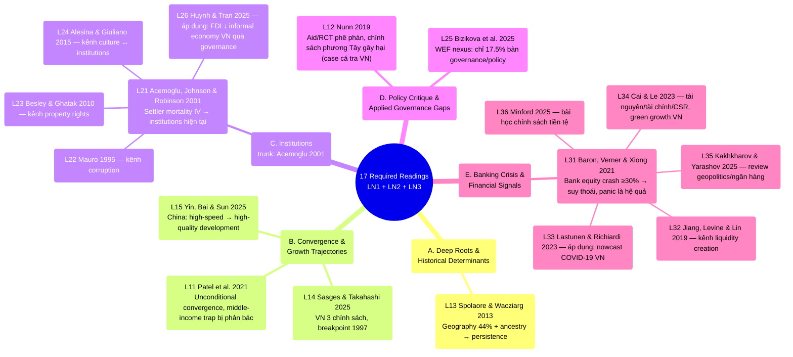

# Mindmap toàn bộ Required Readings — LN1, LN2 & LN3

Tổng hợp từ [[ln1-economic-development]], [[ln2-governance-institutions-policy-making]] và
[[ln3-financial-crisis-and-pandemics]] (17 papers, lectures 4–10 chưa có tài liệu trong `raw/`
— xem [[overview]]). Khác với mindmap riêng của từng lecture (vốn đi theo đúng thứ tự slide),
trang này nhóm 17 paper theo **5 cụm chủ đề xuyên lecture** để lộ ra các connection không nằm
gọn trong 1 buổi học — đặc biệt cụm Institutions, nơi Acemoglu et al. (2001) đóng vai trò
"trunk" lý thuyết mà 3 paper LN2 khác build trên qua 3 kênh cụ thể, và cụm Banking Crisis, nơi
Baron, Verner & Xiong (2021) đóng vai trò tương tự cho 5 paper LN3 còn lại.

## Mindmap theo cụm chủ đề

## Giải thích 5 cụm

### A. Deep Roots & Historical Determinants

Chỉ 1 paper thuần lý thuyết deep-roots ([[l13-spolaore-2013-deep-roots]]), nhưng **L21 Acemoglu
cũng là một deep-roots argument** — chỉ khác kênh truyền dẫn: Spolaore dùng ancestry/geography
trực tiếp, Acemoglu dùng institutions làm biến trung gian (settler mortality lịch sử →
institutions persist đến hiện tại). Xem [[deep-roots-of-development]].

### B. Convergence & Growth Trajectories

3 paper cùng trả lời "nước nào đang bắt kịp, vì sao": Patel ở tầm toàn cầu
([[unconditional-convergence]]), Yin ở tầm nội bộ Trung Quốc (miền Đông vs Trung/Tây —
[[high-quality-development]]), Sasges ở tầm Việt Nam qua 3 chính sách cụ thể. Cả ba đều gợi ý
essay có thể soi vào bất bình đẳng tăng trưởng **nội bộ một nước** (tỉnh VN, vùng Trung Quốc)
thay vì chỉ so sánh quốc gia.

### C. Institutions — 4 kênh cụ thể

Đây là cụm dày nhất trong LN1+LN2 (5/11 paper) và có cấu trúc phân cấp rõ nhất: [[institutions]] (Acemoglu)
là khung lý thuyết gốc, 3 paper sau mỗi paper khai thác **một kênh truyền dẫn** khác nhau từ
institutions tới outcome kinh tế — corruption (Mauro), property rights (Besley & Ghatak),
culture (Alesina & Giuliano) — còn Huynh & Tran là paper duy nhất trong cụm này **test trực
tiếp trên dữ liệu Việt Nam** (63 tỉnh, 2006–2021).

### D. Policy Critique & Applied Governance Gaps

2 paper không thuộc khung lý thuyết convergence/institutions mà phê phán khoảng cách giữa
nghiên cứu và chính sách: Nunn phê phán aid + RCT ở tầm vĩ mô, Bizikova chỉ ra gap governance
trong literature WEF nexus (chỉ 17.5% nghiên cứu thực sự bàn chính sách). Cả hai là lời nhắc
rằng "biết nguyên nhân" (cụm A–C) chưa chắc dẫn tới "chính sách đúng".

### E. Banking Crisis & Financial Signals

Cụm mới từ LN3 (6/17 paper), cấu trúc phân cấp giống cụm C: [[banking-crisis]] (Baron, Verner
& Xiong 2021) là trunk lý thuyết — chứng minh bank equity crash tự nó đã dự báo suy thoái, panic
chỉ là hệ quả khuếch đại — 5 paper còn lại mỗi paper khai thác một khía cạnh khác: Jiang et al.
đào sâu kênh liquidity creation (cạnh tranh ngân hàng), Lastunen & Richiardi áp cùng logic "dữ
liệu tài chính là tín hiệu sớm" sang dự báo phục hồi COVID-19 Việt Nam, Cai & Le nhìn góc
tài nguyên-tài chính-tăng trưởng xanh Việt Nam, còn Kakhkharov & Yarashov và Minford là 2 bài
review/chính sách vĩ mô đặt khung địa chính trị và lịch sử tiền tệ dài hạn cho toàn cụm.

## So sánh với mindmap theo lecture

- Mindmap trong [[ln1-economic-development]],
  [[ln2-governance-institutions-policy-making]] và [[ln3-financial-crisis-and-pandemics]]: theo
  đúng **thứ tự slide giáo sư giảng**, hữu ích để ôn theo buổi học.
- Mindmap trang này: theo **chủ đề xuyên lecture**, hữu ích để thấy paper nào cùng trả lời một
  câu hỏi lý thuyết dù nằm ở lecture khác nhau — ví dụ khi ôn thi theo dạng câu hỏi so sánh
  ("so sánh cách 2 paper X, Y giải thích Z").

## Liên kết

- [[overview]] · [[ln1-economic-development]] · [[ln2-governance-institutions-policy-making]] ·
  [[ln3-financial-crisis-and-pandemics]]
- Concepts: [[deep-roots-of-development]], [[unconditional-convergence]],
  [[high-quality-development]], [[institutions]], [[middle-income-trap]], [[banking-crisis]]
